# Live stock from store databases to the website, observed end to end

For a zero-cloud-cost rehearsal using Lima and local Kafka, see [Run locally](../LOCAL.md).

UrbanStreet is a fictional outdoor retailer with five stores in Italy (Milano, Torino, Bologna, Roma, Firenze) and one online shop. Each store keeps its own stock database, and the website has to show one honest number: how many pairs of a shoe it can sell right now. If that number is wrong in one direction, a shopper buys something that is no longer on a shelf; if it is wrong in the other, the shop turns away a sale it could have made. In this workshop you build the whole path yourself: the store databases publish every stock change as an event, Confluent Cloud carries and aggregates those events, a small service on AWS keeps a fast copy for the website, and Datadog shows you where time is spent when something goes wrong. Then you break it on purpose, find the cause, and roll out a fix safely. Every product, store, sale and shopper in this workshop is synthetic.

**What you will build**

- Five PostgreSQL store databases on one EC2 VM, standing in for a retailer's existing store systems, left exactly as they are.
- Change data capture with self-managed Debezium on Kafka Connect, streaming into Confluent Cloud (Kafka, Schema Registry, Flink SQL).
- An online side on AWS: ECS Fargate services, an ElastiCache Redis serving view, and an Application Load Balancer that can split traffic between releases.
- Optional layers on top: automatic restocking from demand, and offers for carts whose product just sold out, chosen by an AI service with a safe rule-based default.
- Datadog across all of it: APM with trace and log correlation, Data Streams Monitoring, freshness probes, AWS and Confluent integrations, LLM Observability, Synthetics, dashboards and monitors.

**What you will learn**

- What a change event is, and why streaming changes from the existing databases avoids a big-bang migration.
- How to keep a read model honest: newer revisions win, unknown is never shown as zero, and a probe proves the feed is moving.
- How to use version tags in Datadog APM to localise a slow release, and how to roll out the fix as a canary with gates.
- How to keep an AI decision optional: a confidence threshold, a kill switch, a rule default, and a trace that shows why each offer was made.

**Time and cost at a glance**

| Part | Time | Notes |
|---|---|---|
| Accounts and tools (Section 3) | 30–60 min | One-off; longer if you are creating accounts |
| Build from zero (Section 5) | about 36 min, then 10–15 min of warm-up | Measured on our test run on 2026-10-04: 2143 s from `stack-up` to the end of its built-in smoke test |
| Labs 1–7 (Section 6) | about 2 hours | Times per lab are in each lab |
| Teardown (Section 8) | about 15–20 min | Not measured precisely |
| **Running cost while the stack is up** | **about $1.40–1.70 per hour** | An estimate, not a bill: see [Section 4](#4-cost-and-time). Confluent Cloud bills partial hours as full hours. |

> [!WARNING]
> This workshop creates real, billed resources in your AWS and Confluent Cloud accounts from the moment `stack-up` starts. Plan to finish in one sitting and run the teardown in [Section 8](#8-teardown-and-proof-that-nothing-billable-remains) at the end.

## Contents

0. [Quick start (demo mode)](#quick-start-demo-mode)
1. [Why change events and Kafka](#1-why-change-events-and-kafka)
2. [Architecture, layer by layer](#2-architecture-layer-by-layer)
3. [Prerequisites](#3-prerequisites)
4. [Cost and time](#4-cost-and-time)
5. [Build from zero](#5-build-from-zero)
6. [Labs](#6-labs)
   - [Lab 1: One product, five stores, one online number](#lab-1-one-product-five-stores-one-online-number)
   - [Lab 2: Unknown is not zero](#lab-2-unknown-is-not-zero)
   - [Lab 3: The incident, a release ships without a gate](#lab-3-the-incident-a-release-ships-without-a-gate)
   - [Lab 4: Canary the fix](#lab-4-canary-the-fix)
   - [Lab 5: Restock that learns](#lab-5-restock-that-learns)
   - [Lab 6: Offers with a safe default](#lab-6-offers-with-a-safe-default)
   - [Lab 7: Datadog on top of the whole solution](#lab-7-datadog-on-top-of-the-whole-solution)
7. [Troubleshooting](#7-troubleshooting)
8. [Teardown and proof that nothing billable remains](#8-teardown-and-proof-that-nothing-billable-remains)
9. [Recap and further reading](#9-recap-and-further-reading)
10. [Appendix: glossary and command reference](#10-appendix-glossary-and-command-reference)

Conventions: all commands run from the root of this repository (`cd <repo>`). Where a command needs your values, they are written as `<like-this>`. Output blocks show what you should see; anything in `<...>` there will differ on your run.

---

## Quick start (demo mode)

If you only want the running demo, one configuration file and one command bring it up, the same way as Confluent's hybrid cloud workshop. You still need the accounts and tools from [Section 3](#3-prerequisites), and you are billed from the moment `create` starts (about $1.50–1.70 per hour, pre-tax estimate; see [Section 4](#4-cost-and-time)).

1. Copy the example configuration and protect it. `demo.yaml` is ignored by git:

   ```sh
   git clone --recurse-submodules <repo-url> <repo>
   cd <repo>
   cp demo.example.yaml demo.yaml && chmod 600 demo.yaml
   ```

2. Edit `demo.yaml` in an editor: the AWS profile and region (`eu-west-1`), the layers (all by default), the Datadog site and keys, the Confluent Cloud key and secret, and optionally the Jev key. Keep `stack: hybrid` so the lab commands in this guide work unchanged.

3. Sign in to AWS, then create the stack:

   ```sh
   aws login --profile dd-demo
   ./demo create
   ```

   `create` checks the file, writes `.env` from it (mode 600, never printed), generates the local passwords, runs the preflight, asks you to type `yes` to accept the cost, then runs the same `stack-up` described in [Section 5.3](#53-bring-the-stack-up) (about 36 minutes). Add `--dry-run` to see the exact commands without running anything.

4. Use it, then tear it down:

   ```sh
   ./demo status     # stack summary and URLs
   ./demo links      # Datadog, APM, DSM and Control Center links
   ./demo reset      # back to the seeded baseline before a lab
   ./demo destroy    # asks for yes, then runs stack-down
   ```

After `./demo create` you can jump straight to the [Labs](#6-labs). Still run the checks in [Section 8](#8-teardown-and-proof-that-nothing-billable-remains) after `destroy`. The rest of this guide explains every step that `create` runs for you.

---

## 1. Why change events and Kafka

Every retailer with physical stores already has stock data. It lives in store systems that run the tills, that people trust, and that nobody wants to rewrite. In this workshop five PostgreSQL databases play that role, one per store. We call them *the Sources*: each one holds only its own store's stock, and nothing in this workshop changes how they work.

The website needs *sellable stock*: the quantity of a product the online shop can sell, which is the sum of that product's stock across all five stores. The obvious ways to get it both hurt. Asking all five databases on every page view puts web traffic onto the till systems and makes the website as slow as the slowest store. Copying the data in a nightly batch keeps the stores safe but makes the number hours old, which is exactly when a shopper buys the last pair twice.

The approach here is to publish what changes, as it changes. A *change event* is the record that one stock position changed at a Source: which store, which product, the new quantity, and its *revision*, a number that grows every time that position changes. For example, when Bologna sells one pair of the Trailrunner GTX:

```json
{ "store_id": "S03", "product_id": "P0042", "quantity": 2, "revision": 1187, "changed_at": "2026-10-04T18:21:57Z" }
```

(Field names are simplified here; the real records are Avro with a Debezium envelope.)

The ordered sequence of these events is the *change stream*. Every consumer reads the same change events independently, at its own pace, and can start again from the beginning. That is what Apache Kafka is for: a durable, ordered log that many readers share without getting in each other's way.

The events come from *change data capture* (CDC). Debezium reads the database's own write-ahead log, the journal PostgreSQL already keeps for crash recovery and replication, and turns each committed row change into an event. The store applications do not change, no trigger calls the network, and no extra query hits the tills. That is why there is no big-bang migration: you start streaming from the databases as they are, build new things on the stream, and leave the old systems in place for as long as you need them.

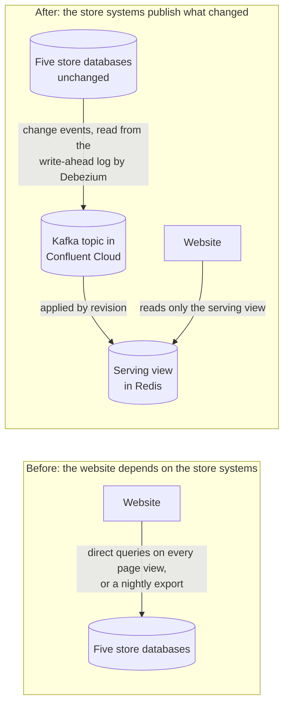

On the right, the website reads a *serving view*: the retailer's copy of stock positions, kept current from the change stream and rebuildable from it. It never falls back to asking the Sources. Two rules keep it honest, and you will see both in the labs:

- A newer revision always wins; an older or repeated event changes nothing. Events can arrive twice (Kafka delivers at least once), so the view must be safe to replay.
- When the view cannot vouch for a position, the answer is *unknown stock*, never zero and never available.

To know whether the view is current, you need *freshness*: how long a stock change takes from the Source to the serving view. A quiet product produces no events, so silence looks the same as a broken feed. A *probe* fixes that: a synthetic stock position that a small service changes every few seconds in each store, then waits to see in the serving view. If the probe stops arriving, the feed has stopped, even when no real stock is selling.

> [!NOTE]
> Further reading: [Debezium PostgreSQL connector](https://debezium.io/documentation/reference/stable/connectors/postgresql.html), [Confluent Cloud for Apache Flink](https://docs.confluent.io/cloud/current/flink/overview.html).

---

## 2. Architecture, layer by layer

The demo is split into *layers*: parts you can switch on or off on their own, each tagged on every resource it adds. *Core* is always on; *releases*, *restock* and *offers* add application behaviour; *dd-streams*, *dd-synthetics* and *dd-rum* add Datadog features. One complete, isolated deployment (its own Confluent environment, VM, AWS services and Datadog `env`) is a *stack*. This guide uses a stack named `hybrid` and builds all layers at once (`LAYERS=all`).

Things run in three places, plus Datadog:

| Zone | What runs there | Why there |
|---|---|---|
| Simulated store estate: one EC2 VM (Ubuntu 24.04, `t4g.xlarge`) with Docker Compose | The five store PostgreSQL databases, the procurement database, Kafka Connect (Debezium sources, Redis sink, JDBC sink), background sales, the probe service (`watchdog`), the supplier simulator, a Datadog Agent, and the `scenario`/`smoke` tools you run | Stands in for the retailer's on-premises systems. Self-managed Connect is what you would run next to real store databases |
| Confluent Cloud (AWS `eu-west-1`) | One Basic Kafka cluster, Schema Registry (Avro), one Flink compute pool with up to five long-running SQL statements | Managed streaming and stream processing |
| AWS online side (`eu-west-1`, default VPC, no NAT gateway) | ECS Fargate services (ARM64), ElastiCache Redis (one `cache.t4g.small` node), one public Application Load Balancer, ECR, SSM Parameter Store | The website and its services. Every Fargate task runs the app, a Datadog Agent sidecar and a FireLens log router |
| Datadog (EU site, `datadoghq.eu`) | APM, Logs, Data Streams Monitoring, metrics, two dashboards, monitors, LLM Observability, Synthetics, RUM (wired, verify on your run), Cloud Cost Management | Observability across all three zones |

The diagrams below build up the same picture one layer at a time. Boxes and arrows that a layer adds are highlighted in orange; Datadog is purple. Every arrow says what flows along it.

### 2.1 Layer: core

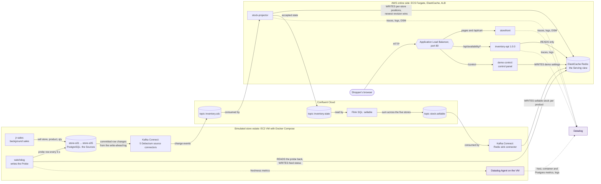

Follow one sale through it. A background sale (or you, with `make sell-out`) calls a `sell()` function inside one store's database; a trigger stamps the row with a new revision and a timestamp. Debezium sees the committed change in the write-ahead log and publishes a change event to `inventory.cdc`. The `stock-projector` service applies the event to Redis with an atomic compare-and-set (newer revision wins), then publishes the accepted state to the compacted topic `inventory.state`. A Flink SQL statement continuously sums `inventory.state` per product into `stock.sellable`, and a Redis sink connector writes that sum into Redis. When a shopper opens a product page, the browser asks the load balancer for `/api/availability/P0042`, which goes to `inventory-api`, which reads Redis and nothing else.

**Kafka Connect: self-managed, next to the Sources.** Debezium is not a separate product to install: it runs as a Kafka Connect *source connector*. In this workshop it runs on a self-managed Kafka Connect worker in a container on the VM (built from `connect/Dockerfile`, which adds the Debezium PostgreSQL, Redis sink and Confluent JDBC sink plugins to the Confluent Connect image). The worker's Kafka is Confluent Cloud: it connects outbound over TLS (SASL_SSL) with its own API key, and even its internal topics (`_connect.dd-demo.configs`, `.offsets`, `.status`) live in the Confluent Cloud cluster. There is no Kafka cluster on the VM and nothing is replicated between clusters: change events are written once, directly to Confluent Cloud. (Teams that already run Kafka on-premises would instead keep Debezium on their local cluster and copy the topics to Confluent Cloud with [Cluster Linking](https://docs.confluent.io/cloud/current/multi-cloud/cluster-linking/index.html) or [Confluent Replicator](https://docs.confluent.io/platform/current/multi-dc-deployments/replicator/index.html); this workshop does not need either.) The worker runs these connectors:

| Connector | Type | From → to | Layer |
|---|---|---|---|
| `inventory-s01` … `inventory-s05` | Debezium PostgreSQL source (`pgoutput`, one per store, config `connect/connector-debezium.json`) | each store's `stock_position` table → `inventory.cdc` | core |
| `sellable-redis` | Redis sink | `stock.sellable` → ElastiCache `sellable:<product>` | core |
| `procurement-orders` | Debezium PostgreSQL source | procurement-db `purchase_order` → `procurement.orders` | restock |
| `restock-procurement` | Confluent JDBC sink | `restock.requests` → procurement-db `purchase_order` | restock |

Why self-managed rather than Confluent's fully managed connectors? The Sources stand in for systems inside a retailer's own network. Running Connect next to them means the databases are never exposed to the internet; the only connections leaving the estate are outbound TLS to Confluent Cloud (and, for the Redis sink, to ElastiCache inside the same AWS VPC). The trade-off is that you operate the worker yourself, and these connectors do **not** appear on Confluent Cloud's managed Connectors page; they show up as clients in Stream Lineage. Their state comes from the Connect REST API on the VM (`make MODE=cloud STACK=hybrid status` prints every connector's status), from Confluent Control Center on the VM (Lab 1) and, continuously, from the Datadog metric `stock.connect.task_running`, which `watchdog` polls every 10 s and which feeds the monitors "Debezium connector task not running" and "Redis sink connector sellable-redis task not running".

**Who writes and who reads the serving view.** ElastiCache Redis is shared by several components, so it is worth being precise:

| Component | Writes | Reads |
|---|---|---|
| `stock-projector` (Fargate) | Per-store positions `stock:<namespace>:<store>:<product>` and readiness metadata | Its own keys, for compare-and-set |
| Redis sink connector (Kafka Connect on the VM) | Sellable stock `sellable:<product>`, from `stock.sellable` | none |
| `watchdog` (VM) | Feed status per store `feed:status:<store>` | The probe positions and `sellable:__probe__` |
| `inventory-api` (Fargate) | none | `sellable:*`, `stock:*`, `feed:status:*` |
| `demo-control` (Fargate) | Demo settings `demo:config` | Demo settings |
| `scenario` tool (VM, run by you) | The current scenario id during reset | Everything, to verify against the Sources |
| Restock and offers layers | `supplier-sim` writes `restock:eta:<product>` | `offer-worker` reads stock of alternatives; `storefront` reads settings |

The Sources are never read on the shopper's path. The only components that touch the store databases are Debezium (reading the log), the background sales and `scenario` tools (writing sales), the probe (writing one synthetic row per store) and, in the restock layer, the supplier simulator (writing deliveries).

**The load balancer.** The Application Load Balancer (ALB) is the single public entry point. Its listener on port 80 has three routes: `/control` and `/control/*` go to the control panel, `/api/availability/*` goes to the stock lookup service, and everything else (pages, `/api/cart`, `/api/offers`) goes to the storefront. Its security group admits only your public IP (detected when you build), the VM's IP for the test tools and, with the `dd-synthetics` layer, Datadog's published Synthetics ranges. The stock lookup route is a *weighted forward* to three target groups, one per release of `inventory-api`; in core all weight is on 1.0.0. That weighting is what makes the canary in Lab 4 possible.

**Datadog in core.** Each Fargate task carries a Datadog Agent sidecar that receives traces and metrics from the app, and a FireLens log router that ships the app's JSON logs to Datadog Logs and to CloudWatch Logs. The Python services run under `ddtrace` with unified service tags (`env`, `service`, `version`), log injection (so each log line carries its trace ID) and Data Streams Monitoring (DSM) enabled. On the VM, the Agent collects host and container metrics, container logs, PostgreSQL checks for the five stores, and the freshness metrics from `watchdog`.

### 2.2 Layer: releases

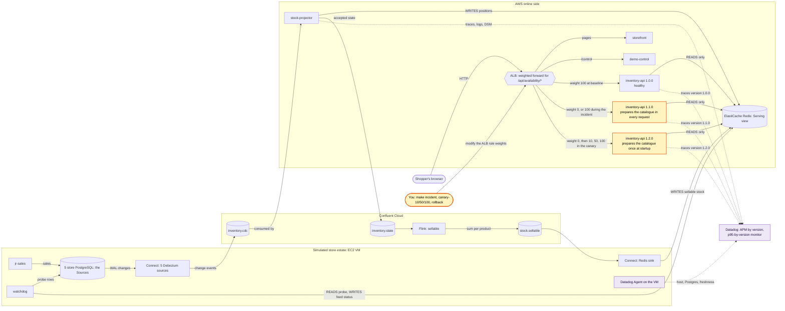

A *release* is one deployed build of the stock lookup service, identified by its version. There are three, all from the same image and all reading only Redis: 1.0.0 is healthy, 1.1.0 adds product details by opening, parsing and indexing a product catalogue inside every request (the regression), and 1.2.0 does the same work once per worker at startup (the fix). Each runs as its own Fargate service behind its own ALB target group. The Fargate services for 1.1.0 and 1.2.0 exist from the first build; the layer is about where traffic goes.

A *canary* means rolling a new release out to a small share of traffic beside the old one and comparing the two by version. Here the ALB does the traffic split (weights 0/90/10, then 0/50/50, then 0/0/100), and Datadog does the comparison, because every trace carries `version:1.x.x`. Datadog does not move traffic; the ALB weights do. This layer also adds a monitor on the p95 latency of `inventory-api` by version.

> [!NOTE]
> The release tasks are not the same size: 1.1.0 runs with 2 vCPU and 4 GB, while 1.0.0 and 1.2.0 run with 0.5 vCPU and 1 GB (each including the Agent sidecar). The regression is CPU-bound, so 1.1.0 was given more room to stay up under load. Treat the comparison as an operational release decision under the deployed sizing, not as a hardware-normalised benchmark.

### 2.3 Layer: restock

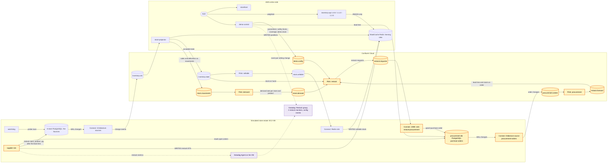

When a store runs out of a product, it should ask for more without anyone clicking a button. The *demand rate* (units of one product one store sells per hour) is learned continuously by Flink from `stock.movements`, over a sliding window of recent sales. The *inventory position* is stock on hand plus stock *on order* (already requested but not yet arrived), so an open order prevents ordering the same thing twice. When the inventory position is at or below the *reorder point* (demand rate × expected supplier lead time × safety factor), Flink emits a *restock request*.

A JDBC sink connector writes each restock request into the procurement database as a *purchase order*: a request accepted by the procurement system and open until the goods arrive. Debezium streams the purchase orders back into Kafka so Flink can learn the observed *supplier lead time* and the quantity on order. The supplier simulator delivers each order when its lead time has passed, by calling `restock()` in that store's database, which flows through the normal change-event path like any other stock change.

The demo uses a *demo clock*: by default one real minute represents one business hour, so a 48-hour lead time takes 48 real minutes, and you can shorten it live.

### 2.4 Layer: offers

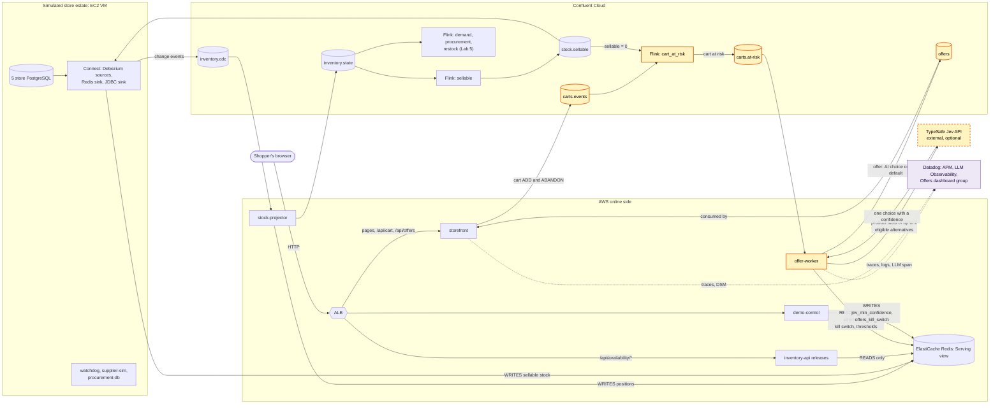

(Core and restock components are drawn condensed in this diagram so the new path stays readable.)

The storefront publishes every cart change to `carts.events`. A Flink statement joins active carts with `stock.sellable`; when a product in an active cart reaches zero sellable stock, it emits a *cart at risk*. Only this event can ask the AI for a choice. The `offer-worker` builds the list of *eligible alternatives*: in-stock products the shopper could actually buy instead, same category and size, priced close to the original (up to two), plus "notify me when it is back". It sends only product facts, never cart or shopper identifiers, to an external decision service (TypeSafe Jev) and accepts the answer only if the chosen ID is in the list and the confidence is at least 0.8 (adjustable live). Otherwise it uses the *rule default*: the offer that policy picks on its own whenever the AI choice is missing, unsure, invalid, late or switched off. It re-checks the alternative's stock, writes the text from a template, and publishes the offer to the `offers` topic, which the storefront consumes and shows under the product.

### 2.5 Datadog across every layer

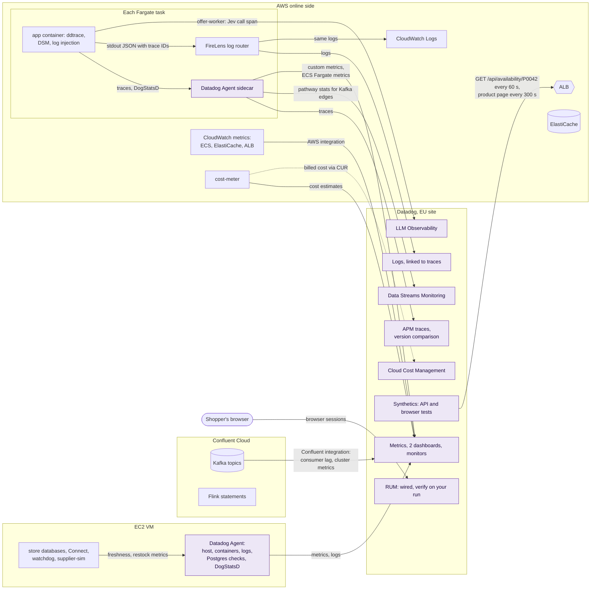

| Question you will ask | Datadog signal | Where it comes from | Lab |
|---|---|---|---|
| Is the feed moving, per store? | `stock.probe.age`, `stock.feed.state`, `stock.sellable.age` | `watchdog` through the VM Agent | 1, 2 |
| How long do changes take to reach the serving view? | `stock.freshness.apply_delay` (p95) | `stock-projector` | 1, 5 |
| Which Kafka edges are healthy? | Data Streams Monitoring map | `ddtrace` in projector, storefront, inventory-api, offer-worker | 1, 7 |
| Which release is slow, and where inside the request? | APM latency by `version`, the `catalogue.prepare` span | `ddtrace` in inventory-api | 3, 4 |
| What did the logs say for that slow request? | Log lines with `dd.trace_id` | FireLens to Datadog Logs | 3 |
| Are the connectors running? | `stock.connect.task_running` | `watchdog` polling the Connect REST API | 1, 7 |
| Is consumer lag growing on Confluent? | `confluent_cloud.kafka.consumer_lag_offsets` | Confluent Cloud integration (`dd-streams` layer) | 7 |
| Are ECS, ElastiCache and the ALB healthy? | AWS-native online dashboard | AWS integration, ECS Fargate metrics | 7 |
| Why did the AI pick that offer, or not? | LLM span input and output, `offer.decision` by route and reason | offer-worker | 6 |
| Can a shopper load the page from outside? | Synthetics API and browser tests | Datadog managed location `aws:eu-central-1` | 7 |
| What is this costing? | `dd_demo.cost.*` metrics, account cost dashboard, Cloud Cost Management | `cost-meter`, AWS Cost and Usage Report | 7 |

DSM sees only the services that run the Datadog tracer. Kafka Connect and Flink are not instrumented, so their edges appear as topics, not as services; connector health is checked separately through the Connect REST API.

> [!IMPORTANT]
> Real User Monitoring (RUM) is wired in this repository (the RUM application is created and its ID and client token are passed to the storefront), but we have not yet verified a RUM session on the current build. Lab 7 tells you how to check it on your run.

---

## 3. Prerequisites

### 3.1 Accounts

| Account | What you need | Notes |
|---|---|---|
| AWS | An account where you can create EC2, ECS, ECR, ELB, ElastiCache, IAM roles, SSM parameters, S3 and Cost and Usage Report exports. Administrator access is simplest | Region `eu-west-1` must have its **default VPC** (the code uses it). The scripts use an AWS CLI profile named `dd-demo` by default, signed in with `aws login` |
| Confluent Cloud | An organisation and a **Cloud resource management** API key owned by a user with OrganizationAdmin | Terraform creates an environment, a Basic cluster, service accounts, role bindings, API keys and a Flink compute pool. New sign-ups usually come with promotional credit; check the amount and its expiry under Billing |
| Datadog | An organisation on the **EU site** (`app.datadoghq.eu`), for example a trial. An API key and an application key | See [3.4](#34-datadog-site). We have not checked which products every Datadog trial includes; this workshop uses APM, Logs, DSM, LLM Observability, Synthetics, RUM (wired, verify on your run) and Cloud Cost Management |
| TypeSafe Jev (optional) | An API key for the Jev decision API | Without it, everything still works and every offer in Lab 6 is the rule default, with reason `disabled` |

You do not need a Datadog browser login stored on disk; you will use the Datadog web app normally.

### 3.2 Local tools

Run everything from macOS or Linux with these tools on your `PATH`:

| Tool | Version the code expects | Used for |
|---|---|---|
| `terraform` | 1.6.0 or newer (`required_version` in every module) | All cloud resources |
| `docker` CLI with the `compose` and `buildx` plugins | Recent; the preflight checks that `docker compose version` and `docker buildx version` work | Driving Docker on the VM over SSH, and building ARM64 images there |
| AWS CLI v2 | A version that has `aws login` and `aws configure export-credentials` (check with `aws login help`); the exact minimum version is unverified | Sign-in, ECS, ECR, ELB, SSM calls |
| `ssh` and an Ed25519 key at `~/.ssh/id_ed25519.pub` | Any | The VM's key pair and the Docker SSH context. Set `TF_VAR_ssh_public_key_path` to use another key |
| `make`, `curl`, `python3`, `jq`, `openssl` | Any recent | Make targets, IP detection, helper scripts, Terraform output parsing, password generation |
| `confluent` CLI (optional) | Any | Read-only checks: prices, and the leftover check after teardown |

You do not need Python packages, Node.js or a local Kafka: the application images are built on the VM.

### 3.3 Where each secret goes

You type three provider credentials once into an untracked file; everything else is generated. Values never appear in this guide, in commands, in Terraform outputs that are printed, or in task definitions.

| Name | Where it lives | Who creates it |
|---|---|---|
| `CONFLUENT_CLOUD_API_KEY`, `CONFLUENT_CLOUD_API_SECRET` | `.env` in the **repository root** (ignored by git) | You |
| `DD_API_KEY`, `DD_APP_KEY` | Same `.env` | You |
| `JEV_API_KEY` (optional) | Same `.env` | You |
| `PRESENTER_CIDR` (optional) | Same `.env`, or the environment; your public IP as `x.x.x.x/32`. If unset, the scripts detect it with `checkip.amazonaws.com` | You, only if detection picks the wrong address |
| Database role passwords and `CONTROL_PASSWORD` (control panel) | `.env.secrets`, mode 600 | `make secrets`, run for you by `stack-up` |
| Per-service Kafka and Schema Registry keys, endpoints, ALB and Redis addresses | `.env.cloud-hybrid`, mode 600 | `stack-up`, from Terraform outputs |
| Secrets the Fargate tasks need | AWS SSM Parameter Store SecureStrings under `/dd-demo/hybrid/` | `stack-up`, from an explicit allowlist |
| AWS credentials | Your AWS CLI profile (`aws login --profile dd-demo`), never in a file here | You |

> [!NOTE]
> The scripts look for `.env`, `.env.secrets` and `.env.cloud-<stack>` in the repository root, where `.gitignore` excludes them so they cannot be committed by accident. To keep them elsewhere, set `ENV_DIR=<directory>` on every `make` command. Run commands from the repository root as shown.

> [!WARNING]
> Never paste these values into a chat, an issue, a screenshot or a terminal recording. Delete the keys you created when you finish (Section 8).

### 3.4 Datadog site

The code targets the Datadog **EU** site (`datadoghq.eu`): the Terraform provider URL, the storefront and Agent `DD_SITE`, the FireLens log intake host, the Synthetics IP-range lookup and the link helper all point there. Using another site means changing the variables `datadog_api_url` (in `terraform/account` and `terraform/datadog`) and `dd_site` (in `terraform/aws`), the FireLens `Host` in `terraform/aws/ecs.tf`, the Synthetics range URL in `terraform/vm`, and the site in `compose/scripts/links.sh`. That path is untested. See [Datadog sites](https://docs.datadoghq.com/getting_started/site/).

### 3.5 Readiness check

Sign in to AWS and confirm the identity (read-only):

```sh
aws login --profile dd-demo
aws sts get-caller-identity --profile dd-demo
```

You should see your account and user or role in JSON. The full readiness gate is `stack-preflight`, in the next sections.

---

## 4. Cost and time

| Item | Size in this repository | Price used for our estimate | Source |
|---|---|---|---|
| EC2 VM | 1 × `t4g.xlarge`, 40 GB gp3, CPU credits `unlimited` | $0.1472/h | AWS Pricing API, `eu-west-1`, read 2026-10-04 |
| ECS Fargate (ARM64) | 8 services, 5 vCPU and 10 GB in total | $0.0324 per vCPU-hour, $0.0036 per GB-hour, about $0.20/h in total | AWS Pricing API, `eu-west-1`, read 2026-10-04 |
| ElastiCache | 1 × `cache.t4g.small` | $0.034/h | AWS Pricing API, `eu-west-1`, read 2026-10-04 |
| ALB, public IPv4 addresses (VM and tasks), EBS, CloudWatch Logs, data transfer | 1 ALB, 9 public IPs | Not itemised here | [ELB pricing](https://aws.amazon.com/elasticloadbalancing/pricing/), [VPC pricing](https://aws.amazon.com/vpc/pricing/) |
| Confluent Cloud | 1 Basic cluster, Schema Registry Essentials, Flink pool capped at 5 CFU running up to 5 statements | Our estimate: about $1.00/h | [Confluent Cloud pricing](https://www.confluent.io/confluent-cloud/pricing/); check your own prices with `confluent billing price list` |
| Datadog | Trial | Check your trial terms | [Datadog pricing](https://www.datadoghq.com/pricing/) |

Two numbers from our runs: a list-price estimate of about $1.40–1.50 per hour for the whole stack (2026-10-04), and the stack's own cost meter showing about $1.72 per hour across vendors on 2026-10-05. Neither is a bill. Plan for roughly **$1.50–1.70 per hour** while the stack is up, and for at least one full extra hour of Confluent charges, because Confluent Cloud bills partial hours as full hours. Billed cost can take up to 72 hours to appear in the Confluent and AWS consoles, so a quiet cost page right after teardown proves nothing; use the resource checks in Section 8 instead.

The account-wide pieces (an S3 bucket with the Cost and Usage Report, an IAM role, the Datadog AWS integration and a read-only Confluent identity for cost data) have no hourly charge beyond small storage and are kept across stacks on purpose.

> [!TIP]
> Set an AWS budget alert before you start, and look at the Confluent Cloud billing page once during the workshop.

---

## 5. Build from zero

### 5.1 Clone and configure

**Why.** The lifecycle script reads three provider credentials from one untracked file and generates everything else. Putting the file outside the clone means `git add .` can never pick it up.

1. Clone the repository and enter it:

   ```sh
   git clone --recurse-submodules <repo-url> <repo>
   cd <repo>
   ```

2. Create `.env` in the repository root with these names (one `NAME=value` per line, no quotes), using an editor rather than `echo` so the values do not land in your shell history:

   ```text
   CONFLUENT_CLOUD_API_KEY=<your Confluent Cloud resource management key>
   CONFLUENT_CLOUD_API_SECRET=<its secret>
   DD_API_KEY=<your Datadog API key>
   DD_APP_KEY=<your Datadog application key>
   ```

   Then protect it:

   ```sh
   chmod 600 .env
   ```

3. Optional: add your Jev key without echoing it or keeping it in history:

   ```sh
   if ! grep -q '^JEV_API_KEY=' ./.env; then read -r -s -p 'JEV_API_KEY: ' JEV_API_KEY; printf '\n'; printf 'JEV_API_KEY=%s\n' "$JEV_API_KEY" >> ./.env; unset JEV_API_KEY; fi
   grep -q '^JEV_API_KEY=.' ./.env && echo "JEV_API_KEY present"
   ```

**What just happened.** Nothing has been created anywhere yet. `stack-up` will read `./.env`, generate `./.env.secrets` with random database and control-panel passwords, and copy only allowlisted secrets into SSM for the Fargate tasks.

### 5.2 Run the preflight gate

**Why.** The preflight checks tools, credentials and Terraform syntax without creating anything, so mistakes cost nothing.

```sh
make MODE=cloud STACK=hybrid stack-preflight
```

You should see something like this (lines starting with `note:` are informational):

```text
== log started: <repo>/.state/logs/hybrid-preflight-<timestamp>.log
   note: JEV_API_KEY not set: offers use the rule default only
   note: .env.secrets absent; stack-up creates it (make secrets)
   AWS login session via refresh profile dd-demo-auto: ok
   presenter CIDR: <your public IP>/32
   terraform/account: valid
   terraform/cloud: valid
   terraform/vm: valid
   terraform/datadog: valid
   terraform/aws: valid
   preflight ok for stack hybrid (owner <your user>)
== log finished: <repo>/.state/logs/hybrid-preflight-<timestamp>.log (exit 0)
```

Any `MISSING` or `INVALID` line stops the gate and names what to fix. Fix it and run the preflight again.

**What just happened.** The script also wrote a small AWS CLI config under `.state/` that refreshes short-lived credentials from your `aws login` session, so long Terraform runs do not fail when a 15-minute credential expires.

### 5.3 Bring the stack up

> [!WARNING]
> From here on you are billed. `CONFIRM=yes` tells the script to apply each Terraform plan without asking; without it, `stack-up` refuses to start.

```sh
make MODE=cloud STACK=hybrid LAYERS=all stack-up CONFIRM=yes
```

In a second terminal, follow the full log:

```sh
tail -f .state/logs/hybrid-latest.log
```

Every stage prints `== [stage name]` when it starts and `[stage name] took N s` when it ends, with the running total. The stages, in order:

| # | Stage | What it does |
|---|---|---|
| 1 | preflight | The same checks as 5.2 |
| 2 | terraform account | Account-wide pieces kept across stacks: Cost and Usage Report export to S3, the Datadog AWS integration role (CloudWatch metrics for ECS, ElastiCache and ALB, plus Cloud Cost Management), a read-only Confluent identity for the cost meter and the Datadog Confluent integration, and the account cost dashboard |
| 3 | terraform cloud | Confluent environment `dd-demo-hybrid`, Basic cluster, Schema Registry, topics, service accounts and keys, Flink compute pool. Flink statements are held back (see stage 9) |
| 4 | terraform vm | The EC2 VM, its security group (your IP only) and key pair |
| 5 | env file, docker context, secrets | Writes `./.env.cloud-hybrid`, waits for SSH and cloud-init, creates the Docker context `dd-demo-hybrid` over SSH, generates `./.env.secrets` |
| 6 | terraform aws, SSM | ECR repositories, ElastiCache, ECS cluster and eight services, ALB and target groups, security groups; then syncs the allowlisted secrets to SSM |
| 7 | build and push | Builds all images on the ARM64 VM, pushes them and the FireLens log-router image to ECR, then forces new ECS deployments and waits for every service to be stable |
| 8 | VM services | Copies config files to the VM, starts the on-prem services with Docker Compose, seeds the five stores, registers the Debezium and Redis sink connectors (and the restock connectors) and waits for them to run |
| 9 | schema priming and Flink | Turns on background sales and sends one cart event and one cancelled purchase order, so every input topic has a schema in Schema Registry; then creates the Flink tables, waits until each output table's schema exists, and starts the Flink statements |
| 10 | first data | Waits until Redis holds sellable stock for all 200 products, resets the demo data to its seeded baseline, verifies Sources against Redis, and turns sales back on |
| 11 | terraform datadog | Dashboards, monitors, Synthetics tests, RUM application, Confluent integration; then re-applies `terraform aws` so the storefront receives the RUM configuration, and redeploys the storefront |
| 12 | smoke | The end-to-end smoke test (Connect, availability API, storefront in a headless browser, control panel), then a status summary |

**Why the Flink statements wait (stage 9).** Confluent Cloud Flink infers a table's columns from the topic's Schema Registry subject (`<topic>-value`), which exists only after the first record has been produced. A statement created before that fails. The script therefore primes each input topic, polls Schema Registry until the subjects exist (up to 300 s), and only then creates the statements.

On our test run the whole command took 2143 s (about 36 minutes). It ends with:

```text
smoke: 9 passed, 0 failed

== stack hybrid
   layers (desired): core releases restock offers dd-streams dd-synthetics dd-rum
   flink deferred:   []
   shop:     http://<alb-dns-name>/#/product/P0042
   control:  http://<alb-dns-name>/control/   (user demo, CONTROL_PASSWORD in .env.secrets)
   dashboard: /dashboard/<id>/urbanstreet-stock-service-dd-demo-hybrid
   cost dashboard: /dashboard/<id>/<name>
   ALB:       http://<alb-dns-name>
   ECS:       dd-demo-hybrid (services-stable required)
   confluent environment: <env-id>, cluster <cluster-id>

== stack hybrid is up in <seconds> s. At the end: make MODE=cloud STACK=hybrid stack-down CONFIRM=yes
```

[^img-build-01]

If any stage fails, the script stops with `stack.sh: step '<stage>' FAILED (command: ...)`. Read the lines above it, check [Troubleshooting](#7-troubleshooting), and keep the log file. Re-running `stack-up` is designed to reconcile an existing stack (it does not recreate Flink statements that already exist), but re-running after a partial failure is not something we measured.

### 5.4 Read back the stack

```sh
make MODE=cloud STACK=hybrid stack-status
make MODE=cloud STACK=hybrid links
make MODE=cloud STACK=hybrid control
```

`stack-status` prints the summary above. `links` prints the Datadog dashboard, APM and DSM links for this stack, built from Terraform state (it fails loudly if something has not been applied). `control` prints the control panel URL; the user is `demo` and the password is `CONTROL_PASSWORD` in `./.env.secrets` (open the file in an editor; it is never printed).

[^img-build-02]

Open the `shop:` URL in your browser. You should see the UrbanStreet catalogue. If the page does not load at all, your public IP has probably changed since the build; see Troubleshooting.

### 5.5 Reset, verify and smoke

**Why.** Every lab starts from a known state. `reset` stops background sales, routes all stock lookups to release 1.0.0, writes the seeded baseline back into all five Sources with fresh revisions (it never truncates Redis or rewinds Kafka), and waits until the serving view agrees. `verify` then compares every store's database with Redis, and `smoke` checks the whole path as a shopper would.

```sh
make MODE=cloud STACK=hybrid reset
make MODE=cloud STACK=hybrid verify
make MODE=cloud STACK=hybrid smoke
```

You should see, among the banner lines:

```text
alb-routing: weights 1.0.0/1.1.0/1.2.0 = 100 0 0%
reset ok: scenario <id>, <n> positions at baseline, sellable caught up, feed ok, <n> open purchase order(s) cancelled, <n> restock:eta key(s) cleared
== background sales are OFF now: make sales-on to restart them
{"ok": true, "mismatches": 0, "sellable_mismatches": 0}
PASS  connect: connectors and tasks RUNNING  ...
...
smoke: 9 passed, 0 failed
```

[^img-build-03]

**What just happened.** Routing commands talk to AWS directly (they change the ALB rule), while `reset`, `verify` and `smoke` run as short-lived containers on the VM next to the store databases.

### 5.6 Warm up telemetry

Turn background sales back on (they never touch product P0042, which the labs use) and give Datadog 10–15 minutes before you rely on charts:

```sh
make MODE=cloud STACK=hybrid sales-on
```

Meanwhile, confirm that your machine can still read the live ALB routing; Labs 3 and 4 depend on it:

```sh
make MODE=cloud STACK=hybrid route-check
```

```text
alb-routing: live weights 1.0.0/1.1.0/1.2.0 = 100 0 0%
```

### Checkpoint

- [ ] `stack-up` ended with `smoke: 9 passed, 0 failed`.
- [ ] `verify` printed `"mismatches": 0, "sellable_mismatches": 0`.
- [ ] The shop opens from your browser and `route-check` reads `100 0 0`.

---

## 6. Labs

Every lab assumes the stack from Section 5 is up and warmed. Labs 1–3 start with `make MODE=cloud STACK=hybrid reset`.

> [!NOTE]
> The storefront screenshots in this guide were captured by a recording tool that adds a dark caption in the bottom-left corner and a small latency overlay in the top-right corner. Your shop will not show them.

### Lab 1: One product, five stores, one online number

**Goal.** Watch five store databases become one sellable number on the website, in seconds, without the website ever querying a store.

**What you'll learn**

- How a sale in one store becomes a change event, a serving-view update and a new number on the page.
- How the probe and the freshness metrics prove the feed is moving.
- What Data Streams Monitoring shows, and what it does not.

**Time.** 15 minutes.

**Architecture so far.** Layer [core](#21-layer-core). The path this lab exercises:

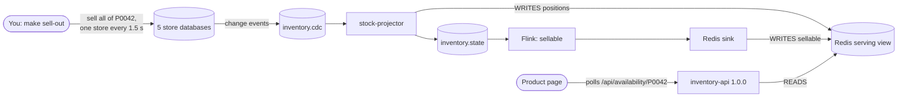

**Steps**

1. **Start from the baseline.** The seeded quantities for the Trailrunner GTX (P0042) are 2, 1, 3, 1, 2 across the five stores, 9 in total.

   ```sh
   make MODE=cloud STACK=hybrid reset
   ```

2. **Open the product page** at `http://<alb-dns-name>/#/product/P0042`. You should see "9 available online", the per-store breakdown, and a footer "Serving release 1.0.0". The page polls the availability API about once a second.

   

3. **Sell it out, one store at a time.** Keep the page visible while you run:

   ```sh
   make MODE=cloud STACK=hybrid sell-out PRODUCT=P0042 GAP=1.5
   ```

   The command sells each store's whole quantity in that store's own database, 1.5 s apart, and prints one line per store:

   ```text
   {"store": "S01", "sold": 2, "remaining_store": 0, "step": 1}
   {"store": "S02", "sold": 1, "remaining_store": 0, "step": 2}
   ...
   {"store": "S05", "sold": 2, "remaining_store": 0, "step": 5}
   ```

   On the page the number counts down 9, 7, 6, 3, 2 and ends at "Out of stock online". Because the restock layer is on, a "Back in stock in about N hours" line also appears; Lab 5 explains it.

   

   **What just happened.** Each `sell()` committed in one PostgreSQL database. Debezium published a change event to `inventory.cdc`; `stock-projector` applied it to Redis by revision and published the accepted state; Flink recomputed the sum for P0042; the Redis sink wrote it; the next poll from your browser read the new number. No component on that path asked a store database anything.

4. **See the change event arrive in Confluent Cloud.** Remember where it came from: the Debezium connector for each store runs on the self-managed Connect worker on the VM and writes straight into the Confluent Cloud cluster over TLS. There is no Kafka cluster on the VM and nothing is copied between clusters. In the Confluent Cloud Console, open Environments > `dd-demo-hybrid` > the cluster > Topics > `inventory.cdc` > Messages. Jump to the latest offset (or filter on `P0042`) and find the record for the last store the sell-out changed (S05, Firenze). In the Debezium envelope, the `after` object shows `store_id` `S05`, `product_id` `P0042`, `quantity` `0` and the new `revision`; `before` shows the previous quantity, and `source` names the database and the log position it was read from.

   [^img-lab1-03]

   Command-line alternative (optional, needs the `confluent` CLI from [3.2](#32-local-tools), logged in, with the environment and cluster selected and an API key that can read the topic): `confluent kafka topic consume inventory.cdc --from-beginning=false`. The values are Avro registered under a record-name strategy, so you need the CLI's Avro options to decode them; we have not verified the exact flags for this topic.

5. **Follow the whole path in Stream Lineage.** In the same environment, open Stream Lineage for `inventory.cdc`. You should see the Connect worker's client producing into `inventory.cdc`, `stock-projector` consuming it and producing `inventory.state`, the Flink `sellable` statement producing `stock.sellable`, and the Redis sink consuming it. Because the connectors are self-managed, they appear here as clients (by their API key or client ID), not as managed connector boxes.

   [^img-lab1-04]

6. **Open Control Center on the VM.** The `control-center` layer (part of `LAYERS=all` on the hybrid stack) runs Confluent Control Center (Legacy) 7.9 as a container on the VM. It is a UI only: it connects to your Confluent Cloud cluster and to the VM's self-managed Connect worker, adds no Kafka cluster and does not change the data path. Confluent documents this Control Center line as able to monitor Confluent Cloud, with some limitations, for example missing cluster-level metrics ([Confluent docs](https://docs.confluent.io/cloud/current/cp-component/c3-cloud-config.html)). Its value here is the connectors, which Confluent Cloud's console cannot show because they are self-managed: their status, tasks and configuration. It also lists the Confluent Cloud topics and their messages, which you have already seen in the Confluent Cloud console. Get its address:

   ```sh
   make MODE=cloud STACK=hybrid links
   ```

   ```text
   control-center: http://<vm-public-ip>:9021
   ```

   Port 9021 is open only to your own IP (the same address the build detected for the ALB). Open the URL, check that the Connect cluster lists `inventory-s01` … `inventory-s05` and `sellable-redis` as Running, open one Debezium connector to see its configuration (database, table, `pgoutput`, target topic), then open the topic `inventory.cdc` and look at its latest messages. If you built with a narrower layer list, add it with `make MODE=cloud STACK=hybrid layer-on L=control-center CONFIRM=yes`.

   > [!NOTE]
   > Control Center creates a few internal topics of its own in your Confluent Cloud cluster, and it runs under Confluent's 30-day trial licence. Both go away with the teardown.

   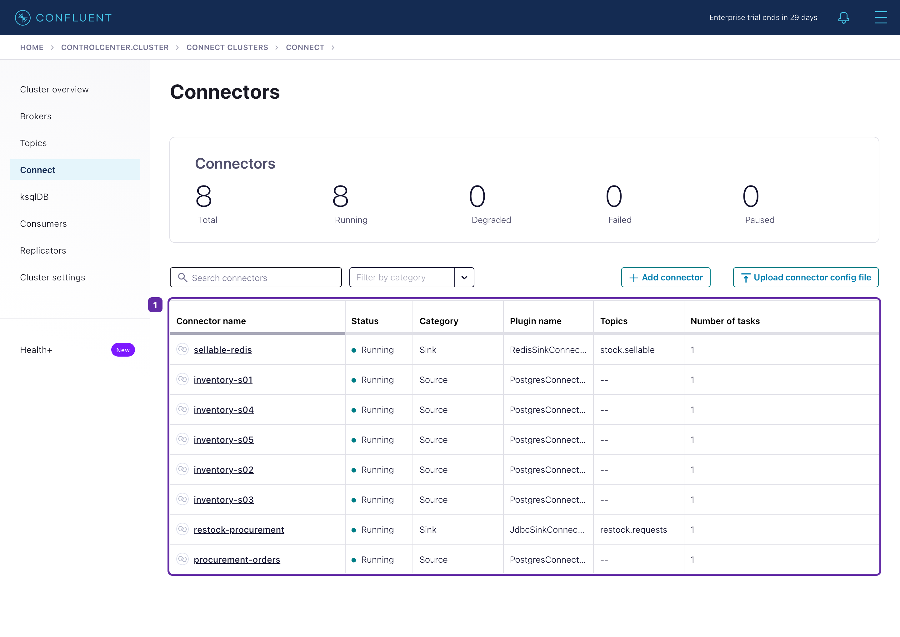[^img-lab1-05]

   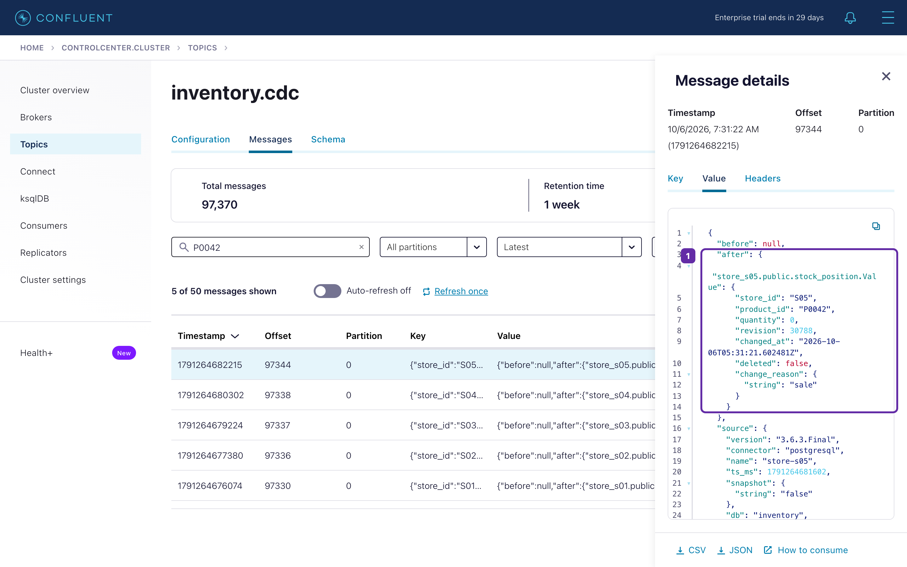[^img-lab1-06]


7. **Check the connectors from the command line.** The connectors are not on Confluent Cloud's managed Connectors page, so ask the Connect REST API on the VM:

   ```sh
   make MODE=cloud STACK=hybrid status
   ```

   The last section prints one status document per connector; every connector and task should be `RUNNING`.

   The Console, Stream Lineage and Control Center are views you look at when you choose to. The always-on, monitored proof of the same path is in Datadog: `stock.connect.task_running` for each connector (with a monitor per connector), and the probe and freshness metrics in the next step.

8. **Check freshness in Datadog.** Open the stock dashboard link printed by `make MODE=cloud STACK=hybrid links` ("UrbanStreet stock service [dd-demo-hybrid]"), keep the `env` template variable on `dd-demo-hybrid`, and scroll to the **Freshness** group. Look at:

   - `stock.probe.age per store`: one series per store, normally a few seconds. This is how far behind each store's probe is.
   - `stock.feed.state per store`: 1 means ok, 0 stale, -1 unknown.
   - `stock.freshness.apply_delay p95`: how long accepted changes took from the Source's `changed_at` to Redis.
   - `stock.sellable.age`: how far the Flink and Redis-sink path is behind the newest probe.

   [^img-lab1-07]

   For a single metric, use Metrics Explorer with `stock.probe.age{env:dd-demo-hybrid} by {store}`.

9. **Look at the stream in Data Streams Monitoring.** Open the DSM link from `make ... links` (Data Streams Monitoring > Map, environment `dd-demo-hybrid`). You should see `stock-projector` consuming `inventory.cdc` and producing `inventory.state`, and the storefront and offer-worker edges. Kafka Connect and Flink are not instrumented, so they appear only through their topics.

   [^img-lab1-08]

**Checkpoint.** `make MODE=cloud STACK=hybrid verify` prints `"mismatches": 0, "sellable_mismatches": 0`, `make MODE=cloud STACK=hybrid status` shows every connector `RUNNING`, and the Freshness group shows five probe-age series.

**Recap.** One number on the website comes from five independent databases through one change stream, and freshness is measured continuously with a probe rather than assumed. Lab 2 shows what the website does when that measurement says a store has gone quiet.

### Lab 2: Unknown is not zero

**Goal.** Stop one store's change stream and see the website say what it can vouch for, instead of a false zero or a false promise.

**What you'll learn**

- How the probe turns "no events" into a measurable stale feed.
- How the lookup service answers when one store cannot be vouched for.
- Which Datadog monitor fires, and for which store.

**Time.** 10 minutes.

**Architecture so far.** Layer [core](#21-layer-core). The path this lab exercises:

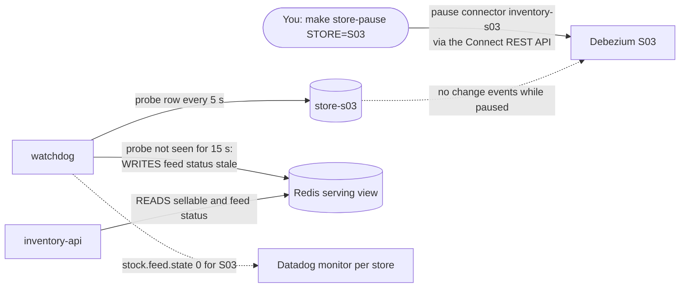

**Steps**

1. **Reset, then open** `http://<alb-dns-name>/#/product/P0042`. You should see "9 available online".

   ```sh
   make MODE=cloud STACK=hybrid reset
   ```

2. **Pause Bologna's (S03) change stream.** This pauses the Debezium connector for that store only; the store's database keeps working.

   ```sh
   make MODE=cloud STACK=hybrid store-pause STORE=S03
   ```

   ```text
   inventory-s03 pause 202
   ```

3. **Wait about 15 seconds** (the `stale_after_s` setting in the control panel) and look at the page. You should see "At least 9 available online", a note that some stores are not reporting live, and Bologna marked "(not live)" in the breakdown.

   

   **What just happened.** `watchdog` kept writing a probe row into store-s03, but no change event left the store, so the probe never reached Redis. After 15 s it marked S03's feed `stale`. The lookup service treats a store with a stale feed as unknown, so the total becomes a lower bound (`at_least: true`). Had the known sum been zero with a store unknown, the answer would be *unknown stock*, never "out of stock".

4. **Check the API answer directly** (from your machine; the ALB admits your IP):

   ```sh
   curl -s http://<alb-dns-name>/api/availability/P0042
   ```

   In the JSON, `at_least` is `true` and the S03 store entry shows a feed that is not `ok`.

5. **Find the store in Datadog.** On the stock dashboard, **Freshness** group: `stock.probe.age per store` climbs for S03 only, and `stock.feed.state per store` drops to 0 for S03 while S01, S02, S04 and S05 stay at 1. Within a minute or two, the monitor "[dd-demo-hybrid] stock.feed.state below 1 on store S03" (Monitors > Manage Monitors, search `stack:hybrid`) changes to Alert for that store only.

   [^img-lab2-02]

6. **Resume the store.**

   ```sh
   make MODE=cloud STACK=hybrid store-resume STORE=S03
   ```

   Debezium resumes from where it stopped (its position is kept in Connect's offsets topic), the probe catches up, and the page returns to "9 available online" within seconds.

**Checkpoint.** After the resume, `make MODE=cloud STACK=hybrid verify` prints zero mismatches and all five `stock.feed.state` series are back at 1.

**Recap.** Missing information is treated as unknown, per store, and the website shows only what it can vouch for. The same probe that protects the shopper tells operations exactly which feed stopped. Next, a problem that has nothing to do with the stream.

### Lab 3: The incident, a release ships without a gate

**Goal.** Route all stock lookups to a regressed release, see the shop slow down, and use Datadog to show that the cause is inside the release, not the stream.

**What you'll learn**

- How unified service tags (`env`, `service`, `version`) let APM compare releases.
- How a trace shows where time goes inside one request.
- How to rule out the pipeline with freshness and DSM before blaming Kafka.

**Time.** 20 minutes.

**Architecture so far.** Layer [releases](#22-layer-releases). The path this lab exercises:

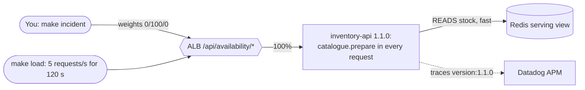

**Steps**

1. **Check that routing commands work from your machine.** They call the AWS API, so they need a valid `aws login` session.

   ```sh
   make MODE=cloud STACK=hybrid route-check
   ```

   If this fails, run `aws login --profile dd-demo` and try again.

2. **Reset, then ship the regressed release to everyone.**

   ```sh
   make MODE=cloud STACK=hybrid reset
   make MODE=cloud STACK=hybrid incident
   make MODE=cloud STACK=hybrid route-show
   ```

   ```text
   alb-routing: weights 1.0.0/1.1.0/1.2.0 = 0 100 0%
   alb-routing: live weights 1.0.0/1.1.0/1.2.0 = 0 100 0%
   current=0 100 0 previous=100 0 0
   ```

3. **Open the product page.** The shop still answers and the number is still right, but each update takes visibly longer, and the footer says "Serving release 1.1.0". On our test run (2026-10-04) the browser saw lookups of roughly 50–90 ms on 1.0.0 and above one second on 1.1.0 under load; yours will differ.

   

4. **Generate steady load** so Datadog has enough samples. Leave it running (2 minutes):

   ```sh
   make MODE=cloud STACK=hybrid load LOAD_DURATION=120 LOAD_RPS=5
   ```

   The banner still mentions nginx; in this topology the load goes through the ALB. The tool prints one JSON line per 10 s window with counts per `X-Release` header, then a summary that it saves for Lab 4.

5. **Compare releases in APM.** In Datadog, open APM > Software Catalog (or Services) > `inventory-api`, set the environment to `dd-demo-hybrid` and the time range to the past 15 minutes, operation `flask.request`. In the latency chart, break down or filter by version and compare `1.0.0` with `1.1.0`. Then open the **Deployments** section, which lists each version with its p95 latency and error rate.

   [^img-lab3-02]

6. **Open one slow trace.** From the service page, open Traces filtered to `version:1.1.0` and pick a slow request. The flame graph shows a `catalogue.prepare` span taking most of the request, and a short `stock.read` span (the Redis reads, a few milliseconds). Open the **Logs** tab of the trace to see the log lines of that same request, linked through `dd.trace_id`.

   [^img-lab3-03]

   **What just happened.** Release 1.1.0 opens, parses and indexes a product catalogue inside every request to add product details. The work is CPU-bound and repeated per request, so latency grows with load. The data path is untouched: the Redis read is still fast.

7. **Rule out the stream.** On the stock dashboard, the **Freshness** group is unchanged (probe age a few seconds per store) and the **Service objective** group shows `inventory-api p95 latency by version` rising only for 1.1.0. The DSM map shows the same healthy edges as in Lab 1. The monitor "[dd-demo-hybrid] inventory-api p95 latency above 0.2s on 1.1.0" goes to Alert after its evaluation window.

   [^img-lab3-04]

**Checkpoint.** `route-show` reads `0 100 0`, the APM Deployments table shows a much higher p95 for 1.1.0 than for 1.0.0, and the Freshness group shows no change.

**Recap.** Version tags turned "the website is slow" into "release 1.1.0 spends its time preparing a catalogue in every request", and the freshness and DSM views showed the stream was not the cause. Do not reset: Lab 4 starts from this state.

### Lab 4: Canary the fix

**Goal.** Move traffic from the regressed release to the fix in gated steps, prove each step with data, and know how to back out.

**What you'll learn**

- How ALB weighted target groups implement a canary traffic split.
- How to gate each step on sample count, error rate, p95 latency and data correctness.
- The difference between `rollback` (previous split) and `route-baseline` (healthy release).

**Time.** 25 minutes.

**Architecture so far.** Layer [releases](#22-layer-releases). The path this lab exercises:

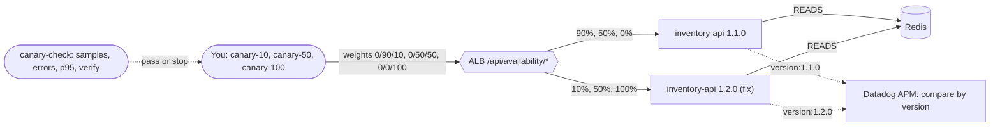

A weight is a target proportion, not an exact split: over a few hundred requests the observed share will be close to, not equal to, the weight. That is why each step is gated on what actually happened, read from the `X-Release` header of every response.

**Steps**

1. **Send 10% to the fix**, read the routing back, generate load, verify the data and run the gate:

   ```sh
   make MODE=cloud STACK=hybrid canary-10
   make MODE=cloud STACK=hybrid route-show
   make MODE=cloud STACK=hybrid load LOAD_DURATION=120 LOAD_RPS=5
   make MODE=cloud STACK=hybrid verify
   make MODE=cloud STACK=hybrid canary-check
   ```

   `canary-check` reads the last load summary and the last verify result. By default it requires at least 100 samples per release, an error rate of 0, a p95 for 1.2.0 within 200 ms, and a passing verify file; it exits non-zero on any failure and says which gate failed. At 10% and 5 requests/s for 120 s you get roughly 60 samples of 1.2.0, so the default sample gate can fail; pass a lower minimum explicitly if you accept that:

   ```sh
   make MODE=cloud STACK=hybrid canary-check CHECK_ARGS="--release-a 1.1.0 --release-b 1.2.0 --min-samples 30 --verify-file /out/verify.json"
   ```

   On our test run on 2026-10-04 the 10% step passed with 600/600 requests answered, 75 samples of 1.2.0, a 1.2.0 p95 of 23.09 ms and no errors, using a 30-sample minimum.

   

2. **Compare the versions in APM** while the canary runs. On the `inventory-api` service page (environment `dd-demo-hybrid`, past 15 minutes), the Deployments section shows 1.1.0 and 1.2.0 side by side; 1.2.0's p95 is in the same range as 1.0.0 was.

   [^img-lab4-02]

3. **Go to 50%** only if the 10% gate passed, then repeat the same four checks:

   ```sh
   make MODE=cloud STACK=hybrid canary-50
   make MODE=cloud STACK=hybrid route-show
   make MODE=cloud STACK=hybrid load LOAD_DURATION=120 LOAD_RPS=5
   make MODE=cloud STACK=hybrid verify
   make MODE=cloud STACK=hybrid canary-check
   ```

4. **Practise backing out.** `rollback` restores the previous split recorded in `.state/routing-hybrid` (here 0/90/10), not necessarily the healthy release:

   ```sh
   make MODE=cloud STACK=hybrid rollback
   make MODE=cloud STACK=hybrid route-show
   ```

   Then go forward again with `canary-50`. In a real emergency, `route-baseline` sends everything back to 1.0.0 (100/0/0). Both change only routing: no image, data or Kafka offset is touched.

5. **Finish the rollout.** At 100% there is no 1.1.0 traffic left, so the gate checks only 1.2.0:

   ```sh
   make MODE=cloud STACK=hybrid canary-100
   make MODE=cloud STACK=hybrid route-show
   make MODE=cloud STACK=hybrid load LOAD_DURATION=120 LOAD_RPS=5
   make MODE=cloud STACK=hybrid verify
   make MODE=cloud STACK=hybrid canary-check CHECK_ARGS="--release-b 1.2.0 --verify-file /out/verify.json"
   ```

   **What just happened.** The ALB listener rule for `/api/availability/*` forwarded to three target groups with the weights you set; each target group is a separate Fargate service. Datadog compared the releases because every span carried its `version` tag. Each `load` overwrites the summary that `canary-check` reads, so never promote on an old summary.

**Checkpoint.** `route-show` reads `0 0 100` and the final `canary-check` exits 0.

**Recap.** The fix reached all traffic in three gated steps, with a tested way back at each step. When you are done with this lab, `make MODE=cloud STACK=hybrid reset` returns routing to 100/0/0.

### Lab 5: Restock that learns

**Goal.** See a sold-out product trigger restock requests automatically, become purchase orders, and come back in stock when the supplier delivers.

**What you'll learn**

- How Flink combines stock on hand, demand rate, lead time and stock on order into a reorder decision.
- How a sink connector and a second CDC connector close the loop with a procurement database.
- How the demo clock and the control panel let you compress days into minutes.

**Time.** 15 minutes.

**Architecture so far.** Layer [restock](#23-layer-restock). The path this lab exercises:

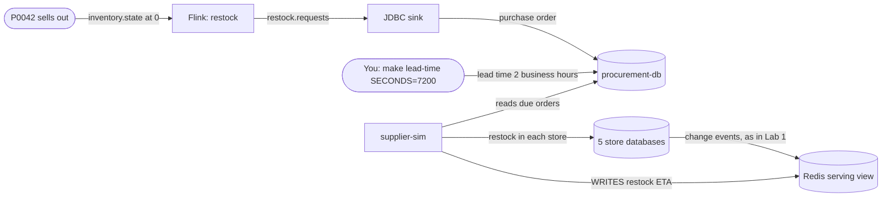

**Steps**

1. **Reset and sell out P0042.**

   ```sh
   make MODE=cloud STACK=hybrid reset
   make MODE=cloud STACK=hybrid sell-out PRODUCT=P0042 GAP=1.5
   ```

2. **Watch the ETA appear.** Within a few seconds the page shows "Out of stock online" with "Back in stock in about N hours" and the note "demo clock: 1 min = 1 h". The default supplier lead time is 48 business hours, drawn per order with jitter, so N is around 30–50.

   

   **What just happened.** For each store, Flink saw an inventory position (0 on hand, 0 on order) at or below the reorder point and emitted a restock request. The JDBC sink upserted each one into `purchase_order` in the procurement database. Debezium streamed the new orders to `procurement.orders`, so Flink now counts them as on order and will not request again. `supplier-sim` drew a lead time for each order and wrote the earliest due time to Redis, which the page turns into the ETA.

3. **Open the control panel** (URL from `make MODE=cloud STACK=hybrid control`, user `demo`) and look at the restock parameters: supplier lead time, lead time jitter, safety factor, coverage after delivery, minimum order quantity, demand window, and the demo clock (`time_compression`, 60 by default). Every change you save is also sent to Datadog as an event.

   [^img-lab5-03]

4. **Shorten the supplier lead time to 2 business hours** (2 real minutes at the default demo clock). You can do it in the panel or from the terminal:

   ```sh
   make MODE=cloud STACK=hybrid lead-time SECONDS=7200
   ```

   ```text
   lead time set to 7200 s (applies to every open purchase order within a second)
   ```

   A change of the base lead time rescales every open order, keeping each order's own jitter.

5. **Watch the delivery.** About two minutes later the supplier delivers each store's order by calling `restock()` in that store's database. Those deliveries are ordinary change events, so the page goes back to "N available online". The quantity depends on the demand Flink has learned from background sales and on the coverage setting; on our test run it came back with 91 units.

   

6. **See it in Datadog.** On the stock dashboard, the **Restock** group shows `restock.orders.open` rising after the sell-out and falling at delivery, `restock.orders.delivered by store`, `restock.lead_time`, and the "Demo config changes" event for your lead-time change overlaid on the chart.

   [^img-lab5-04]

7. **Optional: look at the Flink statements.** In the Confluent Cloud Console, open the environment's Flink section and list the statements named `dd-demo-hybrid-*`. The `-0` statements create the output tables; the `-1` statements are the long-running inserts (`sellable-1`, `demand-1`, `procurement-1`, `restock-1`, `offers-1`).

**Checkpoint.** The page shows P0042 available again and `make MODE=cloud STACK=hybrid verify` prints zero mismatches.

**Recap.** The stream drove a replenishment decision without a batch job, the operator kept explicit control of its parameters, and every order state was observable. The demo clock is illustrative: the restock numbers are a simulation, not a forecast.

### Lab 6: Offers with a safe default

**Goal.** When a product in a shopper's cart sells out, offer an eligible alternative, let an AI service choose only when it is confident, and see exactly why each offer was made.

**What you'll learn**

- How Flink detects a cart at risk from two streams.
- How a confidence threshold, a kill switch and a rule default keep the AI optional.
- How LLM Observability shows the input and output of each AI call next to the APM trace.

**Time.** 20 minutes.

**Architecture so far.** Layer [offers](#24-layer-offers). The path this lab exercises:

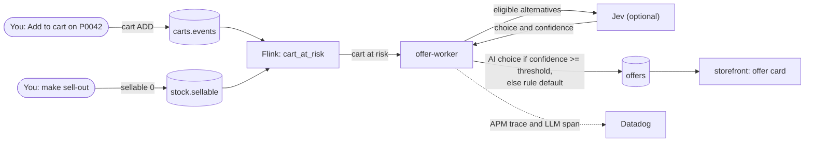

> [!NOTE]
> Without a Jev key every offer takes the rule default with reason `disabled`, and there is no AI call to show in LLM Observability. The rest of the lab works the same way.

**Steps**

1. **Reset, open** `http://<alb-dns-name>/#/product/P0042` **and click "Add to cart".** The cart badge shows 1. Your browser now has an active cart holding P0042, and the storefront has published a cart `ADD` event.

   ```sh
   make MODE=cloud STACK=hybrid reset
   ```

2. **Sell it out** and keep the page visible:

   ```sh
   make MODE=cloud STACK=hybrid sell-out PRODUCT=P0042 GAP=1.5
   ```

   About 8–10 seconds after the last store sells out (8.4–10.4 s on three of our runs), an offer card appears under the product. With the default threshold of 0.8 it is usually the rule default: an eligible alternative from the same category and size at 10% off.

   

   **What just happened.** Flink joined your cart (from `carts.events`) with `stock.sellable = 0` and emitted a cart at risk. `offer-worker` built the eligible alternatives from Redis stock and the catalogue, asked Jev to choose one, compared the confidence with 0.8, re-checked the chosen product's stock, wrote the text from a template and published the offer. The storefront consumed it and served it at `/api/offers`.

3. **See why in LLM Observability.** In Datadog, open LLM Observability > Traces and search `@ml_app:urbanstreet-offers` (the path is `/llm/traces?query=%40ml_app%3Aurbanstreet-offers`). Open the latest trace and its `offer.jev.call` span: the input shows the state, instructions and the eligible alternatives as `criteria`; the output shows the `choice`, its `confidence` and the probabilities. Search by the application name rather than using the application picker, which may default to another application in your organisation.

   [^img-lab6-02]

   [^img-lab6-03]

   The same request in APM (service `offer-worker`, span `offer.process` with child `offer.jev.call`) has linked logs that state the decision, for example route `RULE_DEFAULT` with reason `low_confidence`.

4. **Lower the threshold, live.** In the control panel set `jev_min_confidence` to `0.7` and save. Then reset, reload the product page, add P0042 to the cart again, and sell out again:

   ```sh
   make MODE=cloud STACK=hybrid reset
   make MODE=cloud STACK=hybrid sell-out PRODUCT=P0042 GAP=1.5
   ```

   Now the AI choice is likely to be accepted, not guaranteed: on our test run on 2026-10-05, six observations at 0.7 had confidences from 0.53 to 0.82, and five of the six were accepted. An accepted "notify me" choice shows "Trailrunner GTX just sold out" and "We will let you know as soon as it is back in stock."

   The reset is needed because it expires carts from the previous scenario, so each sell-out produces exactly one offer for the current one.

5. **Use the kill switch.** In the control panel set `offers_kill_switch` to `1`, then repeat the reset, add-to-cart and sell-out. The offer is the rule default with reason `kill_switch`, and no Jev call is made. On the stock dashboard, the **Offers** group shows `offer.decision by route and reason` with each of your runs.

   [^img-lab6-04]

6. **Restore the defaults:** `jev_min_confidence` back to `0.8`, `offers_kill_switch` back to `0`, then `make MODE=cloud STACK=hybrid reset`.

**Checkpoint.** You have seen at least one offer card, and `offer.decision` shows at least two different reasons (for example `low_confidence` and `kill_switch`, or `disabled` without a Jev key).

**Recap.** The AI is an extension, not a dependency: policy defines what may be offered, the rule default always has an answer, and the trace plus the LLM span show why each offer was made. An offer is an offer; nothing here proves a saved sale.

### Lab 7: Datadog on top of the whole solution

**Goal.** Step back from the individual incidents and use Datadog as the operating layer across the VM, Confluent Cloud and AWS.

**What you'll learn**

- What the AWS and Confluent integrations add to the application telemetry.
- How Synthetics tests the shop from outside, and how to check RUM on your run.
- How the stack's cost is estimated live and billed later.

**Time.** 20 minutes.

**Architecture so far.** [Datadog across every layer](#25-datadog-across-every-layer).

**Steps**

1. **Read back the stack.**

   ```sh
   make MODE=cloud STACK=hybrid status
   make MODE=cloud STACK=hybrid route-show
   ```

   `status` lists the VM containers, the current routing, the layers (all ON) and every connector's status from the Connect REST API (six core connectors plus `restock-procurement` and `procurement-orders`). This is the connector view; DSM does not replace it.

2. **AWS-native online dashboard.** Open "UrbanStreet AWS-native online [dd-demo-hybrid]" (link from `make ... links`). It shows Fargate CPU and memory by service and version, ECS service CPU, ElastiCache memory and engine CPU, ALB unhealthy targets and consumed LCUs, next to `inventory-api` p95 by version. If you ran Lab 3, the CPU of the 1.1.0 service during the incident is visible here.

   [^img-lab7-01]

3. **Confluent Cloud integration.** On the stock dashboard, **Pipeline** group, the widget "Confluent Cloud consumer lag (offsets) by group" comes from the Confluent integration enabled by the `dd-streams` layer. Lag near zero for `stock-projector` and `connect-sellable-redis` matches what the freshness probe told you.

   [^img-lab7-02]

4. **Synthetics.** Open Synthetic Monitoring > Tests and search `dd-demo-hybrid`. Two tests run from the Datadog-managed location `aws:eu-central-1` against your ALB: an API test of `GET /api/availability/P0042` every 60 s (status 200, response under 800 ms, a known status in the body), and a browser test of `/#/product/P0042` every 300 s that checks the page shows the online availability text.

   [^img-lab7-03]

5. **Monitors.** Open Monitors > Manage Monitors and search `tag:project:dd-demo tag:stack:hybrid`. You will find the freshness monitors (probe age, probe no-data, feed state, sellable age), connector task monitors, the VM Agent monitor, the p95-by-version monitor, the restock monitors and the AWS-side monitors (ElastiCache memory, ALB unhealthy targets, cost sampling, Fargate Agent check). On our test run there were 16 monitors with this tag. A monitor in "No Data" is not healthy; it means the signal is missing, which is itself worth investigating.

6. **Cost.** Open the account cost dashboard (link from `make ... links`) with the `stack` variable set to `hybrid`. The `cost-meter` service estimates the hourly cost of EC2, EBS, public IPv4, Fargate, ALB and ElastiCache from list prices, and reads Confluent usage and billed amounts; billed AWS cost arrives later through the Cost and Usage Report into Cloud Cost Management (typically 48–72 hours after the first complete report).

   [^img-lab7-04]

7. **Verify RUM on your run.** RUM is wired but not yet verified on the current build, so check it rather than assume it:

   ```sh
   curl -s http://<alb-dns-name>/config
   ```

   The JSON should contain a `rum` block with an application ID and client token (the client token is public by design). Then browse the shop for a minute and open Digital Experience > RUM > Sessions for the application `dd-demo-hybrid-shop`. If a session appears, RUM works on your run; if not, see Troubleshooting.

   [^img-lab7-05]

**Checkpoint.** `status` shows all eight connectors RUNNING, both Synthetics tests have recent passing results, and the cost dashboard shows a current USD-per-hour value for `hybrid`.

**Recap.** APM localised the slow request, freshness and DSM tested the data path, version tags validated the canary, the integrations added the platform view, and monitors made missing telemetry visible. Next: tear it all down.

---

## 7. Troubleshooting

When a step fails, read the last lines before the failure; every script names the step, the command and, where it can, the fix. Logs of the lifecycle commands are under `.state/logs/` (mode 600; they can contain operational details, so do not share them publicly).

| Symptom | Likely cause | Check | Fix |
|---|---|---|---|
| `AWS login session unavailable; run: aws login --profile dd-demo` | Your `aws login` session expired | `aws sts get-caller-identity --profile dd-demo` | `aws login --profile dd-demo`, then rerun the command. Routing commands (`incident`, `canary-*`, `rollback`, `reset`) also need it: run `route-check` before Labs 3 and 4 |
| Preflight: `MISSING docker compose plugin` or `buildx` | The Docker CLI cannot find its plugins | `docker compose version`, `docker buildx version` | Install the plugins; with Homebrew, add the plugin directory to `cliPluginsExtraDirs` in `~/.docker/config.json` |
| Preflight: `MISSING ~/.ssh/id_ed25519.pub` | No Ed25519 key | `ls ~/.ssh` | `ssh-keygen -t ed25519`, or set `TF_VAR_ssh_public_key_path` |
| `calibration selection failed` before anything runs | A performance profile for the chosen VM or Fargate size is missing | `make MODE=cloud STACK=hybrid calibration-check` | Use the defaults (`t4g.xlarge`, `FARGATE_SIZE=2048-4096`) |
| `terraform account` fails with an import error such as "Cannot import non-existent remote object" | The account module contains `import` blocks for objects that exist only in the original authors' organisation | `terraform/account/imports.tf` | Remove the `import` blocks from that file for a new organisation, then rerun |
| `terraform account` fails creating the Datadog AWS integration | Your Datadog organisation already integrates this AWS account | Datadog Integrations > AWS | Use an AWS account not yet integrated, or remove the existing integration if it is yours to remove |
| `terraform cloud` prints `This server does not host this topic-partition` | A transient Confluent Cloud error right after topic creation | The log shows `retrying terraform/cloud with a fresh plan (attempt n/3)` | Nothing; the script retries up to three times |
| `readiness timeout after 300s for table/topic: <topic> (missing subject <table>-value)` | An input topic never received its first record, so Flink cannot infer the table | Connect status (`make MODE=cloud STACK=hybrid status`), background sales running | Fix the producer (usually a connector), then rerun `stack-up`; existing Flink statements are not recreated |
| You changed a table definition in `flink/*.sql` and nothing changed | Output tables use `CREATE TABLE IF NOT EXISTS`, so an existing table is left as it is | Flink > Statements, `SHOW CREATE TABLE` | Evolve the schema compatibly, or tear the stack down and build it again |
| `after 5 minutes only N sellable:P* keys in Redis (expected 200)` | The Flink `sellable` statement or the `sellable-redis` connector is not running | Flink statement `dd-demo-hybrid-sellable-1`; `make ... status` | Fix the failing piece, then rerun `stack-up` |
| `ECS service ... did not reach steady state` | A task keeps failing to start (image, secret or health check) | AWS console > ECS > cluster `dd-demo-hybrid` > service > Events and stopped tasks | Fix the cause shown there, then rerun `stack-up` |
| The shop or control panel does not load from your browser | Your public IP changed since the build; the ALB admits only the IP detected at build time | `curl -s https://checkip.amazonaws.com` | Set `PRESENTER_CIDR=<new ip>/32` in `./.env` and rerun `stack-up` (re-applies the security groups; not measured) |
| `route-show` shows a split you did not expect | Someone changed the ALB rule; `route-show` reads the live rule first | `make MODE=cloud STACK=hybrid route-check` | Set the split you want with `route-baseline`, `incident` or `canary-*`. Terraform no longer resets the weights on later applies |
| `canary-check` fails on samples at 10% | Too few 1.2.0 responses: a weight is a proportion, not an exact split | The `samples` per release in the load summary | Run a longer `load`, or pass `--min-samples` explicitly (Lab 4) |
| `smoke` fails on the product page or API with a feed not ok | A store is paused (Lab 2) or a connector is down | `make MODE=cloud STACK=hybrid status` | `make MODE=cloud STACK=hybrid store-resume STORE=S0n`, or restart the failed connector, then `reset` |
| Lab 6 offers are always `RULE_DEFAULT` with reason `disabled`, although you added a Jev key | The key was added after `stack-up`, so it never reached the offer-worker | Control panel, Offers group in Datadog | `make MODE=cloud STACK=hybrid layer-on L=offers CONFIRM=yes` (syncs the key to SSM and redeploys the worker; billed) |
| No offer appears after the sell-out | The cart is from a previous scenario, or no cart was added after the last reset | Cart badge on the page | `reset`, reload, Add to cart, sell out again |
| LLM Observability shows another application | The application picker defaulted to something else in your organisation | The query field | Search `@ml_app:urbanstreet-offers` directly |
| No data in Datadog charts for the first minutes | Telemetry needs a few minutes to arrive and fill a 15-minute window | Metrics Explorer `stock.probe.age{env:dd-demo-hybrid}` | Wait 10–15 minutes with `sales-on` running |
| No RUM session | Unverified path on the current build | `curl -s http://<alb-dns-name>/config` has a `rum` block | If the block is missing, check that `dd-rum` is in the stack's layers (`stack-status`) and rerun `stack-up` |
| Some ElastiCache or host widgets on the stock dashboard are empty | Unverified on the current build | Metrics Explorer for the widget's metric | Use the AWS-native online dashboard for ElastiCache, which comes from the AWS integration |
| `stack-down` used to stop at Schema Registry subjects with HTTP 403 | The stack's service accounts are deliberately not allowed to delete subjects | Log of `stack-down` | Already handled: the script detaches the schema resources from Terraform state and the subjects are removed with the Confluent environment |
| `terraform datadog destroy FAILED` during teardown | A Datadog object could not be deleted | The warning names the command | No hourly cost; clean up later with the command the warning prints |

> [!TIP]
> If a step fails twice, stop and read before trying a third time. Re-running provisioning blindly is the most expensive way to debug.

---

## 8. Teardown and proof that nothing billable remains

> [!WARNING]
> `stack-down` destroys everything in the `hybrid` stack: Datadog objects, the AWS online side (ECR images included), the VM with its volumes, and the Confluent environment with all topics. Data is synthetic and the stack can be rebuilt, but the build takes about 36 minutes.

1. **Destroy the stack.** The script shows each Terraform destroy plan; with `CONFIRM=yes` it proceeds without asking.

   ```sh
   make MODE=cloud STACK=hybrid stack-down CONFIRM=yes
   ```

   It stops the VM services, destroys `terraform/datadog`, deletes the ECR repositories and destroys `terraform/aws`, then `terraform/vm`, then `terraform/cloud`, removes the Docker context and the VM's SSH host key, and deletes the stack's generated files. It ends with a leftover check:

   ```text
   == leftover check: every AWS resource tagged project=dd-demo (all stacks; other running stacks show up here too)
   <only account-wide resources, tagged stack=account>
      no dd-demo-* Confluent environment
   == stack hybrid destroyed in <seconds> s
   ```

   The Confluent part of the check needs the `confluent` CLI, logged in; otherwise it tells you to check the console.

   [^img-teardown-01]

2. **Check that the secrets the build stored in SSM are gone.** `stack-down` deletes every parameter under `/dd-demo/hybrid` after the AWS destroy and prints how many it removed (names only). Confirm it; the command should print nothing:

   ```sh
   aws ssm get-parameters-by-path --path /dd-demo/hybrid --recursive --profile dd-demo --region eu-west-1 --query 'Parameters[].Name' --output text
   ```

3. **Prove that nothing billable remains in AWS** (all read-only). Each command should return nothing for the stack:

   ```sh
   aws ec2 describe-instances --profile dd-demo --region eu-west-1 --filters Name=tag:project,Values=dd-demo Name=instance-state-name,Values=pending,running,stopping,stopped --query 'Reservations[].Instances[].InstanceId' --output text
   aws ecs list-clusters --profile dd-demo --region eu-west-1 --output text
   aws elbv2 describe-load-balancers --profile dd-demo --region eu-west-1 --query 'LoadBalancers[?starts_with(LoadBalancerName, `dd-demo`)].LoadBalancerName' --output text
   aws elasticache describe-cache-clusters --profile dd-demo --region eu-west-1 --query 'CacheClusters[?starts_with(CacheClusterId, `dd-demo`)].CacheClusterId' --output text
   aws ec2 describe-volumes --profile dd-demo --region eu-west-1 --filters Name=tag:project,Values=dd-demo --query 'Volumes[].VolumeId' --output text
   aws resourcegroupstaggingapi get-resources --profile dd-demo --region eu-west-1 --tag-filters Key=stack,Values=hybrid --query 'ResourceTagMappingList[].ResourceARN' --output text
   ```

   `list-clusters` lists all ECS clusters in the region; check that none is named `dd-demo-hybrid`.

4. **Prove that nothing billable remains in Confluent Cloud:**

   ```sh
   confluent environment list
   ```

   There should be no `dd-demo-hybrid` environment. In the console, also check that no Flink compute pool or cluster remains under any `dd-demo-*` environment. Remember that billing lags: the console may show charges for up to 72 hours after deletion, and the last partial hour is billed as a full hour.

5. **Datadog.** Search Monitors and Synthetic tests for `stack:hybrid` and Dashboards for `dd-demo-hybrid`: all should be gone. These have no hourly cost, but a forgotten Synthetics test would keep running against a dead URL.

6. **Account-wide pieces (only when you no longer want cost history).** `stack-up` also created account-wide resources that are kept across stacks: the Cost and Usage Report export and its S3 bucket, the Datadog AWS integration and its IAM role, a read-only Confluent service account with its API key and the Datadog Confluent integration, and the account cost dashboard. They have no hourly cost. To remove them:

   ```sh
   make MODE=cloud STACK=account account-down CONFIRM=yes ACCOUNT_DOWN_DESTROY=yes
   ```

   `ACCOUNT_DOWN_DESTROY=yes` is a deliberate second switch: only with it does the script temporarily lift Terraform's `prevent_destroy` protection on the account resources and allow the report bucket to be emptied, after you review the plan. Without it, nothing account-wide is deleted. Not yet tested end to end.

7. **Clean up credentials.** Delete the Confluent Cloud API key and the Datadog application key you created for this workshop if you do not need them, and the local files `./.env`, `./.env.secrets` and `./.env.cloud-hybrid` if they still exist.

**Checkpoint.** Every command in steps 3 and 4 returns nothing for `hybrid`, and the SSM path is empty.

---

## 9. Recap and further reading

You streamed changes out of five unchanged store databases, built a serving view that never asks the Sources and never shows unknown as zero, and proved with a probe that it stays fresh. You then broke the website with a release, used version-tagged traces to find the cause in seconds, and rolled out the fix as a gated canary with a tested way back. Two optional layers showed the same stream driving restocking and governed AI offers, each observable end to end.

| Question | Datadog view that answered it | Lab |
|---|---|---|
| Is the stock on the website current? | Freshness group: probe age, feed state, apply delay, sellable age | 1, 2 |
| Which store stopped reporting? | `stock.feed.state` by store, per-store monitor | 2 |
| Is the slowness in the release or in the stream? | APM latency by version, trace with `catalogue.prepare`, freshness and DSM unchanged | 3 |
| Is the fix safe to roll out further? | APM Deployments by version, plus `canary-check` gates | 4 |
| Are restock orders flowing? | Restock group, config-change events, restock monitors | 5 |
| Why did the shopper get this offer? | LLM Observability span input and output, `offer.decision` by reason | 6 |
| Is the platform underneath healthy, and what does it cost? | AWS-native dashboard, Confluent consumer lag, Synthetics, monitors, cost dashboard | 7 |

**Further reading (official documentation)**

- Debezium: [PostgreSQL connector](https://debezium.io/documentation/reference/stable/connectors/postgresql.html)
- Confluent Cloud: [Apache Flink in Confluent Cloud](https://docs.confluent.io/cloud/current/flink/overview.html), [Schema Registry](https://docs.confluent.io/cloud/current/sr/index.html), [billing](https://docs.confluent.io/cloud/current/billing/overview.html)
- Datadog APM: [tracing](https://docs.datadoghq.com/tracing/), [unified service tagging](https://docs.datadoghq.com/getting_started/tagging/unified_service_tagging/), [deployment tracking](https://docs.datadoghq.com/tracing/services/deployment_tracking/), [connecting Python logs and traces](https://docs.datadoghq.com/tracing/other_telemetry/connect_logs_and_traces/python/)
- Datadog [Data Streams Monitoring](https://docs.datadoghq.com/data_streams/)
- Datadog [LLM Observability](https://docs.datadoghq.com/llm_observability/)
- Datadog [Amazon ECS on AWS Fargate, including log collection with FireLens](https://docs.datadoghq.com/integrations/ecs_fargate/)
- Datadog integrations: [AWS](https://docs.datadoghq.com/integrations/amazon_web_services/), [Confluent Cloud](https://docs.datadoghq.com/integrations/confluent_cloud/)
- Datadog [Synthetic Monitoring](https://docs.datadoghq.com/synthetics/), [RUM](https://docs.datadoghq.com/real_user_monitoring/), [Cloud Cost Management for AWS](https://docs.datadoghq.com/cloud_cost_management/setup/aws/), [API and application keys](https://docs.datadoghq.com/account_management/api-app-keys/)
- AWS: [Application Load Balancer listeners and weighted forward actions](https://docs.aws.amazon.com/elasticloadbalancing/latest/application/load-balancer-listeners.html), [Fargate pricing](https://aws.amazon.com/fargate/pricing/), [ElastiCache pricing](https://aws.amazon.com/elasticache/pricing/)

---

## 10. Appendix: glossary and command reference

### Glossary

| Term | Meaning in this workshop |
|---|---|
| Sources | The five store PostgreSQL databases, one per store, standing in for the retailer's existing store systems |
| Change event | The record that one stock position changed at a Source, with its new quantity and revision |
| Change stream | The ordered sequence of change events; every consumer reads it independently |
| Revision | The ever-increasing number a Source gives a stock position on each change; a newer revision always wins |
| Stock position | The quantity of one product at one store |
| Serving view | The copy of stock positions the website reads (ElastiCache Redis), kept current from the change stream and rebuildable from it; it never asks the Sources |
| Sellable stock | The quantity the online shop can sell: the sum of a product's stock positions across all stores |
| Freshness | How long a stock change takes from the Source to the serving view |
| Probe | A synthetic stock position changed on a schedule, so a stopped feed shows up even when nothing sells |
| Unknown stock | The answer when the serving view cannot vouch for a position; never shown as zero or available |
| Release | One deployed build of the stock lookup service, identified by its version (1.0.0, 1.1.0, 1.2.0) |
| Canary | Rolling a new release out to a small share of traffic beside the old one and comparing the two by version |
| Restock request | The automatic request a store raises when its inventory position falls to the reorder point |
| Purchase order | A restock request accepted by the procurement system, open until the goods arrive |
| Demand rate | Units of one product one store sells per hour, learned from recent sales |
| Inventory position | Stock on hand plus stock on order |
| Reorder point | Demand rate × expected supplier lead time × safety factor |
| Cart at risk | An active cart holding a product whose sellable stock has just reached zero |
| Eligible alternative | An in-stock product of the same category and size, priced within the agreed band |
| Rule default | The offer policy picks on its own when the AI choice is missing, unsure, invalid, late or switched off |
| Layer | A part of the demo you can switch on or off on its own: core, releases, restock, offers, dd-streams, dd-synthetics, dd-rum |
| Stack | One complete, isolated deployment with its own Confluent environment, VM, AWS services and Datadog `env` |

### Make targets used in this guide

All targets take `MODE=cloud STACK=hybrid`; `make help` lists every target.

| Target | What it does |
|---|---|
| `stack-preflight` | Read-only checks of tools, credentials, AWS sign-in and Terraform |
| `stack-up LAYERS=all CONFIRM=yes` | Builds the whole stack (billed) |
| `stack-status` | Shop and control URLs, dashboards, ECS cluster, Confluent IDs |
| `stack-down CONFIRM=yes` | Destroys the stack and runs a leftover check |
| `links` | Datadog dashboard, APM and DSM links for the stack |
| `control` | Control panel URL and where the password is |
| `reset`, `verify`, `smoke` | Baseline data and 100/0/0 routing; Sources vs Redis; end-to-end smoke |
| `sales-on`, `sales-off` | Background sales in all five stores (never P0042) |
| `sell-out PRODUCT=P0042 GAP=1.5` | Sells a product's whole stock, store by store |
| `store-pause STORE=S03`, `store-resume STORE=S03` | Pause or resume one store's Debezium connector |
| `incident`, `canary-10`, `canary-50`, `canary-100`, `rollback`, `route-baseline` | Set the ALB weights for 1.0.0/1.1.0/1.2.0 |
| `route-check`, `route-show` | Read the live ALB weights (and the recorded current and previous split) |
| `load LOAD_DURATION=120 LOAD_RPS=5` | Fixed-rate load on the availability API, counted per release |
| `canary-check [CHECK_ARGS=...]` | Gate the last load and verify results |
| `lead-time SECONDS=<n>` | Set the supplier lead time in business seconds |
| `status`, `layers-status` | VM containers, routing, layers, connector status |
| `layer-on L=<layer> CONFIRM=yes`, `layer-off L=<layer> CONFIRM=yes` | Switch one layer on an existing stack (billed Terraform changes) |
| `account-down` (with `STACK=account`) | Remove the account-wide pieces |

[^img-build-01]: Terminal, after `make MODE=cloud STACK=hybrid LAYERS=all stack-up CONFIRM=yes` completes. Show the last ~20 lines: `smoke: 9 passed, 0 failed`, the `== stack hybrid` status block and the final `== stack hybrid is up in N s` line. Box: the `smoke` line and the total seconds. Redact the ALB DNS name, dashboard IDs and Confluent environment and cluster IDs.
[^img-build-02]: Terminal, output of `make MODE=cloud STACK=hybrid stack-status` followed by `make MODE=cloud STACK=hybrid links`. Box: the `shop:` and `control:` lines and the `stock dashboard:` link. Redact the ALB DNS name, dashboard IDs and Confluent IDs.
[^img-build-03]: Terminal, output of `reset`, `verify` and `smoke` run one after another. Box 1: `reset ok: ...`; box 2: `{"ok": true, "mismatches": 0, "sellable_mismatches": 0}`; box 3: `smoke: 9 passed, 0 failed`. Redact any hostnames.
[^img-lab1-03]: Confluent Cloud Console, Environments > `dd-demo-hybrid` > cluster > Topics > `inventory.cdc` > Messages, jumped to the latest offset right after `make ... sell-out`, with the `P0042` record for store `S05` expanded. Box: the `after` object with `store_id`, `product_id`, `quantity` 0 and `revision`. Redact the environment and cluster IDs in the breadcrumb and URL, and the organisation name.
[^img-lab1-04]: Confluent Cloud Console, Environments > `dd-demo-hybrid` > Stream Lineage, centred on topic `inventory.cdc`, past 10 minutes. Box: the path from the Connect producer client through `inventory.cdc`, `stock-projector`, `inventory.state`, the Flink `sellable` statement and `stock.sellable` to the Redis sink client. Redact environment and cluster IDs, API key IDs shown as client names, and the organisation name.
[^img-lab1-05]: Control Center at `http://<vm-public-ip>:9021` (from `make links`), Connect cluster view of the VM's Connect worker listing `inventory-s01` … `inventory-s05` and `sellable-redis` (plus the restock connectors). Box: the Running state of the five Debezium connectors. Redact the host address and any cluster IDs.
[^img-lab1-06]: Control Center at `http://<vm-public-ip>:9021`, Confluent Cloud cluster > topic `inventory.cdc` > Messages with the latest `P0042` record expanded. Box: `after.quantity` and `after.revision`. Redact the host address and cluster IDs.
[^img-lab1-07]: Datadog, dashboard "UrbanStreet stock service [dd-demo-hybrid]", template variable `env` = `dd-demo-hybrid`, past 15 minutes, scrolled to the **Freshness** group. Box 1: `stock.probe.age per store` with five series; box 2: `stock.feed.state per store` at 1. Crop to the dashboard area; hide the left navigation's user and organisation name.
[^img-lab1-08]: Datadog, Data Streams Monitoring > Map, environment `dd-demo-hybrid`, past 15 minutes. Box: `stock-projector` consuming `inventory.cdc` and producing `inventory.state`. Hide user and organisation name.
[^img-lab2-02]: Datadog, same dashboard, **Freshness** group, taken about 60 s after `store-pause STORE=S03`. Box: the S03 series in `stock.probe.age per store` climbing and in `stock.feed.state per store` at 0, other stores at 1. Hide user and organisation name.
[^img-lab3-02]: Datadog, APM service page for `inventory-api`, environment `dd-demo-hybrid`, operation `flask.request`, past 15 minutes, during `make ... load` after `make ... incident`. Box: the latency chart broken down by version, with 1.1.0 well above 1.0.0. Hide user and organisation name; do not show trace IDs in full.
[^img-lab3-03]: Datadog, a single trace of `inventory-api` with `version:1.1.0`, flame graph view. Box 1: the `catalogue.prepare` span; box 2: the short `stock.read` span. Crop or blur the trace ID and any host or task identifiers.
[^img-lab3-04]: Datadog, Monitors > the monitor "[dd-demo-hybrid] inventory-api p95 latency above 0.2s on {{version.name}}", status page showing the `1.1.0` group in Alert. Box: the 1.1.0 group status. Hide user, organisation name and notification handles.
[^img-lab4-02]: Datadog, APM service page for `inventory-api`, Deployments section, environment `dd-demo-hybrid`, during the 50% canary. Box: the rows for 1.1.0 and 1.2.0 with their p95 latency. Hide user and organisation name.
[^img-lab5-03]: Control panel at `http://<alb-dns-name>/control/`, restock parameters visible: supplier lead time, jitter, safety factor, coverage, demo clock. Box: the supplier lead time field. Redact the ALB DNS name in the address bar.
[^img-lab5-04]: Datadog, dashboard "UrbanStreet stock service [dd-demo-hybrid]", **Restock** group, past 15 minutes, after Lab 5 step 5. Box 1: `restock.orders.open` rising then falling; box 2: the "demo config: lead_time_s = 7200" event marker. Hide user and organisation name.
[^img-lab6-02]: Datadog, LLM Observability > Traces with query `@ml_app:urbanstreet-offers @event_type:span @is_root_span:true`, past 15 minutes. Box: the query field showing `urbanstreet-offers` and the most recent trace row. Hide user, organisation name and any other application names.
[^img-lab6-03]: Datadog, the same trace opened on its `offer.jev.call` span, Input and Output visible. Box 1: the `criteria` with the eligible alternatives; box 2: `choice` and `confidence`. Crop or blur trace and span IDs.
[^img-lab6-04]: Datadog, dashboard "UrbanStreet stock service [dd-demo-hybrid]", **Offers** group, after Lab 6 step 5. Box: `offer.decision by route and reason` showing at least two reasons. Hide user and organisation name.
[^img-lab7-01]: Datadog, dashboard "UrbanStreet AWS-native online [dd-demo-hybrid]", past 1 hour covering Lab 3. Box: Fargate CPU by service/version with the 1.1.0 peak. Hide user and organisation name.
[^img-lab7-02]: Datadog, dashboard "UrbanStreet stock service [dd-demo-hybrid]", **Pipeline** group. Box: "Confluent Cloud consumer lag (offsets) by group". Hide user, organisation name and any Confluent cluster IDs in legends.
[^img-lab7-03]: Datadog, Synthetic Monitoring > Tests filtered on `dd-demo-hybrid`, both tests listed with recent results. Box: the two test rows and their uptime. Hide user, organisation name and the ALB DNS name if shown.
[^img-lab7-04]: Datadog, the account cost dashboard with template variable `stack` = `hybrid`. Box: the current USD-per-hour value and the per-service items (EC2, EBS, public IPv4, Fargate, ALB, ElastiCache). Hide user, organisation name and any billed organisation totals you prefer not to publish.
[^img-lab7-05]: Datadog, Digital Experience > RUM > Sessions, application `dd-demo-hybrid-shop`, past 15 minutes, with at least one session listed. Box: the session row. Only capture this after RUM has been verified on the run; hide user, organisation name and any IP or geolocation details.
[^img-teardown-01]: Terminal, last lines of `make MODE=cloud STACK=hybrid stack-down CONFIRM=yes`. Box: the leftover check and `no dd-demo-* Confluent environment`. Redact ARNs and account IDs (the leftover list prints ARNs).
