# Observable inventory streaming with Confluent and Datadog

<div class="gh-only">

> **Follow this workshop on its website:** [https://gianlucanatali.github.io/observable-inventory-streaming/workshop.html](https://gianlucanatali.github.io/observable-inventory-streaming/workshop.html). There you choose the control panel or the terminal once and see only the steps for your choice, with copy buttons and term explanations. This Markdown file is the source of that page and shows both paths.

</div>

UrbanStreet, a fictional outdoor retailer, has five shoe stores in Italy and an Online shop. The Online shop must show how many pairs are left across all five stores. Then a new release makes it slow. In this workshop you build the whole path yourself, with PostgreSQL, Debezium, Confluent Cloud and Redis on AWS. Then you use Datadog to find the cause of the slowdown and roll out a fix safely.

Every product, store, sale and shopper in this workshop is synthetic.

> [!IMPORTANT]
> This is an educational demo. Do not use it for production workloads. It is provided as is, without warranty (see [LICENSE](../LICENSE)). It creates cloud resources that you pay for, and you are responsible for the costs and for deleting them. It uses synthetic data only. It is not an official Datadog, Confluent or AWS project. Product names and logos are trademarks of their owners and are used only to identify the products (see [NOTICE](../NOTICE)).

| Time | Cost while the stack is up | You need |
|---|---|---|
| About 3 hours: 30 to 60 min of setup, about 30 to 36 min of build, about 2 hours of labs, 15 to 20 min of teardown | About $1.50 to $2.50 per hour in total with every layer on (less with core only, see [Which layers each Chapter needs](#which-layers-each-chapter-needs)): roughly $0.50 on AWS and $1 to $2 on Confluent Cloud; Datadog on its trial. This is an estimate, not a bill. Trial credits can cover part or all of it ([details](#d-cost-details)) | AWS, Confluent Cloud and Datadog trial accounts, and a macOS or Linux terminal |

**The idea in three boxes**

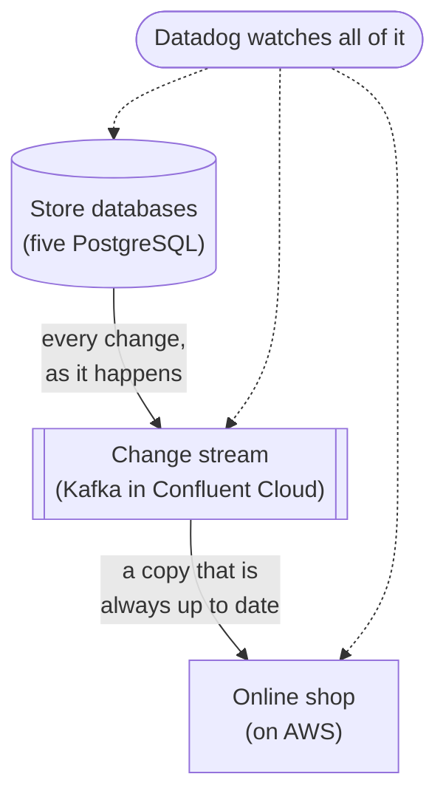
```mermaid
flowchart TB
  src[("Store databases<br/>(five PostgreSQL)")] -->|"every change,<br/>as it happens"| k[["Change stream<br/>(Kafka in Confluent Cloud)"]]
  k -->|"a copy that is<br/>always up to date"| shop["Online shop<br/>(on AWS)"]
  dd(["Datadog watches all of it"]) -.-> src
  dd -.-> k
  dd -.-> shop
```

The store databases keep selling as they always did. Their changes flow through Confluent Cloud, and the Online shop reads only the copy. Datadog shows whether each part is healthy. Everything else in this workshop is a closer look at one of these boxes.

## Which layers each Chapter needs

You choose one of two ways. Both build the same stack. The difference is when the optional layers start billing.

- **Step by step (default, cheaper).** Write `layers: core` in `demo.yaml`, or leave the `layers:` key out: no key means core only. Each Lab that needs a new layer begins with a "Turn on" step, so you pay only for the layers you run. Chapters 1 and 2 are enough to see the main idea.
- **Everything at once.** Write `layers: all` in `demo.yaml`. Every layer comes up together, so you can look around freely. It bills the full rate from the first minute, about $1.50 to $2.50 per hour ([Reference D](#d-cost-details)). Skip every "Turn on" step.

<details><summary>More about layers and their cost</summary>

**Which Chapter needs which layer, what each one bills, and how to add one.**

| Chapter | Labs | Layers needed | What the layers add |
|---|---|---|---|
| 1. One honest number | [1.1](#lab-11-one-product-five-stores-one-online-number), [1.2](#lab-12-optional-look-inside-confluent) (optional) | `core` | The five stores, Debezium, Confluent Cloud, Flink, Redis, the stock API and the Online shop, with Datadog on top. |
| 2. Unknown is not zero | [2.1](#lab-21-unknown-is-not-zero) | `core` | Nothing new. |
| 3. The incident | [3.1](#lab-31-the-incident) | `core,releases` | Releases 1.1.0 (slow) and 1.2.0 (fix), the traffic split and the p95-by-version monitor |
| 4. Canary the fix | [4.1](#lab-41-canary-the-fix) | `core,releases` | Nothing new: `releases` is already on from Chapter 3. |
| 5. The AI offer | [5.1](#lab-51-offers-with-a-safe-default), [5.2](#lab-52-restock-that-learns) (optional) | `offers` for 5.1, `restock` for 5.2, each turned on by its Lab | `offers`: offers for carts. `restock`: automatic reordering |
| 6. Datadog on top | [6.1](#lab-61-datadog-on-top-of-the-solution) | `dd-streams`, `dd-synthetics`, `dd-rum` (keep only the ones you want) | Datadog integrations and tests |

A stack with every layer is `layers: core,releases,restock,offers,dd-streams,dd-synthetics,dd-rum`. What each group of layers bills:

- **`core`:** the base of every stack. On AWS that is the VM, the Fargate services, ElastiCache and the load balancer. On Confluent Cloud it is the cluster and one Flink statement.
- **`releases`:** two more small Fargate services, 0.5 vCPU and 1 GB each.
- **`restock` and `offers`:** `restock` adds three running Flink statements and a procurement database container on the VM. `offers` adds one Flink statement and a Fargate service.
- **`dd-streams`, `dd-synthetics`, `dd-rum`:** Datadog usage on your trial, plus a small amount of AWS and Confluent for the Confluent integration and the Synthetics private location.

How to add a layer when you build step by step:

1. In `demo.yaml`, add the layer to the `layers:` line. Do this first: `make layer-on` changes the running stack but not the file, and a later `./demo create` applies the file again, which would switch the layer off.
2. Run `make layer-on L=<layer> CONFIRM=yes`. Each Lab that needs a layer starts with a "Turn on" step that gives the exact command and what it creates.

**What one layer costs.** We have no measured cost per layer. The estimate at the top of this page is for a stack with every layer on. A core-only stack costs less, and [Reference D](#d-cost-details) lists the billed pieces and their prices, so you can add up your own total. Confluent bills a partial hour as a full hour, so turning a layer on and off within one hour still costs that hour.

</details>

## The whole picture, for later

This is the full architecture. You do not need to understand it now: each Chapter shows the part it adds, and Figure 1 is where they all end up.

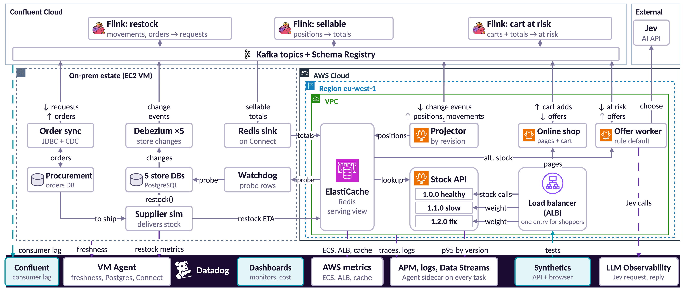

*Figure 1: what you will build. The store databases (left) stream their changes into Confluent Cloud (top). The online side on AWS (right) serves the Online shop. Datadog (bottom) monitors all of it.*

<details><summary>What you will build</summary>

- Five PostgreSQL store databases, left unchanged. Debezium sends every stock change from them to Confluent Cloud.
- An online side on AWS that reads stock from Redis and never queries a store. A check compares Redis with the stores.
- Three releases of the stock lookup service behind a load balancer, plus optional layers for restocking and AI-chosen offers. Datadog monitors all of it.

</details>

**What you will learn**

- Why streaming the changes out of existing databases lets you avoid replacing those databases, and how to make sure the copy matches them.
- How a <abbr title="A new release that gets a small share of traffic next to the current one, so you can compare the two before going further.">canary</abbr> catches a slow release while it gets only 10% of traffic, how version tags in Datadog APM show where the slowdown comes from, and how to roll out the fix the same way.
- How to keep an AI decision optional and explainable.

## Contents

- **0. Getting started:** [Which layers each Chapter needs](#which-layers-each-chapter-needs), [The whole picture, for later](#the-whole-picture-for-later), [Why change events](#why-change-events), [The architecture at a glance](#the-architecture-at-a-glance), [0.1 Prerequisites](#01-prerequisites), including [0.1.4 Get the code](#014-get-the-code), and [0.2 Build the stack](#02-build-the-stack)
- **Labs**, one Chapter each: Chapter 1 [Lab 1.1](#lab-11-one-product-five-stores-one-online-number) and [Lab 1.2](#lab-12-optional-look-inside-confluent) (optional); Chapter 2 [Lab 2.1](#lab-21-unknown-is-not-zero); Chapter 3 [Lab 3.1](#lab-31-the-incident); Chapter 4 [Lab 4.1](#lab-41-canary-the-fix); Chapter 5 [Lab 5.1](#lab-51-offers-with-a-safe-default) and [Lab 5.2](#lab-52-restock-that-learns) (optional); Chapter 6 [Lab 6.1](#lab-61-datadog-on-top-of-the-solution). See [Labs](#labs)
- [Troubleshooting](#troubleshooting)
- [Teardown](#teardown)
- [Recap and further reading](#recap-and-further-reading)
- [Reference](#reference): glossary, components, Datadog signals, cost, commands, [the control panel button by button](#h-the-control-panel-button-by-button), [what `./demo` does](#i-what-demo-does-step-by-step)

**Conventions.** Once you have the code ([0.1.4 Get the code](#014-get-the-code)), run every command from the root of the repository. Values you must replace look like `<this>`. Output blocks show what you should see. In an output, `<...>` is a value that is different on your run, and `...` marks lines that were left out.

**Two ways to run the labs.** You can run every lab step from the *control panel*, a web page with one button per step, or from the *terminal* with `make` commands. Both change the stack in the same way. Pick one path and use it from start to finish: the control panel and the terminal each remember their own last routing for **Rollback**, so mixing them in one run can roll back to the wrong state. <span class="gh-only">In the Markdown file you see both: steps that differ appear twice, once under **With the control panel** and once under **With the terminal**. The [workshop website](https://gianlucanatali.github.io/observable-inventory-streaming/workshop.html) shows only the path you choose.</span>

<!-- path-chooser -->

<div class="path-both" markdown="1">

</div>

<details><summary>More about this step</summary>

**Try it on your own machine instead?** To try the core path on your own machine without any cloud cost, see [Run locally](../LOCAL.md).

**Terminal you need in both paths.** The terminal is the command-line app on your computer: Terminal on macOS, or a shell on Linux. You type each command from the folder that holds the code ([0.1.2 Local tools](#012-local-tools) lists the tools, [0.1.4 Get the code](#014-get-the-code) shows how to get the code). Even on the control panel path you use it for these few steps:

| Command | What it is for |
|---|---|
| `aws login --profile dd-demo` | Sign in to AWS before you build or tear down the stack, and again after 12 hours |
| `./demo create` | Check your setup, then build the stack ([0.2.2 Run the preflight](#022-run-the-preflight-no-cloud-costs-yet), [0.2.3 Create the stack](#023-create-the-stack)) |
| `./demo status`, `./demo links` | Print the addresses of the Online shop, the control panel and the Datadog pages ([0.2.5 Open the shop, the control panel and Datadog](#025-open-the-shop-the-control-panel-and-datadog)) |
| `grep '^CONTROL_PASSWORD=' .env.secrets \| cut -d= -f2-` | Print the control panel password ([Open the control panel](#2-open-the-control-panel)) |
| `./demo destroy` | Delete the stack at the end, then check that nothing is left ([Teardown](#teardown)) |

</details>

---

## Why change events

So the stores publish each change as it happens. A *change event* says that one <abbr title="The quantity of one product at one store.">stock position</abbr> changed at a Source: which store, which product, the new quantity and its *revision*, a number that goes up with every change. For example, when the Bologna store sells one pair of the Trailrunner GTX (in the box below).

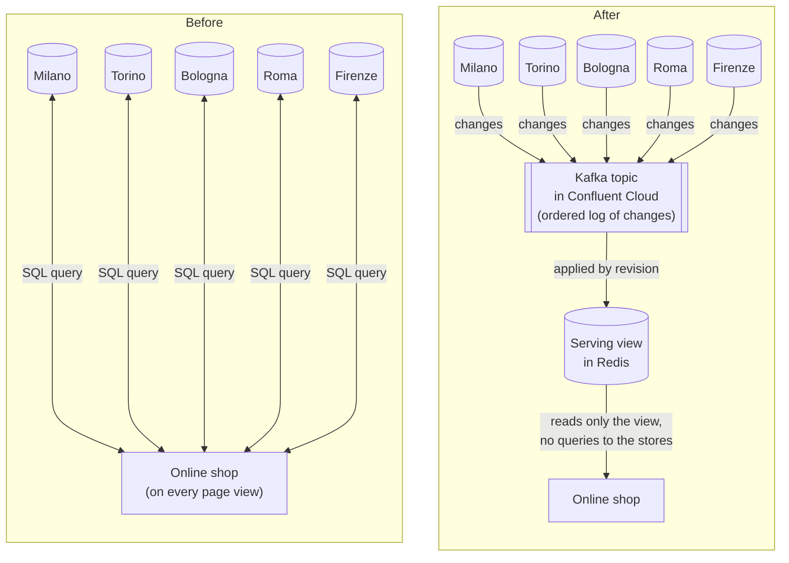
```mermaid
%%{init: {"flowchart": {"nodeSpacing": 14, "rankSpacing": 46}}}%%
flowchart LR
  subgraph BEFORE["Before"]
    direction TB
    b1[("Milano")]
    b2[("Torino")]
    b3[("Bologna")]
    b4[("Roma")]
    b5[("Firenze")]
    b1 & b2 & b3 & b4 & b5 <------->|"SQL query"| web1["Online shop<br/>(on every page view)"]
  end
  subgraph AFTER["After"]
    direction TB
    a1[("Milano")]
    a2[("Torino")]
    a3[("Bologna")]
    a4[("Roma")]
    a5[("Firenze")]
    a1 & a2 & a3 & a4 & a5 -->|"changes"| k[["Kafka topic<br/>in Confluent Cloud<br/>(ordered log of changes)"]]
    k -->|"applied by revision"| view[("Serving view<br/>in Redis")]
    view -->|"reads only the view,<br/>no queries to the stores"| web2["Online shop"]
  end
  BEFORE ~~~ AFTER
```

The Online shop reads a *serving view*: a copy of the stock positions in Redis that the change stream keeps up to date and can rebuild at any time. Two rules keep the view from showing a wrong number, and you will see both in the labs:

- A newer revision always wins. An older or repeated event changes nothing, so you can safely replay events.
- When the view is not sure about a position, the answer is *unknown stock*, never zero.

A product that does not sell produces no events, so from the outside a quiet product looks the same as a broken feed. A *probe* solves this: a synthetic stock position that changes every few seconds in each store. If the probe's changes stop reaching the serving view, the feed has stopped. The time a change takes to get from the Source to the serving view is the *freshness*.

<details><summary>More about this step</summary>

**The problem: why not just query the stores?** Every retailer with physical stores already has stock data. It lives in the store systems that run the checkouts, and nobody wants to rewrite them. In this workshop five PostgreSQL databases play that role, one per store. We call them *the Sources*. Nothing in this workshop changes how they work.

The Online shop needs *sellable stock*: the sum of a product's stock across all five stores. If the shop queries all five databases on every page view, shopper traffic lands on the systems the stores use to sell. If you copy the databases once a night instead, the number can be hours old, and the same last pair can be sold twice.

**A change event up close: the record, SKUs and how Debezium captures it.**

```json nocopy
{ "store_id": "S03", "product_id": "P0042", "quantity": 2, "revision": 1187, "changed_at": "2026-10-04T18:21:57Z" }
```

The field names are simplified here. The real records are Avro, wrapped in a Debezium envelope.

A `product_id` such as `P0042` is a *SKU*: one model in one colour and one size. Every part of the path tracks stock per SKU: the stores, the change events, Kafka, Flink, Redis and the stock API. Only the Online shop groups SKUs into models for display (see [0.2.5 Open the shop, the control panel and Datadog](#025-open-the-shop-the-control-panel-and-datadog)).

*Change data capture* (CDC) turns committed database changes into these events. Here Debezium does it: it reads PostgreSQL's <abbr title="The journal PostgreSQL already writes for crash recovery. Reading it adds no queries to the store database.">write-ahead log</abbr>, so the store applications do not change and the store databases get no extra queries. Apache Kafka keeps the events as an ordered log on disk, and each reader reads it at its own pace.

</details>

---

## The architecture at a glance

Figure 1 at the top shows the whole system. It runs in three places, plus Datadog.

The demo is split into *layers* that you can switch on or off. *Core* is always on. Each lab adds or uses one layer and shows it in a diagram with the same layout.

A *stack* is one complete deployment, separate from any other. This guide uses a stack named `hybrid`. You build it with `core` only and add the other layers when a lab needs them ([Which layers each Chapter needs](#which-layers-each-chapter-needs)); the screenshots and examples come from a run with every layer on. The details of each component, connector and signal are in the [Reference](#reference).

<details><summary>More about this step</summary>

**What runs where.**

| Zone | What runs there |
|---|---|
| Simulated store estate: one EC2 VM with Docker Compose | The five store databases, a procurement database, a self-managed <abbr title="The process that runs the Debezium connectors and the sink connectors.">Kafka Connect</abbr> worker (Debezium sources and sink connectors), background sales, the freshness probe (`freshness-probe`), a supplier simulator, the `scenario-api` that runs the load, verify and canary checks for the control panel, and a Datadog Agent |
| Confluent Cloud (AWS `eu-west-1`) | One Basic Kafka cluster, Schema Registry and a <abbr title="Flink runs long-running SQL queries on the Kafka topics. In the core layer it sums stock across stores.">Flink</abbr> compute pool running SQL statements |
| AWS online side (`eu-west-1`) | ECS Fargate services behind an Application Load Balancer (ALB), and an ElastiCache Redis serving view |
| Datadog (EU site) | <abbr title="Application Performance Monitoring: traces each request through the services.">APM</abbr>, logs, <abbr title="Maps the services and the Kafka topics between them.">Data Streams Monitoring</abbr>, dashboards, monitors, LLM Observability, Synthetics, RUM and cost |

**Which layer each Lab uses.**

| Layer | Adds | Lab |
|---|---|---|
| `core` | Sources, Debezium, Kafka, Flink sum, Redis, lookup service, Online shop | [1.1](#lab-11-one-product-five-stores-one-online-number), [2.1](#lab-21-unknown-is-not-zero) |
| `releases` | Lookup releases 1.1.0 (slow) and 1.2.0 (fix), a traffic split | [3.1](#lab-31-the-incident), [4.1](#lab-41-canary-the-fix) |
| `restock` | Demand-driven restocking with a procurement database | [5.2](#lab-52-restock-that-learns) |
| `offers` | Offers for carts whose product just sold out, with an optional AI choice | [5.1](#lab-51-offers-with-a-safe-default) |
| `dd-streams`, `dd-synthetics`, `dd-rum` | Confluent integration, Synthetics tests, Real User Monitoring | [6.1](#lab-61-datadog-on-top-of-the-solution) |

</details>

---

## 0.1 Prerequisites

<!-- box: setup-do
- Check your accounts and tools, then fill in one configuration file and run one command to build the stack.
- Open the Online shop, the control panel and Datadog, and start from a clean state.
- Check that everything is green before Chapter 1.

The build takes about 30 minutes with the default core layers, about 36 with every layer, mostly waiting.
-->

### 0.1.1 Accounts

| Account | What you need |
|---|---|
| AWS | Permission to create EC2, ECS, ECR, ELB, ElastiCache, IAM roles, SSM parameters, S3 and Cost and Usage Report exports; administrator access is simplest. Region `eu-west-1` must still have its **default VPC**. An AWS CLI profile, `dd-demo` in this guide, that you sign in to with `aws login` |
| Confluent Cloud | An organisation and a **Cloud resource management** API key owned by a user with the OrganizationAdmin role. New sign-ups usually come with promotional credit; check its amount and expiry under Billing |
| Datadog | An organisation on the **EU site** (`app.datadoghq.eu`), for example a trial, with an API key and an application key. Not verified: which products every trial includes. This workshop uses APM, Logs, DSM, LLM Observability, Synthetics, RUM and Cloud Cost Management |
| TypeSafe Jev (optional) | An API key for the Jev decision API. Without it, everything still works, and every offer in Lab 5.1 uses the rule default |

Sign-up pages: [AWS](https://aws.amazon.com/free/), [Confluent Cloud](https://www.confluent.io/confluent-cloud/tryfree/), [Datadog trial](https://www.datadoghq.com/free-datadog-trial/).

### 0.1.2 Local tools

| Tool | Version | Used for |
|---|---|---|
| `git` | Any recent | Getting the code and its submodule |
| `terraform` | 1.6.0 or newer | All cloud resources |
| `docker` CLI with the `compose` and `buildx` plugins | Recent | Driving Docker on the VM over SSH; images are built there |
| AWS CLI v2 | 2.32.0 or newer, the first with `aws login` | Sign-in and AWS calls |
| `ssh` and an Ed25519 key at `~/.ssh/id_ed25519.pub` | Any | The VM's key pair (set `TF_VAR_ssh_public_key_path` for another key) |
| `python3`, `make`, `curl`, `jq`, `openssl` | Any recent | `./demo`, make targets, helper scripts, password generation |
| `confluent` CLI (optional) | Any | Read-only checks: prices and the leftover check after teardown |
| A Chromium-based browser (Chrome) | Recent | The shop, the control panel, Datadog and the Confluent Cloud console; the console did not load topic lists in Safari in our tests |

You do not need Node.js, Python packages or a local Kafka.

### 0.1.3 Readiness check

Sign in to AWS. This command opens a browser window; finish the sign-in there:

```sh
aws login --profile dd-demo
```

Then check which identity you are using (this is read-only):

```sh
aws sts get-caller-identity --profile dd-demo
```

You should see your account ID and your user or role ARN in JSON. The full readiness check, which tests every tool and credential, runs as the first part of `./demo create` in [0.2.2 Run the preflight](#022-run-the-preflight-no-cloud-costs-yet).

### 0.1.4 Get the code

The workshop code is in a public GitHub repository. It uses one git submodule, `vendor/jr` (the generator for background sales). The build needs it, so clone with `--recurse-submodules`:

```sh
git clone --recurse-submodules https://github.com/gianlucanatali/observable-inventory-streaming.git
cd observable-inventory-streaming
```

<details><summary>Other ways to get the code: a fork, a clone without submodules, or no git</summary>

- **If you want to push your own changes:** first press **Fork** on GitHub. Then run the same two commands with your fork's URL and folder name.
- **If you cloned without `--recurse-submodules`:** fetch the submodule from the repository root:

  ```sh
  git submodule update --init
  ```

- **If you don't have git:** on the repository page, choose **Code > Download ZIP** and unzip it. The ZIP does **not** include the submodule, so `vendor/jr` is empty and the build fails. On GitHub, the `vendor/jr` entry links to the exact commit that the workshop uses. Download that commit as a ZIP too, and unzip its contents into `vendor/jr`. Cloning with git is simpler.

</details>

From here on, run every command from the root of this folder (`observable-inventory-streaming`, or your fork's folder).

---
## 0.2 Build the stack

You build everything with one configuration file and one command; the steps follow. If you are curious what the command does underneath, [Reference I](#i-what-demo-does-step-by-step) explains it, but the labs do not need it.

<details><summary>Can I run it on my computer instead of the cloud? (preview, not yet tested)</summary>

This guide runs the demo in the cloud (AWS and Confluent Cloud, with Datadog). That is the tested way, and every lab is written for it.

There is also a local mode (`mode: local` in `demo.yaml`) that runs the demo in a Lima VM on your computer, with no AWS or Confluent Cloud costs. It is a preview: it has not been tested end to end on a fresh machine yet, so expect rough edges. If you want to try it, set up with [Run locally](../LOCAL.md) instead of 0.1 and 0.2, then come back for the labs.

| | In the cloud (`mode: cloud`, the default) | On your computer (`mode: local`) |
|---|---|---|
| Runs on | AWS and Confluent Cloud, with Datadog | A Lima VM on your computer, with Datadog |
| Cost | AWS and Confluent Cloud: about $1.50 to $2.50 per hour while it runs. Datadog: usage on your account (a trial covers it) | No AWS or Confluent Cloud cost. Datadog: usage on your account (a trial covers it). Jev: its own calls, only if you set a key |
| Labs | Every lab | Not Lab 1.2 (no Confluent Cloud console); no Synthetics, Confluent integration, AWS or cost views; Flink is replaced by a Python stand-in |
| Tested end to end | Yes | Not yet on a fresh machine |
| Use it for | The full workshop | Trying the main labs without AWS or Confluent Cloud costs, or changing the code and testing it on your computer |

</details>

### 0.2.1 Configure `demo.yaml`

`demo.yaml` keeps all your settings and credentials in one file. Git ignores it, and `./demo` refuses to run if anyone other than you can read it. From the repository root ([0.1.4 Get the code](#014-get-the-code)):

```sh
cp demo.example.yaml demo.yaml
chmod 600 demo.yaml
```

Open `demo.yaml` in an editor and set the keys below. Use an editor, not `echo`, so your keys do not end up in your shell history. Write values as plain text, without quotes.

| Key | Value |
|---|---|
| `stack` | The name of your deployment. Keep `hybrid` to match the examples in this guide, or choose your own (see below) |
| `aws_profile`, `aws_region` | Keep `dd-demo` and `eu-west-1`. The code uses these by default |
| `layers` | Optional. Leave it out, or write `layers: core`, for step by step: core only, and the labs add layers one by one ([Which layers each Chapter needs](#which-layers-each-chapter-needs)). Write `layers: all` for everything at once: it bills for every layer from the first hour |
| `datadog_site` | Keep `datadoghq.eu`. This guide does not support other sites |
| `dd_api_key`, `dd_app_key` | Your Datadog API key and application key |
| `confluent_cloud_api_key`, `confluent_cloud_api_secret` | Your Confluent Cloud resource management key and secret |
| `allowed_cidr` | Optional, commented out in the file. Leave it commented out and `./demo create` detects your current public IP. To set it, remove the leading `# ` and write one IPv4 address as a `/32`, without quotes, for example `allowed_cidr: 203.0.113.7/32`. Only this address can reach the Online shop, the control panel and the VM. |
| `jev_api_key` | Optional, commented out in the file. Leave it commented out to use only the rule default |
| `keep_images` | Optional, commented out in the file, `true` or `false` (default `false`). With `false`, `./demo destroy` also deletes the stack's container image repositories, so nothing is left billing. With `true`, destroy keeps them (storage about $0.10 per GB-month) and the next `./demo create` reuses every image whose code has not changed instead of building it again ([Teardown](#teardown)) |
| `owner` | Optional, commented out in the file (default: your local user name, `id -un`). The value of the `owner` tag on every AWS resource the build creates. Many companies ask for a work email, for example `jane.doe@example.com`. Letters, digits and `_ . : / = + - @` only, no spaces, up to 256 characters; `./demo` refuses anything else and names the key. Datadog does not receive this tag from the build |

> [!WARNING]
> Never paste these values into a chat, an issue, a screenshot or a terminal recording.

Choose one way. Both are one line in `demo.yaml`.

Step by step (default, cheaper). Core only, and the labs turn on the other layers. You can also leave the whole line out:

```yaml
layers: core
```

Everything at once. All layers, billed at the full rate from the first minute:

```yaml
layers: all
```

<details><summary>Pick your own set of layers</summary>

You can also write a comma-separated list with no spaces, for example `layers: core,releases`. `core` is always on. Valid names are `core`, `releases`, `restock`, `offers`, `dd-streams`, `dd-synthetics` and `dd-rum`; [Which layers each Chapter needs](#which-layers-each-chapter-needs) says what each one adds. `all` stands alone and does not mix with other names.

There is one more layer, `control-center`, that no lab needs: Confluent Control Center, Confluent's web console for self-managed components, here the Kafka Connect worker on the VM. It is not part of `all`; to try it, add it to a list, for example `layers: core,control-center`.

</details>

You do not need to get anything for `stack` and `aws_region`: keep the defaults. For `layers`, write `core` (or `all`) as above, or leave the line out. The blocks below explain where each of the other values comes from.

#### The stack name

<details><summary>More about <code>demo.yaml</code>: the stack name, where each value comes from, the files it writes</summary>

**Choosing another name, and where the name appears.**

`stack: hybrid` is the name of your deployment. You can change it before the first `./demo create`: use 2 to 16 characters, lowercase letters, digits and `-`, starting with a letter (the rule is `^[a-z][a-z0-9-]{1,15}$`). The name appears in three places:

- as the `stack` tag on everything the build creates in AWS and Datadog (`stack:<name>` in Datadog);
- in resource names, which start with `dd-demo-<name>`: the ECS cluster, the Confluent Cloud environment, the Datadog `env` and the dashboard titles;
- in the local files for this deployment, such as `.env.cloud-<name>` and `.state/logs/<name>-latest.log`.

The make commands in this guide read `stack` (and the AWS profile, region and layers) from `demo.yaml`, the same way `./demo` does, so you type `make reset`, not `make STACK=<name> reset`. A value you give on the command line still wins. This guide uses `hybrid` in its examples: if you chose another name, read `dd-demo-<your name>` wherever it shows the `hybrid` environment name, and `stack:<your name>` for the `hybrid` stack tag. Do not rename the stack while it exists: the build would treat the new name as a second deployment.

**How to find everything this demo created.**

| Where | How the build marks it | Example search |
|---|---|---|
| AWS | Tags on every resource: `project = dd-demo`, `stack = <name>` (`stack = account` for the account-wide pieces) and `owner = <your local user name>`. The VM's resources also carry `layer = core` | Resource Groups > Tag Editor with tag `project` = `dd-demo`, or `aws resourcegroupstaggingapi get-resources --tag-filters Key=project,Values=dd-demo --profile dd-demo --region eu-west-1`. This list lags behind deletions (see [Teardown](#teardown)) |
| Datadog | Tags `project:dd-demo` and `stack:<name>`, plus `layer:<layer>` on the objects of optional layers. The telemetry `env` is `dd-demo-<name>` | Search `project:dd-demo stack:<name>` in Monitors and Synthetic tests, and `dd-demo-<name>` in Dashboards |
| Confluent Cloud | The environment is named `dd-demo-<name>`. The build can also put Stream Catalog tags (project, stack, layer) on topics, but that option is off by default, so do not expect them | `confluent environment list`, or the environment list in the console |

The `owner` tag holds the user name you are logged in with on your computer (`id -un`) unless you set `owner:` in `demo.yaml`, for example `owner: jane.doe@example.com`. It is visible to anyone who can read the AWS account's tags, so use something you are happy to show. An `OWNER=<value>` environment variable, as in `OWNER=<value> ./demo create`, overrides the file for that run. Datadog does not get this tag from the build. If the Datadog AWS integration imports it, Datadog's tagging rules turn `@` into `_` (not tested in this workshop).

**What the demo writes in this folder.** Everything stays in the folder you cloned, and git ignores all of it, so none of it can be committed by mistake. Your own keys are in two places only: `demo.yaml` and a private copy in `.env`.

| File | What it holds | Lifetime |
|---|---|---|
| `demo.yaml` | Your settings and your Confluent and Datadog keys | Yours; never changed by the build |
| `.env` | A copy of the keys from `demo.yaml`, readable only by you (mode 600). Docker Compose and the scripts read env files, not YAML | Rewritten by every `./demo create`; stays until you delete it |
| `.env.secrets` | Random passwords the build generates (store databases, control panel, load tool). Not your keys | Created once; stays until you delete it |
| `.env.cloud-<name>` | What the build created for this stack: addresses, ids, and keys the build made itself (for example the cost meter's Confluent key and the RUM client token). Mode 600 | Written by `./demo create`, deleted by `./demo destroy` |
| `.state/` | Small bookkeeping files: which layers are on, the release routing | The stack's files are removed by `./demo destroy` |
| `terraform/<part>/terraform.tfstate.d/<name>/` | Terraform's record of what it created. Like any Terraform state, it can contain the secrets of those resources | Emptied by `./demo destroy` |

**Running more than one deployment.** Each folder holds the state of its deployments (see "What the demo writes in this folder" above). `./demo` works with the one stack named in that folder's `demo.yaml`. If you need more deployments, use a separate folder for each one:

1. Make a **fresh clone** ([0.1.4 Get the code](#014-get-the-code)) into a new folder. Do not copy a folder that has already built a stack: the copy would contain that stack's Terraform state and files, and a command run in the copy would change or destroy the other deployment.
2. In the new folder, create `demo.yaml` and choose a **different** `stack` name.
3. Decide what to do with the account-wide pieces (below), then run `./demo create` there.

The account-wide pieces are shared by every deployment in the same AWS account, Datadog organisation and Confluent Cloud organisation: the Cost and Usage Report export and its S3 bucket, the Datadog AWS integration and its IAM role, the read-only Confluent identity for the cost meter and the account cost dashboard. Every `./demo create` applies them first, in the `terraform account` step, from the state in that folder (`terraform/account/terraform.tfstate.d/account/`). A fresh clone has no such state, so:

- **Other accounts** (a different AWS account, Datadog organisation and Confluent organisation): nothing to do. The clone creates its own account-wide pieces.
- **The same accounts:** a fresh clone tries to create the account-wide pieces again. The names are fixed, so expect the `terraform account` step to fail with "already exists" errors before any per-stack resource is created. Terraform may create some pieces before it stops, so after such a failure run `make stack-leftovers` and check the Confluent Cloud console. The build has no option to skip this step. The workaround is to copy only the account state file from the first folder into the clone before `./demo create`: `terraform/account/terraform.tfstate.d/account/terraform.tfstate`, to the same path. Both folders then manage the same account-wide resources, so remove them ([F](#f-remove-the-account-wide-pieces)) from one folder only, after every deployment is destroyed. We have not tested two deployments in the same accounts.

Each deployment bills on its own, about $1.50 to $2.50 per hour ([details](#d-cost-details)). Destroy each one from its own folder.

**Where do I get `aws_profile`?**

1. Install AWS CLI 2.32.0 or newer ([0.1.2 Local tools](#012-local-tools)).
2. Run `aws login --profile dd-demo` as in [0.1.3 Readiness check](#013-readiness-check). The first time, it creates the profile and asks for a region: enter `eu-west-1`.
3. Sign in in the browser with a user or role that has the permissions in [0.1.1 Accounts](#011-accounts). An IAM user or role also needs the AWS managed policy `SignInLocalDevelopmentAccess`; the root user does not.
4. Check the profile with `aws sts get-caller-identity --profile dd-demo`, then keep `aws_profile: dd-demo`.

The session lasts up to 12 hours. After that, run `aws login --profile dd-demo` again.

Official docs: [Login for AWS local development using console credentials](https://docs.aws.amazon.com/cli/latest/userguide/cli-configure-sign-in.html)

**Where do I get `allowed_cidr`?**

`allowed_cidr` is an address range in CIDR notation, where `/32` means exactly one address. It is the only source address that the security groups (AWS firewall rules) of the load balancer and the VM let through.

If you leave it commented out (or empty), `./demo create` looks up your public IPv4 address once at `https://checkip.amazonaws.com` (5 second timeout) and uses it as a `/32`, before it writes or bills anything. If the lookup fails, it stops and creates nothing, and you set `allowed_cidr` yourself. `--dry-run` skips the lookup. The detected address is not saved to `demo.yaml`, so if your IP changes, set `allowed_cidr` or run `./demo create` again. `make stack-preflight`, `make stack-up`, `make layer-on` and `make layer-off` do the same lookup when `allowed_cidr` is empty, print the address they use, and stop with a clear message if the lookup fails. See also [Troubleshooting](#troubleshooting).

To find your public IP yourself, open [https://checkip.amazonaws.com](https://checkip.amazonaws.com) in the browser you will use for the labs, or run `curl https://checkip.amazonaws.com`. Add `/32` to the address it shows, for example `203.0.113.7/32`.

If you are behind a VPN or a corporate NAT, set `allowed_cidr` to your outgoing IP yourself: the detected address may not be the one your browser uses.

**Where do I get `datadog_site`?**

1. Sign in to Datadog and look at the address bar.
2. If it starts with `https://app.datadoghq.eu`, your site is `datadoghq.eu`: keep the default.
3. If it shows another address, your organisation is on another site, which this guide does not support. Create a trial on the EU site instead.

Official docs: [Getting Started with Datadog Sites](https://docs.datadoghq.com/getting_started/site/)

**Where do I get `dd_api_key` and `dd_app_key`?**

1. In Datadog, open **Organization Settings > API Keys**. Choose **New Key**, give it a name such as `dd-demo`, and copy the key into `dd_api_key`.
2. Open **Organization Settings > Application Keys**. Choose **New Key**, give it a name, and copy the key into `dd_app_key`. In new organisations, Datadog shows it only once.
3. Do not set scopes on the application key. The build does not restrict them, and a key without scopes has the same permissions as your user.
4. An application key belongs to the user who creates it. Create it with a user that can manage dashboards, monitors, Synthetic tests, RUM applications and the AWS and Confluent Cloud integrations, because the build creates all of these. An admin user is simplest.

Official docs: [API and Application Keys](https://docs.datadoghq.com/account_management/api-app-keys/)

**Where do I get the Confluent Cloud `api_key` and `api_secret`?** This must be a **Cloud resource management** key, not a Kafka cluster key. The build uses it to create the environment, the cluster, service accounts, their API keys and role bindings, some of them for the whole organisation. So the key's owner needs the **OrganizationAdmin** role.

1. In the Confluent Cloud Console, open the **API keys** page ([confluent.cloud/settings/api-keys](https://confluent.cloud/settings/api-keys)) and choose **Add API key**.
2. Choose **My account**, so the key has your user's permissions. Your user must have OrganizationAdmin.
3. Under **Resource scope**, choose **Cloud resource management**, then **Next**.
4. Give it a name such as `dd-demo`, choose **Create API key** and copy the key into `confluent_cloud_api_key` and the secret into `confluent_cloud_api_secret`. Confluent shows the secret only once.

With the `confluent` CLI, after `confluent login`: `confluent api-key create --resource cloud`.

Official docs: [Manage API Keys in Confluent Cloud](https://docs.confluent.io/cloud/current/security/authenticate/workload-identities/service-accounts/api-keys/manage-api-keys.html), [confluent api-key create](https://docs.confluent.io/confluent-cli/current/command-reference/api-key/confluent_api-key_create.html)

**Where do I get `jev_api_key`?** This key is optional. Jev is the external decision API from TypeSafe that the offer worker asks to choose an offer in [Lab 5.1](#lab-51-offers-with-a-safe-default). If you have access to Jev, remove the leading `# ` from the `jev_api_key` line and put your Jev API key after the colon, without quotes. Leave it commented out and every offer uses the rule default; all labs still work.

</details>

### 0.2.2 Run the preflight (no cloud costs yet)

Sign in to AWS first; the command opens a browser window:

```sh
aws login --profile dd-demo
```

Then start the preflight. It runs for a minute or two and ends with a question that waits for your answer:

```sh
./demo create
```

You should see the checks and then the cost question. If you are not ready to build yet, type anything other than `yes`: nothing has been created.

<details><summary>More about this step</summary>

**What the preflight checks.** The preflight runs read-only checks of your tools, credentials and configuration. `./demo create` runs it first and asks you before it creates anything, so this step costs nothing.

**The full preflight output, and what it means.** If `allowed_cidr` is not set, the first line shows the detected address:

```text
demo: allowed_cidr not set; using your current IP <a.b.c.d>/32
gen-secrets: wrote <repo>/.env.secrets (<n> passwords, mode 600, values not shown)
...
   note: JEV_API_KEY not set: offers use the rule default only
   AWS login session via refresh profile dd-demo-auto: ok
   ...
   terraform/account: valid
   terraform/cloud: valid
   terraform/vm: valid
   terraform/datadog: valid
   terraform/aws: valid
   preflight ok for stack hybrid (owner <your user>)
...
========================================================================
  ACTION NEEDED: ./demo is waiting for your answer
========================================================================
  This creates billed AWS and Confluent Cloud resources: about $1.50 to
  $2.50 per hour (AWS about $0.50, Confluent Cloud about $1 to $2;
  Datadog on its trial). This is an estimate, not a bill. Trial credit
  depends on your accounts, so check it.

  Type yes and press Enter to continue (anything else stops here):
```

Each `terraform/...: valid` line is one of the six Terraform configurations passing validation. A `MISSING` or `INVALID` line stops the run and says what to fix.

**Look first with `--dry-run`, and the two files the preflight wrote.** To look first without running anything, use `./demo create --dry-run`: it checks `demo.yaml` and prints the commands it would run, without writing any file.

*What just happened:* `./demo` checked `demo.yaml`, wrote two files and ran the preflight. Only you can read the two files, and git ignores them:

- `.env`: a copy of your Confluent and Datadog keys from `demo.yaml`. The scripts read this file.
- `.env.secrets`: new random passwords for the demo's own services (the store databases, the control panel login and the load tool). None of them comes from `demo.yaml`. You only ever need the control panel one, and a later step shows how to read it.

</details>

### 0.2.3 Create the stack

> [!WARNING]
> As soon as you type `yes`, AWS and Confluent Cloud start billing you, about $1.50 to $2.50 per hour with every layer on; a core-only stack costs less, but we have not measured how much ([details](#d-cost-details)). Confluent Cloud bills a partial hour as a full hour. Set an AWS budget alert, plan to finish in one session, and run the [teardown](#teardown) at the end.

Run `./demo create` again and type `yes` at the question.

> [!NOTE]
> **The build takes a while, and longer the more layers you bring up.**
> - Every layer on (`layers: all`): about 36 minutes in our test run, most of it waiting on the cloud.
> - Core only (`layers: core`, the default): about 28 to 30 minutes, estimated from our first test runs; we will re-measure it on a clean build.
>
> Keep the terminal open until the build ends.

At the end you should see a summary that starts with `smoke: 9 passed, 0 failed`.

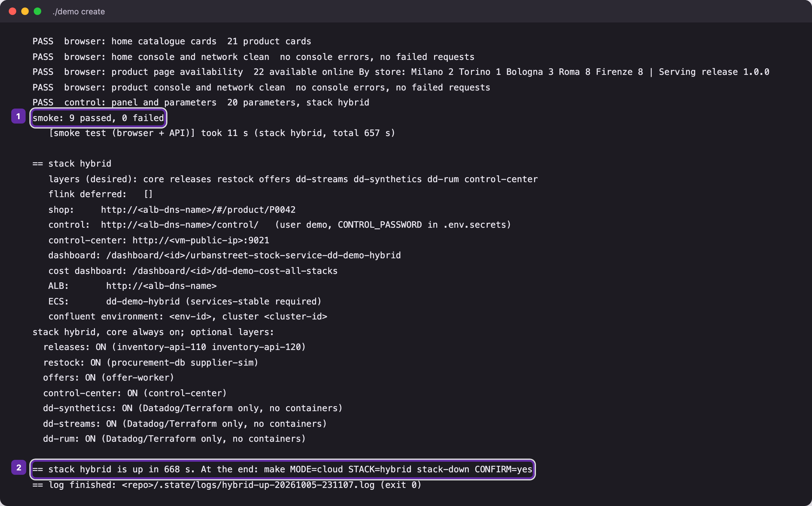

If a step fails, the script stops with `stack.sh: step '<stage>' FAILED (command: ...)`: see [Troubleshooting](#troubleshooting).

<details><summary>More about this step</summary>

**The progress lines, the log file and the full summary.** The build shows its progress in the same terminal, and also saves it to `.state/logs/hybrid-latest.log`, so you can read it again later or keep it if something fails.

Each step prints `== [stage name]` when it starts and `[stage name] took N s` when it ends. At the end it runs a smoke test, a quick end-to-end check of Connect, the availability API, the Online shop in a browser and the control panel. Then it prints a summary that starts with `smoke: 9 passed, 0 failed`.

The output below comes from a run with every layer on (`layers: all`). With `layers: core` the summary lists the optional layers as `off`.

```text
smoke: 9 passed, 0 failed

== stack hybrid
   layers (desired): core releases restock offers dd-streams dd-synthetics dd-rum
   flink deferred:   []
   shop:     http://<alb-dns-name>/#/product/P0042
   control:  http://<alb-dns-name>/control/   (user demo, CONTROL_PASSWORD in .env.secrets)
   dashboard: /dashboard/<id>/urbanstreet-stock-service-dd-demo-hybrid
   cost dashboard: /dashboard/<id>/<name>
   ALB:       http://<alb-dns-name>
   ECS:       dd-demo-hybrid (services-stable required)
   confluent environment: <env-id>, cluster <cluster-id>
stack hybrid, core always on; optional layers:
  releases: ON (inventory-api-110 inventory-api-120)
  restock: ON (procurement-db supplier-sim)
  offers: ON (offer-worker)
  dd-synthetics: ON (Datadog/Terraform only, no containers)
  dd-streams: ON (Datadog/Terraform only, no containers)
  dd-rum: ON (Datadog/Terraform only, no containers)

== stack hybrid is up in <seconds> s. At the end: make MODE=cloud STACK=hybrid stack-down CONFIRM=yes
== log finished: <repo>/.state/logs/hybrid-up-<timestamp>.log (exit 0)
```

**If a step fails.** Read the lines above it, check [Troubleshooting](#troubleshooting), and keep the log. If you run `./demo create` again, it updates the existing stack to match the configuration instead of starting from zero. We have not measured how long a rerun after a partial failure takes.

</details>

### 0.2.4 Connect this guide to your stack (recommended)

1. In the repository root, run (copies the JSON to your clipboard):

   ```sh
   make -s links-json | pbcopy
   ```

2. Paste it in the Connect box below and press **Connect**.

<!-- connect-box -->

<details><summary>More about this step</summary>

**Not on a Mac?**

`pbcopy` exists only on macOS. Use the clipboard command of your system instead:

- Linux: `make -s links-json | xclip -selection clipboard` (or `make -s links-json | wl-copy` on Wayland).
- Windows with WSL: `make -s links-json | clip.exe`.
- Or run `make -s links-json` and copy the whole output by hand.

**Why is this recommended?** We recommend this step: it takes a minute and makes every lab easier to follow. The labs send you to many places: the shop, the control panel, the Datadog dashboards and APM, the Confluent console. Once you connect the guide to your stack, each of those becomes a link to your own page, one click away, and placeholders in angle brackets, such as the load balancer address, show your real values. You paste your stack's addresses once, and they stay in your browser.

**Skipping it?** If you skip this step, read each placeholder in angle brackets as the matching value in your `./demo status` output.

**Stable links for slides and bookmarks.** Once a stack is connected in a browser, <a href="https://gianlucanatali.github.io/observable-inventory-streaming/go.html"><code>go.html#&lt;key&gt;</code></a> on this site opens that stack's page, so a link in a slide or a bookmark survives a rebuild. The stack is stored per browser, so use the same browser (we recommend Chrome) where you connected it. Keys: `demo-home`, `demo-home-1` to `demo-home-6` (the demo home at that Chapter), `night-of-incident`, `control`, `shop`, `shop-home`, `stock-dashboard`, `online-dashboard`, `apm`, `dsm`, `cost-dashboard`, `confluent`, `stream-lineage`, `topic-inventory-cdc`, `topic-stock-sellable`. Without a connected stack the page says so and links to the Connect box.

</details>

### 0.2.5 Open the shop, the control panel and Datadog

Open these three windows and keep them open for the labs.

#### 1. Open the Online shop

Open the [Online shop](#1-open-the-online-shop "stack-link:shop-home"). You should see the UrbanStreet Online shop: one card per model, with the price and a dot for each colour.

<details><summary>More about this step</summary>

**Not connected, or the page does not load? Find the addresses with `./demo status`.** Print the stack's addresses:

```sh
./demo status
```

It prints the summary from the end of the build again. Open the `shop:` URL in your browser. If the page does not load, your public IP has probably changed since the build; see [Troubleshooting](#troubleshooting).

**More about the shop page.** The shop shows one card per model: the 200 SKUs are grouped into 21 models. You open the product page in [Lab 1.1](#hop-5-the-shop-page). The product photos are AI-generated images of fictional, unbranded products ([how they are made](../storefront/assets-src/README.md)).

</details>

#### 2. Open the control panel

Open the [control panel](#2-open-the-control-panel "stack-link:control") and sign in with user `demo` and the password. Print the password:

```sh
grep '^CONTROL_PASSWORD=' .env.secrets | cut -d= -f2-
```

It is a secret: do not paste it into a chat, a screenshot or a recording.

<details><summary>More about this step</summary>

**Not connected? Find the control panel address, and why the password is there.** On the control panel path you run the labs from this page. On the terminal path you open it only in Labs 5.1 and 5.2, to change settings that have no make command.

1. In the `./demo status` output, find the `control:` line:

   ```text
   control:  http://<alb-dns-name>/control/   (user demo, CONTROL_PASSWORD in .env.secrets)
   ```

2. The password is a random password that `make secrets` generated on your computer when you built the stack.
3. If the page does not load, check that your IP still matches `allowed_cidr` ([Troubleshooting](#troubleshooting)).

**The Links card.** The **Links** card at the top of the panel opens every page of this stack in a new tab: the Online shop, the Datadog dashboards, APM and DSM, the Confluent Cloud cluster and the ECS cluster. Bookmark the panel and you have them all. The build fills the card at the end; `make links-publish` fills it again.

<div data-path="panel" markdown="1">

**With the control panel**

**The five cards of the panel.** The panel shows five cards at the top and the demo's settings below them. You do not need to learn them now: each lab tells you which button to press and what the card shows afterwards.

| Card | You use it in |
|---|---|
| **Background sales** (**Full reset**) | Every lab, to start from a clean state |
| **Actions** (**Sell out product**) | Labs 1.1, 5.1 and 5.2 |
| **Store feed** | Labs 1.1 and 2.1 |
| **Release routing** | Labs 3.1 and 4.1 |
| **Checks** (**Run load**, **Verify**, **Check canary**) | Start from a clean state, Labs 1.1 to 4.1 |

[Reference H](#h-the-control-panel-button-by-button) describes every button, for when you want the details.

</div>

</details>

#### 3. Open the Datadog stock dashboard

Open the [Datadog stock dashboard](#3-open-the-datadog-stock-dashboard "stack-link:stock-dashboard"). Its charts fill up over the next minutes; you read them from Lab 1.1 on.

<details><summary>More about this step</summary>

**Not connected? Find the Datadog links with `./demo links`.**

```sh
./demo links
```

It prints the Datadog links for this stack:

```text
overview dashboard: https://app.datadoghq.eu/dashboard/<id>/...
stock dashboard: https://app.datadoghq.eu/dashboard/<id>/...
online dashboard: https://app.datadoghq.eu/dashboard/<id>/...
account-cost dashboard: https://app.datadoghq.eu/dashboard/<id>/...
APM inventory-api 1.1.0: https://app.datadoghq.eu/apm/services/inventory-api?env=dd-demo-hybrid&version=1.1.0
APM latency comparison: https://app.datadoghq.eu/apm/services/inventory-api?env=dd-demo-hybrid&compare_to=previous
DSM map: https://app.datadoghq.eu/data-streams?env=dd-demo-hybrid
```

The examples here come from a run with every layer on. Open the [stock dashboard](#3-open-the-datadog-stock-dashboard "stack-link:stock-dashboard") (the `stock dashboard:` link).

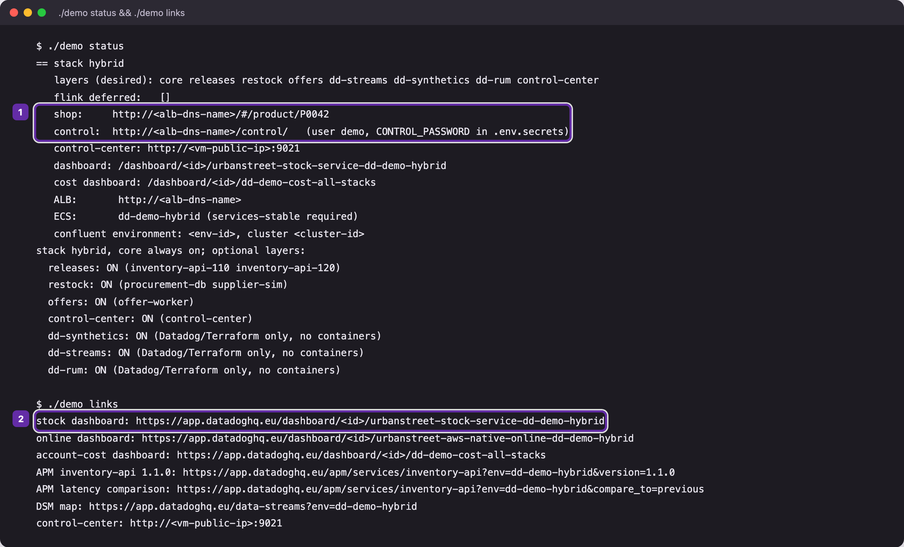

**Optional: see what the build created in AWS.** Open the [ECS cluster](#2-open-the-control-panel "stack-link:ecs") in the AWS console in `eu-west-1` (Ireland). It lists the running services. With every layer on, that includes the three `inventory-api` releases side by side; with core only, the 1.1.0 and 1.2.0 services exist but run no tasks until Lab 3.1 turns on the `releases` layer. On the load balancer, the listener rule for `/api/availability/*` sends traffic to three <abbr title="The set of containers that receives one release's share of the traffic.">target groups</abbr>, one per release, and the weight on each group sets its share. ElastiCache runs the Redis serving view.

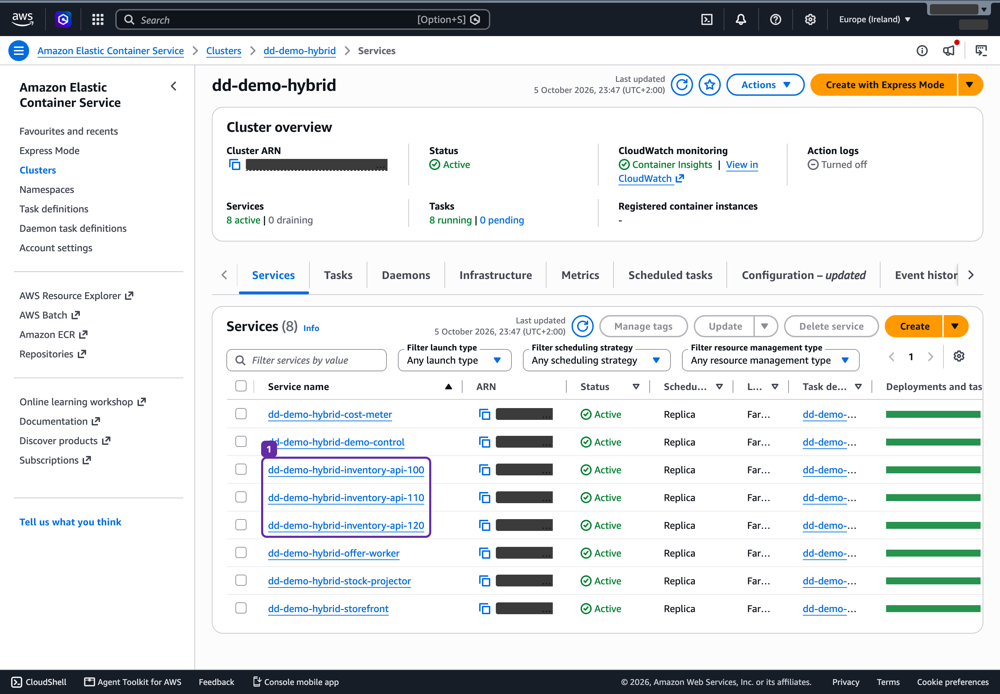

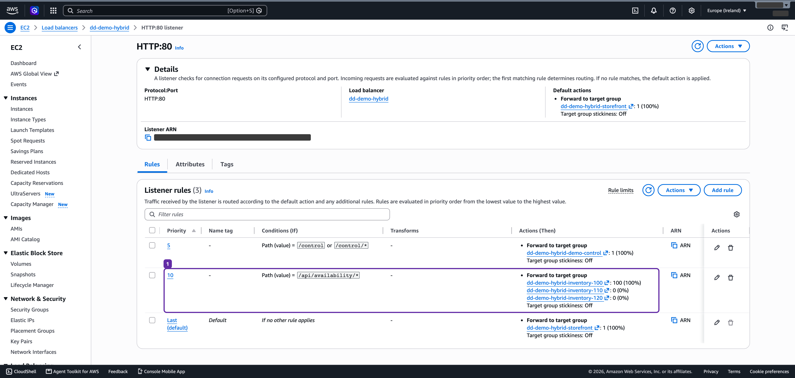

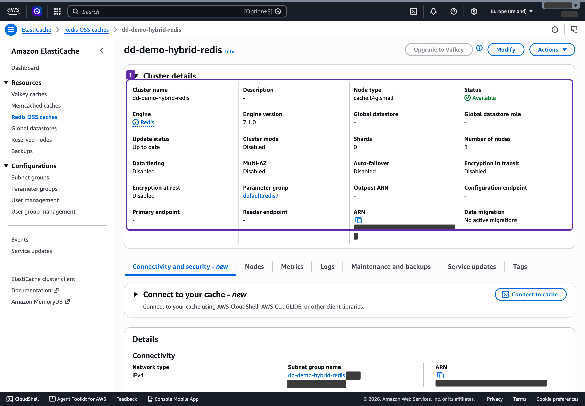

</details>

### 0.2.6 Start from a clean state

Every lab starts from the seeded stock, so do this once now.

<div data-path="panel" markdown="1">

**With the control panel**

1. In the [control panel](#2-open-the-control-panel "stack-link:control"), on the **Background sales** card, press **Full reset** and confirm. Wait until the card reads `full-reset succeeded: ...`.
2. On the **Checks** card, press **Verify**. You should see `VERIFY PASSED`.

</div>

<div data-path="terminal" markdown="1">

**With the terminal**

```sh
make reset
make verify
```

You should see `reset ok: ...` and, at the end, `{"ok": true, "mismatches": 0, "sellable_mismatches": 0}`.

</div>

Start Lab 1.1 now: its first Datadog step comes after about 10 minutes of data.

<details><summary>More about this step</summary>

<div data-path="panel" markdown="1">

**With the control panel**

**Full reset** turns background sales off, sends all stock lookups to release 1.0.0 and writes the seeded stock back into the five stores. The card ends with `full-reset succeeded: Full reset done: background sales off (rate 0), routing 100/0/0 verified, demo data at the seeded baseline and Redis converged; ...`.

After a few seconds **Verify** shows `VERIFY PASSED` in the result box, and the status line reads `verify succeeded: Verify passed: 0 position mismatch(es), 0 sellable mismatch(es)`.

If you press **Verify** before **Full reset**, it can fail with a list such as `sellable P0011: sources sum 97, redis 96`. Nothing is broken: background sales were changing the stock while Verify compared it. Press **Full reset**, then **Verify** again.

</div>

<div data-path="terminal" markdown="1">

**With the terminal**

**Full output, and what to do if verify reports mismatches.**

`reset` turns background sales off, sends all stock lookups to release 1.0.0 and writes the seeded stock back into the five stores. It first prints the AWS rule JSON that changes the routing. Among the output lines you should see:

```text
alb-routing: weights 1.0.0/1.1.0/1.2.0 = 100 0 0%
reset ok: scenario <id>, <n> positions at baseline, sellable caught up, feed ok, <n> open purchase order(s) cancelled, <n> restock:eta key(s) cleared
== background sales are OFF now: make sales-on to restart them
{"ok": true, "mismatches": 0, "sellable_mismatches": 0}
```

The last line is `verify`: every store matches Redis. If you run `verify` before `reset`, it can report mismatches, because background sales were changing the stock while it compared. Run `reset`, then `verify` again.

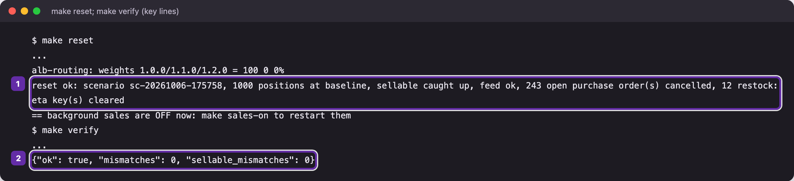

</div>

**Why background sales stay off, and why Datadog needs minutes.** When the build ends, background sales are running: every store sells a few products each minute, so the stock keeps changing. Every lab starts by stopping them and writing the seeded stock back, so that you know what the page should show. Background sales stay off until you turn them on; the labs do not need them. Datadog needs about 10 minutes of data before its charts are useful, and the freshness probe keeps sending data while sales are off.

</details>

### 0.2.7 Checkpoint

- [ ] The build ended with `smoke: 9 passed, 0 failed` ([0.2.3](#023-create-the-stack)).
- [ ] The [Online shop](#1-open-the-online-shop "stack-link:shop-home"), the [control panel](#2-open-the-control-panel "stack-link:control") and the Datadog [stock dashboard](#3-open-the-datadog-stock-dashboard "stack-link:stock-dashboard") are open ([0.2.5](#025-open-the-shop-the-control-panel-and-datadog)).

- [ ] The reset ended and verify passed. **Control panel:** **Full reset** ended with `full-reset succeeded`, and **Verify** showed `VERIFY PASSED` · **Terminal:** `make reset` printed `reset ok`, and `make verify` printed `"mismatches": 0, "sellable_mismatches": 0` ([0.2.6](#026-start-from-a-clean-state)).

---

## Labs

| Lab | What happens to the shop | What you show |
|---|---|---|
| [1.1](#lab-11-one-product-five-stores-one-online-number) | A product sells out in all five stores | The online number follows within seconds, without querying any store |
| [1.2](#lab-12-optional-look-inside-confluent) (optional) | The same sale, seen from inside | The change event in Confluent Cloud, and its path in Stream Lineage |
| [2.1](#lab-21-unknown-is-not-zero) | One store stops reporting | The shop shows "at least" instead of a wrong number, and Datadog names the store |
| [3.1](#lab-31-the-incident) | A new release is slow | The canary check stops it at 10% of traffic; APM shows why |
| [4.1](#lab-41-canary-the-fix) | The fix goes out | The same check lets it through, step by step, with a way back |
| [5.1](#lab-51-offers-with-a-safe-default) (optional layer) | A shopper's product sells out in their cart | An offer, chosen by AI only when it is confident enough |
| [5.2](#lab-52-restock-that-learns) (optional layer) | A product runs out | The system orders more and the stock comes back |
| [6.1](#lab-61-datadog-on-top-of-the-solution) | Nothing breaks | Datadog's view of the whole platform: integrations, tests, monitors, cost |

Every lab follows the same pattern: start from a clean state with **Full reset** (or `make reset`; Lab 4.1 continues from Lab 3.1 instead), do one thing to the shop, look at the result in the shop and in Datadog, then tick the checkpoint.

<details><summary>Before each lab: the stack name, and where to get help</summary>

The labs tell one story about UrbanStreet's Online shop. Do them in order: each lab uses what the one before showed you. They are grouped by the layers they need ([Which layers each Chapter needs](#which-layers-each-chapter-needs)).

Every lab expects the stack from [0.2 Build the stack](#02-build-the-stack) to be running and warmed up. On the terminal path, run the commands from the repository root: the make commands read your stack name from `demo.yaml`. The examples use the stack name `hybrid`; if you chose another one ([the stack name in 0.2.1](#the-stack-name)), read `dd-demo-<your name>` for the `hybrid` environment name and `stack:<your name>` for the `hybrid` stack tag. Each lab first says what you will do and why, then shows the part of the architecture it uses. If something does not work, see [Troubleshooting](#troubleshooting).

</details>

### Lab 1.1: One product, five stores, one online number

*About 25 minutes.* First you walk along the path of one number, hop by hop, and change nothing. Then you sell out one <abbr title="One model in one colour and one size, such as P0042. Stock is tracked per SKU.">SKU</abbr> in all five stores and watch the Online shop count down to "Out of stock online" within seconds, although it never queries a store. After that you use Datadog to check that the feed is fresh: that changes reach the Online shop quickly.

**Needs:** the stack you built in 0.2 Build the stack. Nothing to turn on.

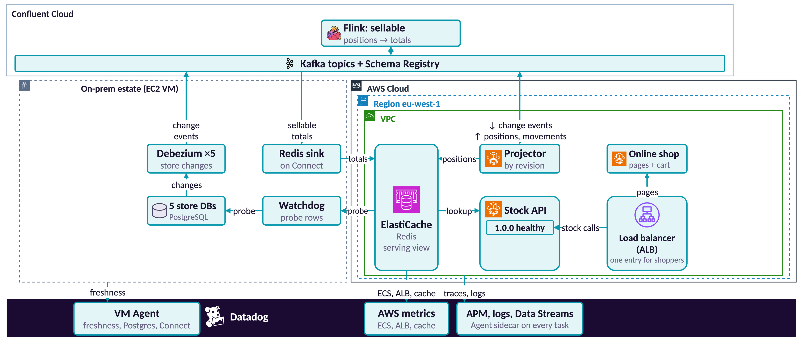

*Figure 2: the core layer. A sale in a store database becomes a change event, then a Redis update, then a new number on the page.*

Open this Chapter in the [demo home](#3-open-the-datadog-stock-dashboard "stack-link:overview-dashboard"), group "1. One honest number": the probe age per store, with links to the stock dashboard and the DSM map.

#### 1. Start from the baseline

You follow product P0042, the Alpenpace Trailrunner GTX in Forest green, size EU 42. Its seeded quantities in the five stores are 2, 1, 3, 1 and 2, so 9 in total.

<div data-path="panel" markdown="1">

**With the control panel**

Press **Full reset** on the **Background sales** card of the control panel ([how to open it](#2-open-the-control-panel "stack-link:control")) and confirm. Wait until the card reads `full-reset succeeded`. Background sales are now off.

</div>

<div data-path="terminal" markdown="1">

**With the terminal**

```sh
make reset
```

You should see `reset ok: ...` as in [0.2.6 Start from a clean state](#026-start-from-a-clean-state). Background sales are now off.

</div>

#### 2. Tour: follow one number through five hops

You build and change nothing in this tour. You only look.

<details><summary>About the tour</summary>

The number you follow is the stock of P0042, which is 9 pairs in total. It travels along the path in the picture: a store database, Debezium, Kafka in Confluent Cloud, Flink, Redis, and the page. At each hop you open one thing, see one thing and check one thing.

</details>

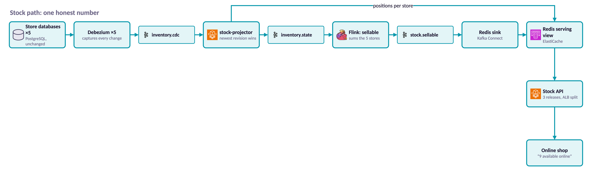

*The stock path you walk along. Five hops: the store table, the change event, the Flink sum, Redis and the shop page.*

##### Hop 1: the store table

*Open:* nothing yet.

<details><summary>Why there is nothing to open</summary>

The store databases run on the VM and the guide has no command that prints one row. The command `verify` reads every store table and compares it with Redis, and it changes nothing.

</details>

<div data-path="panel" markdown="1">

**With the control panel**

In the [control panel](#2-open-the-control-panel "stack-link:control"), press **Verify** on the **Checks** card.

</div>

<div data-path="terminal" markdown="1">

**With the terminal**

```sh
make verify
```

</div>

*You should see:* `VERIFY PASSED` in the panel, or `"mismatches": 0, "sellable_mismatches": 0` in the terminal. P0042 holds 2, 1, 3, 1 and 2 pairs in stores S01 to S05, 9 in total. Zero mismatches means the five tables and Redis agree.

##### Hop 2: the change event in Confluent Cloud

*Open:* the [`inventory.cdc` messages in the Confluent Cloud console](#2-open-the-control-panel "stack-link:topic-inventory-cdc").

*You should see:* a steady trickle of probe messages, about one per second, and new ones keep arriving while you watch.

<details><summary>What these messages are</summary>

Debezium writes a change event for every change in a store table, and each event carries the new quantity and its revision. The finale below changes P0042, and [Lab 1.2](#lab-12-optional-look-inside-confluent) shows its event.

</details>

##### Hop 3: the Flink sum

*Open:* the [`stock.sellable` topic in the Confluent Cloud console](#2-open-the-control-panel "stack-link:topic-stock-sellable"), then press **Query with Flink**. In the SQL editor, select everything (⌘A, or Ctrl+A), paste the query below and press **Run**:

```sql
SELECT * FROM `stock.sellable` WHERE product_id = 'P0042';
```

*You should see:* one row for `P0042`, with `sellable` 9 and `stores_reporting` 5. One row is expected: the table is keyed by product, so a change updates the row in place, and background sales are off since the reset, so nothing changes it yet. Press **Stop** when you have seen it: a running query uses the compute pool.

<details><summary>More about this step</summary>

**Why not the Messages search.** On this topic, Quick only reads recent records, and Full turns into a fixed query that lists every product, so neither can pick out `P0042`.

**What it costs.** The query runs on the stack's Flink compute pool, which bills while statements run. That is why you stop it.

</details>

##### Hop 4: Redis

*Open:* the availability API. Open `http://<alb-dns-name>/api/availability/P0042` in your browser.

<details><summary>Or ask it from the terminal</summary>

```sh
curl -s http://<alb-dns-name>/api/availability/P0042
```

</details>

*You should see:* a JSON answer with the total and one entry per store. The lookup service reads it from Redis and never asks a store. The total in the JSON is 9.

##### Hop 5: the shop page

*Open:* the [product page](#hop-5-the-shop-page "stack-link:shop") of `P0042`.

<details><summary>What the product page shows</summary>

You should see the brand Alpenpace, the name Trailrunner GTX, the price and "Item P0042", then a description. Below that you see "Colour: Forest green" with one swatch per colour and "Size: EU 42" with one button per size. The page also shows "9 available online", the quantity per store, and the footer "Serving release 1.0.0". The page asks the availability API for the stock about once a second.

If you click another size or colour, the page opens the URL of that SKU, with its own stock.

</details>

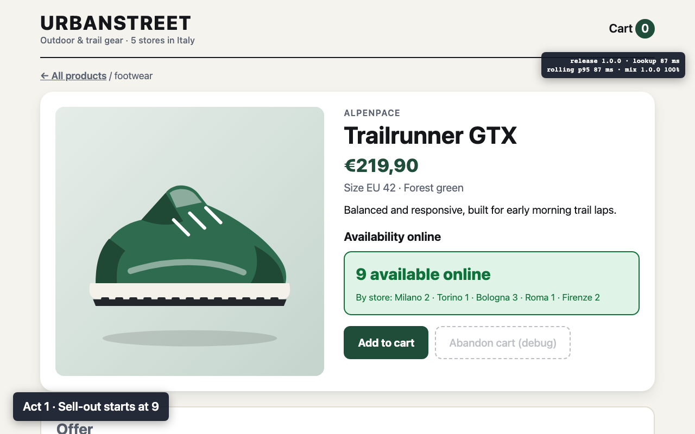

*You should see:* "9 available online". The same 9 is now in the table, in Kafka, in Flink, in Redis and on the page.

#### 3. The finale: watch a sale cross every hop

Now sell the product out and watch the change cross the hops you just visited. Open the views first, so you see the change arrive.

1. Get ready: open the [product page](#hop-5-the-shop-page "stack-link:shop") and the [`inventory.cdc` messages](#2-open-the-control-panel "stack-link:topic-inventory-cdc") side by side. In the messages view keep **By offset: Latest** and **Auto-refresh** on, and type `P0042` in the **Search** box.

<div data-path="panel" markdown="1">

**With the control panel**

2. In the [control panel](#2-open-the-control-panel "stack-link:control"), on the **Actions** card, keep `P0042` in the **Product ID** field and press **Sell out product**. Confirm; the card ends with `succeeded: Source and Redis verification completed`.

</div>

<div data-path="terminal" markdown="1">

**With the terminal**

2. This command sells all of P0042's stock in each store, one store every 1.5 s:

```sh
make sell-out PRODUCT=P0042 GAP=1.5
```

</div>

<div data-path="terminal" markdown="1">

You should see one line per store in the terminal:

```text
{"store": "S01", "sold": 2, "remaining_store": 0, "step": 1}
{"store": "S02", "sold": 1, "remaining_store": 0, "step": 2}
...
{"store": "S05", "sold": 2, "remaining_store": 0, "step": 5}
```

</div>

3. *You should see:* the product page counts 9, 7, 6, 3, 2 and then shows "Out of stock online", and five sale records for `P0042` arrive in `inventory.cdc`, one per store. [Lab 1.2](#lab-12-optional-look-inside-confluent) opens one of them.

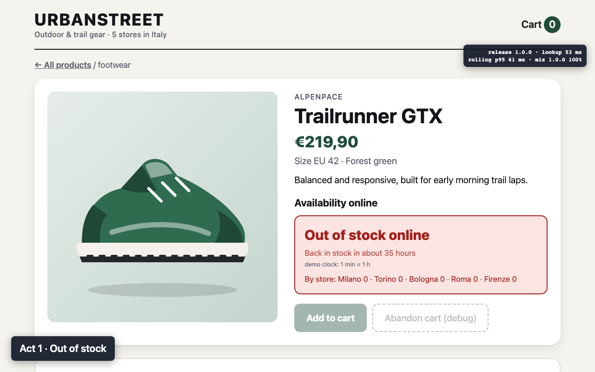

<details><summary>More about this step</summary>

**Optional: watch the count in Flink.** Before you press **Sell out product**, run the hop 3 Flink query again in a third tab, and watch the `sellable` value for `P0042` count down to 0 as each store's sale arrives. Press **Stop** afterwards.

<div data-path="panel" markdown="1">

**With the control panel**

**What the card shows while it runs.** The panel sells all of P0042's stock in each store, one store every 1.5 s. The card shows `running: Sold out S01 (1/5); source verified`, then the next store, and ends with `succeeded: Source and Redis verification completed`.

</div>

<div data-path="panel" markdown="1">

**With the control panel**

**What the Actions card looks like.**

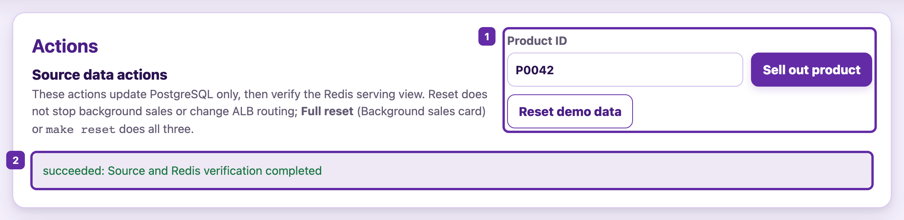

</div>

**The restock line.** A line "Back in stock in about N hours" also appears. [Lab 5.2](#lab-52-restock-that-learns) explains it.

*What just happened:* each sale was committed in one store database. Debezium published a change event to the Kafka topic `inventory.cdc`, and `stock-projector` applied it to Redis; if two events disagree, the newer <abbr title="A number that the store database increases on every change to a stock position.">revision</abbr> wins. Flink recomputed the total for P0042, a Redis sink connector wrote it to Redis, and the next request from your browser read it. No step on that path queried a store database.

**The size buttons: only the SKU you sold out is gone.** Look at the size buttons. EU 42 turns red and is crossed out, and the line "Crossed-out sizes are sold out online." appears. The other sizes in the same colour are still available. Click EU 41: that SKU still has stock. Only the SKU you sold out is gone.

**How the page knows which sizes are sold out.** While a product page is open, the Online shop asks the availability API about the other sizes in the same colour (at most 7 calls), once when the page opens and then every 10 s. It crosses out a size only when the answer confirms zero stock; an unknown answer leaves the size available. You can see these extra calls in <abbr title="Datadog's tracing of each request through the services.">APM</abbr> on `inventory-api`, and as resource calls in <abbr title="Real User Monitoring: Datadog's record of what real browser sessions do.">RUM</abbr>, next to the once-a-second lookup for the SKU you are viewing.

</details>

#### 4. Check the connectors

<div data-path="panel" markdown="1">

**With the control panel**

In the [control panel](#2-open-the-control-panel "stack-link:control"), the **Store feed** card lists the five Debezium connectors, `S01` to `S05`. Each should read `RUNNING` with `tasks RUNNING`; press **Refresh state** to read them again.

</div>

<div data-path="terminal" markdown="1">

**With the terminal**

Ask the worker's REST API:

```sh
make status
```

The last section prints one status document per connector. Every connector and task should be in state `RUNNING`, starting with `inventory-s01` … `inventory-s05` and `sellable-redis`.

</div>

<details><summary>More about this step</summary>

**Why Confluent's Connectors page does not list them.** The connectors run on a self-managed Kafka Connect worker on the VM, so Confluent Cloud's managed Connectors page does not list them.

<div data-path="panel" markdown="1">

**With the control panel**

**See the Redis sink connector too.** To see the Redis sink connector too, open the [stock dashboard](#3-open-the-datadog-stock-dashboard "stack-link:stock-dashboard") and look at `stock.connect.task_running by connector` in the **Pipeline** group: all six connectors, `inventory-s01` … `inventory-s05` and `sellable-redis`, should be at 1.

</div>

</details>

#### 5. Check freshness in Datadog

Open the [stock dashboard](#3-open-the-datadog-stock-dashboard "stack-link:stock-dashboard") and scroll to the **Freshness** group. These widgets use the <abbr title="A test stock row in each store that changes every 5 s.">probe</abbr>. You should see five `stock.probe.age per store` series, usually a few seconds each.

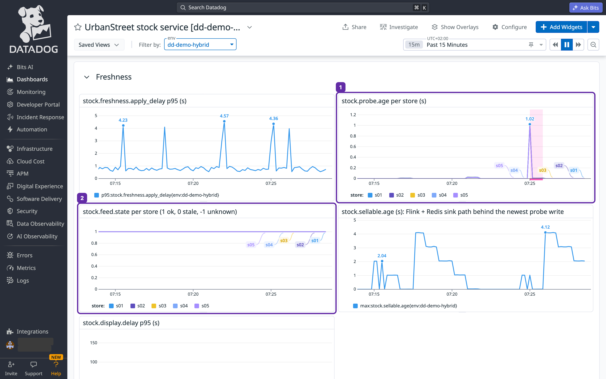

<details><summary>More about this step</summary>

**What each Freshness widget shows.**

- `stock.probe.age per store`: five series, usually a few seconds each.
- `stock.feed.state per store`: 1 means ok, 0 means stale, -1 means unknown.
- `stock.freshness.apply_delay p95`: how long accepted changes took to travel from the store to Redis, at the <abbr title="The value that 95% of measurements stay below.">p95</abbr>.
- `stock.sellable.age`: how far the Flink and Redis-sink path is behind the newest probe.
- `stock.display.delay p95`: how long a change took to appear in a browser, measured by a beacon in the Online shop's page. It has data only while a product page is open.

*What just happened:* the freshness probe (`freshness-probe`) changes a probe row in every store every 5 s and measures when the change reaches Redis. A stopped feed therefore shows up even when there are no sales.

</details>

#### 6. Look at the stream in Data Streams Monitoring

Open the [`DSM map:` link](#3-open-the-datadog-stock-dashboard "stack-link:dsm"). <abbr title="Data Streams Monitoring: Datadog's map of which services write to and read from which Kafka topics.">DSM</abbr> should show `stock-projector` consuming `inventory.cdc` and producing to "2 queues" (`inventory.state` and `stock.movements`), plus the edges of `storefront` (the Online shop's service) and `offer-worker`.

<details><summary>Why Kafka Connect and Flink appear only as topics</summary>

Kafka Connect and Flink do not run a Datadog tracer, so they appear only through their topics.

</details>

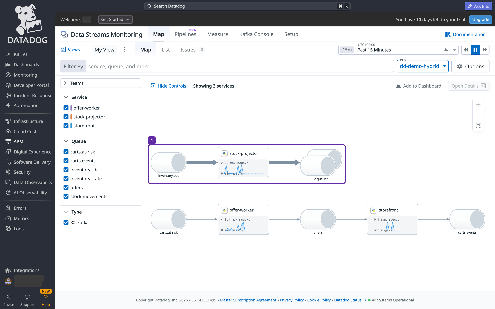

#### Checkpoint

- [ ] Verify passes. **Control panel:** **Verify** on the **Checks** card shows `VERIFY PASSED` · **Terminal:** `make verify` prints `"mismatches": 0, "sellable_mismatches": 0` ([step 2, hop 1](#hop-1-the-store-table)).
- [ ] The connectors are running. **Control panel:** the **Store feed** card shows all five stores `RUNNING` · **Terminal:** `make status` shows every connector `RUNNING` ([step 4](#4-check-the-connectors)).
- [ ] The Freshness group shows five probe-age series ([step 5](#5-check-freshness-in-datadog)).

The one number in the Online shop comes from five separate databases through one change stream, and Datadog measures how fresh it is. **Next:** [Lab 1.2](#lab-12-optional-look-inside-confluent) (optional) or [Lab 2.1](#lab-21-unknown-is-not-zero).

### Lab 1.2 (optional): Look inside Confluent

*About 10 minutes.* You follow the same sale in the Confluent Cloud console. This lab changes nothing in the stack, so you can skip it if you have little time.

#### 1. See the change event in Confluent Cloud

Open the `S05` record for `P0042` from the [finale](#3-the-finale-watch-a-sale-cross-every-hop), still on screen in the [`inventory.cdc` messages](#2-open-the-control-panel "stack-link:topic-inventory-cdc").

*You should see:* `op: "u"`, `change_reason: "sale"` and `after.quantity` 0. `after.revision` holds the new revision.

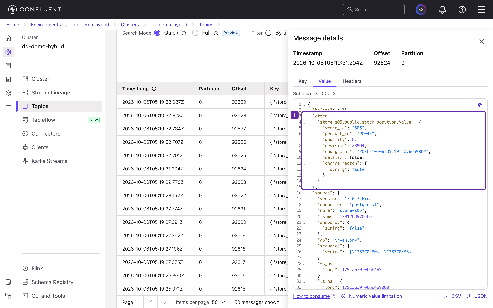

<details><summary>More about this step</summary>

**Missed it?** The records may have left the screen. Press **Full reset** on the **Background sales** card (it puts P0042 back to 9), then press **Sell out product** on the **Actions** card again while you watch the messages.

**Sale or start-up record?** An older `P0042` record may also match your search. Tell them apart by these fields:

| | Start-up record | Sale |
|---|---|---|
| `op` | `"r"` | `"u"` |
| `source.snapshot` | `"true"` | not `"true"` |
| `change_reason` | `"seed"` | `"sale"` |
| `after.quantity` | the starting stock | `0` |
| `after.revision` | lower | higher |

The start-up record is the starting stock that the connector read when it started. The other `change_reason` values are `restock` and `reset`.

**Coming back later?** The sale records leave the **Latest** window within about a minute, because the probe writes one message per second. **By time: Last hour** and **Earliest** both load the first 1,000 messages from the start, so neither reaches them. To find them later, set **By time** to a custom start a minute before your sell-out.

**Why `before` is null.**

`before` is `null`, because the store table keeps PostgreSQL's default <abbr title="What PostgreSQL logs about the old row on an update. The default logs no old values, so Debezium sends no before image.">replica identity</abbr>.

*What just happened:* the Debezium connector on the VM wrote this record directly into the Confluent Cloud cluster over TLS. The VM has no Kafka cluster, and no data is copied between clusters.

</details>

#### 2. Follow the path in Stream Lineage

Open <abbr title="Confluent Cloud's graph of who writes to and reads from each topic.">Stream Lineage</abbr> in the console with the [Stream Lineage link](#2-open-the-control-panel "stack-link:stream-lineage"), and pick the stream that contains `inventory.cdc`. You should see the Connect worker's client producing into `inventory.cdc`, `stock-projector` reading it and producing `inventory.state`, the Flink `sellable` statement producing `stock.sellable`, and the Redis sink reading that topic.

<details><summary>Why connectors appear as clients</summary>

Self-managed connectors appear as clients, not as connector boxes.

</details>

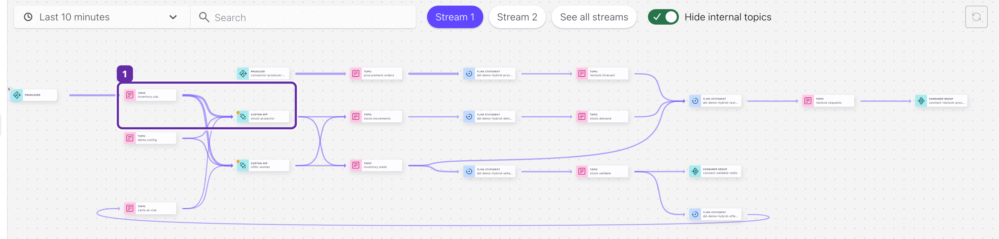

#### Checkpoint

- [ ] You found the `S05` / `P0042` sale record with quantity 0 (`op: "u"`, `change_reason: "sale"`) in Confluent Cloud ([step 1](#1-see-the-change-event-in-confluent-cloud)).
- [ ] You found the path `inventory.cdc` > `stock-projector` > `stock.sellable` > Redis sink in Stream Lineage ([step 2](#2-follow-the-path-in-stream-lineage)).

You open the consoles only when you want to look. Datadog measures the same path all the time. **Next:** [Lab 2.1](#lab-21-unknown-is-not-zero).

### Lab 2.1: Unknown is not zero

*About 10 minutes.* Sometimes one store stops sending changes, for example because its connector stops. If the Online shop then shows zero, it turns shoppers away from stock that exists. If it keeps showing the last number, it can sell stock that is already gone. You stop one store's change stream and see that the Online shop shows only the stock it can confirm, and Datadog tells you which store stopped.

**Needs:** the stack you built in 0.2 Build the stack. Nothing to turn on.

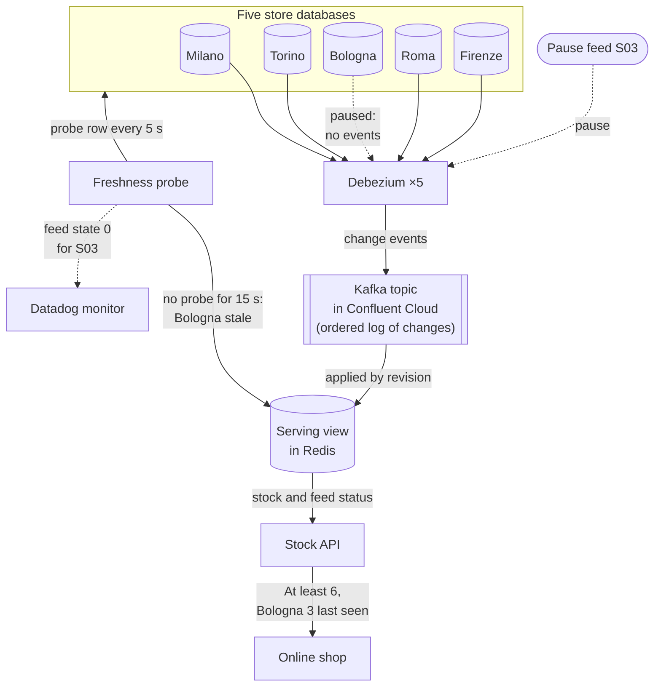
```mermaid
%%{init: {"flowchart": {"nodeSpacing": 16, "rankSpacing": 40}}}%%
flowchart TB
  subgraph STORES["Five store databases"]
    direction TB
    s1[("Milano")]
    s2[("Torino")]
    s3[("Bologna")]
    s4[("Roma")]
    s5[("Firenze")]
  end
  s1 --> dbz["Debezium ×5"]
  s2 --> dbz
  s3 -.->|"paused:<br/>no events"| dbz
  s4 --> dbz
  s5 --> dbz
  you(["Pause feed S03"]) -.->|"pause"| dbz
  STORES ~~~ fp["Freshness probe"]
  fp -->|"probe row every 5 s"| STORES
  dbz -->|"change events"| k[["Kafka topic<br/>in Confluent Cloud<br/>(ordered log of changes)"]]
  k -->|"applied by revision"| view[("Serving view<br/>in Redis")]
  fp -->|"no probe for 15 s:<br/>Bologna stale"| view
  fp -.->|"feed state 0<br/>for S03"| dd["Datadog monitor"]
  view -->|"stock and feed status"| api["Stock API"]
  api -->|"At least 6,<br/>Bologna 3 last seen"| web["Online shop"]
```

Open this Chapter in the [demo home](#3-open-the-datadog-stock-dashboard "stack-link:overview-dashboard"), group "2. Unknown is not zero": the feed state per store and the store-feed monitor.

#### 1. Reset and open the page

<div data-path="panel" markdown="1">

**With the control panel**

Press **Full reset** on the **Background sales** card of the control panel ([how to open it](#2-open-the-control-panel "stack-link:control")) and confirm. Wait until the card reads `full-reset succeeded`. Background sales are now off.

</div>

<div data-path="terminal" markdown="1">

**With the terminal**

```sh
make reset
```

</div>

Open the [product page](#hop-5-the-shop-page "stack-link:shop") of `P0042`. You should see "9 available online" for the selected size and colour.

#### 2. Pause Bologna's change stream

<div data-path="panel" markdown="1">

**With the control panel**

In the [control panel](#2-open-the-control-panel "stack-link:control"), on the **Store feed** card, choose `S03` in the **Store** list, press **Pause feed** and confirm. The card waits up to 20 seconds and then shows S03 as `PAUSED`.

</div>

<div data-path="terminal" markdown="1">

**With the terminal**

```sh
make store-pause STORE=S03
```

```text
inventory-s03 pause 202
```

</div>

<details><summary>More about this step</summary>

**What you pause.** You pause the Debezium connector of store S03 only. The store's database keeps working.

<div data-path="panel" markdown="1">

**With the control panel**

**What the Store feed card looks like.**

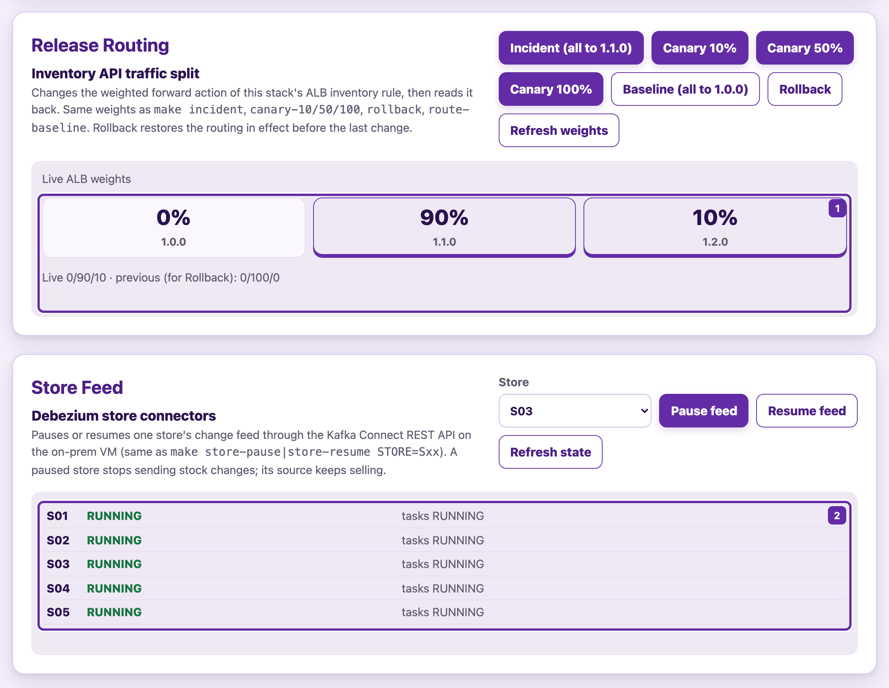

</div>

</details>

#### 3. Watch the page

Wait about 15 seconds (`stale_after_s` in the control panel). You should see "At least 6 available online", a note that only stores reporting live are counted, and "Bologna 3 (last seen, not live)" in the store line.

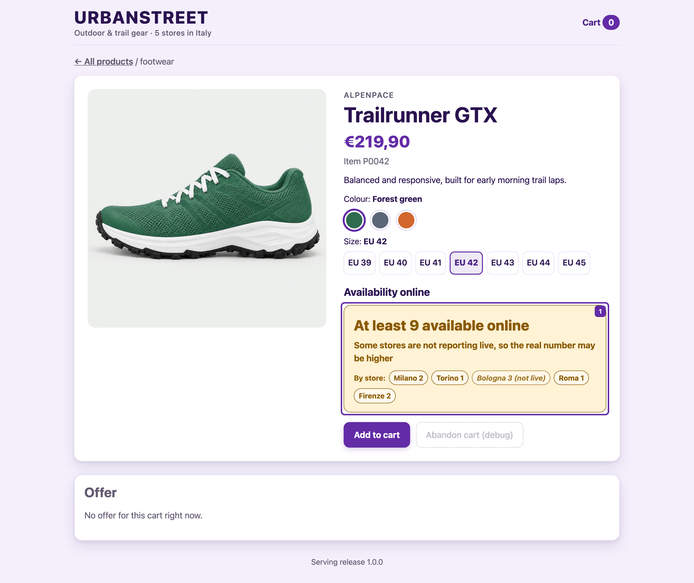

*The screenshot is from an older version and will be retaken. It still shows "At least 9"; the page now shows "At least 6" and "Bologna 3 (last seen, not live)".*

<details><summary>What just happened: why "at least 6", and not 9 or 0</summary>

*What just happened:* the freshness probe (`freshness-probe`) kept writing probe rows into store S03, but no change event left the store, so after 15 s it marked the S03 feed `stale`. The probe decides which stores are live. The minimum counts only the live stores: Milano 2, Torino 1, Roma 1 and Firenze 2 make 6. Bologna shows its last seen value, 3, but it is not counted, because Bologna may have sold them while its feed was quiet. So "at least 6" is a promise the shop can keep. If the live stores had added up to zero, the answer would have been *unknown stock*, never "out of stock".

</details>

#### 4. Check the API answer

Open `http://<alb-dns-name>/api/availability/P0042` in your browser.

In the JSON, look for `"at_least": true` and `"confirmed_min": 6`, the number the shop shows.

<details><summary>The other fields, and the terminal command</summary>

```sh
curl -s http://<alb-dns-name>/api/availability/P0042
```

`"sellable": 9` is still the total over all five stores, including Bologna's last seen 3. The S03 entry has `"feed": "stale"`, `"live": false` and `"quantity": 3`.

</details>

#### 5. Find the store in Datadog

On the [stock dashboard](#3-open-the-datadog-stock-dashboard "stack-link:stock-dashboard"), in the **Freshness** group, `stock.probe.age per store` rises for S03 only, and `stock.feed.state per store` drops to 0 for S03 while the other stores stay at 1. Within a minute or two the <abbr title="A Datadog alert rule on a metric.">monitor</abbr> "[dd-demo-hybrid] stock.feed.state below 1 on store S03" goes to Alert. You find it under Monitors > Manage Monitors by searching `stack:hybrid`.

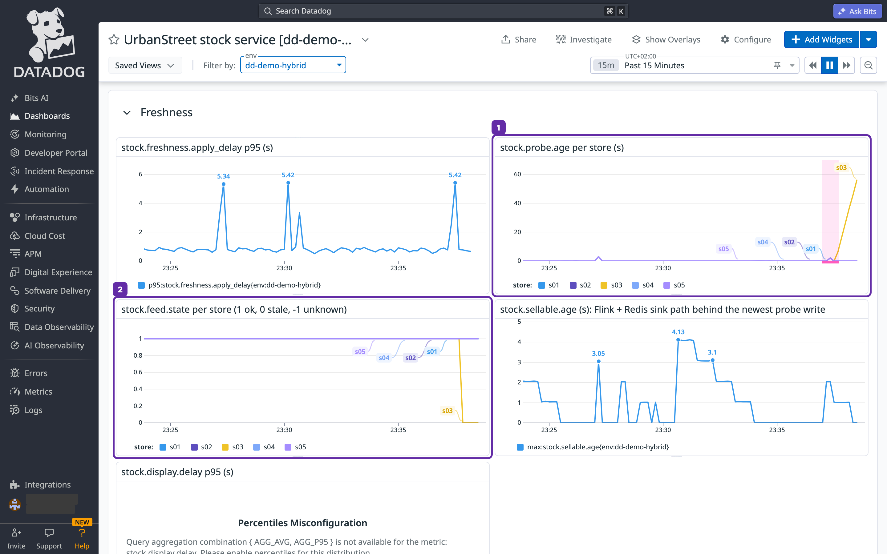

#### 6. Resume the store

<div data-path="panel" markdown="1">

**With the control panel**

In the [control panel](#2-open-the-control-panel "stack-link:control"), on the **Store feed** card, choose `S03`, press **Resume feed** and confirm. S03 goes back to `RUNNING`.

</div>

<div data-path="terminal" markdown="1">

**With the terminal**

```sh
make store-resume STORE=S03
```

```text
inventory-s03 resume 202
```

</div>

Within seconds the page shows "9 available online" again.

<details><summary>Why it catches up</summary>

Debezium continues from where it stopped, because Connect keeps its position in the offsets topic.

</details>

#### Checkpoint

- [ ] After the resume, verify passes. **Control panel:** **Verify** on the **Checks** card shows `VERIFY PASSED` · **Terminal:** `make verify` prints zero mismatches ([step 6](#6-resume-the-store)).
- [ ] While S03 was paused, the page showed "At least 6 available online" and "Bologna 3 (last seen, not live)" ([step 3](#3-watch-the-page)).
- [ ] All five `stock.feed.state` series are back at 1 ([step 5](#5-find-the-store-in-datadog)).

The probe decides which stores are live. The Online shop counts only those, shows a quiet store's last seen value without counting it, and the same probe tells operations which feed stopped. **Next:** [Lab 3.1](#lab-31-the-incident), a problem that has nothing to do with the stream.

### Lab 3.1: The incident

*About 20 minutes.* A new release of the stock lookup service makes every stock request slow. The team ships it as a <abbr title="A new release that gets a small share of traffic next to the current one, so you can compare the two before going further.">canary</abbr> with 10% of the traffic. You run the canary check, it fails, and you roll back before the other 90% of lookups are affected. Then you use Datadog on the canary's traffic to show that the cause is in the release code, not in the stream.

**Needs:** one more layer, `releases`. Lab 3.1 starts by turning it on (skip that if you chose everything at once).

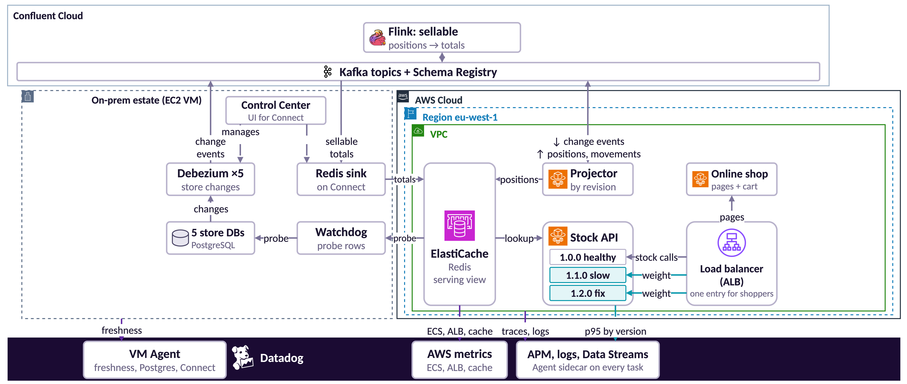

*Figure 3: the releases layer. Three releases of the stock lookup service, all reading only Redis, each behind its own target group of the load balancer.*

A *release* is one deployed build of the lookup service, identified by its version. 1.0.0 is healthy. 1.1.0 adds product details by preparing a product catalogue inside every request: the regression. 1.2.0 prepares the catalogue once at startup: the fix. The load balancer (ALB) rule for `/api/availability/*` sends requests to the three releases by weight, one <abbr title="The set of containers that receives one release's share of the traffic.">target group</abbr> per release.

The ALB moves the traffic and Datadog compares the versions. The gate (`canary-check`, or **Check canary** in the panel) says pass or stop, but only when you run it: nothing runs it for you.

<details>
<summary>Why the comparison between versions is fair</summary>

All three releases run on the same Fargate task size (0.5 vCPU / 1 GB, `service_sizing` in `terraform/aws/variables.tf`). Any difference in latency or CPU between versions therefore comes from the code, not from the task size.

</details>

Open this Chapter in the [demo home](#3-open-the-datadog-stock-dashboard "stack-link:overview-dashboard"), group "3. The incident": p95 by version, ECS CPU against the task's whole vCPU and unhealthy targets, with the Amazon ECS events as markers, and links to APM and the 1.1.0 traces.

#### Turn on the releases layer

Skip this if you chose everything at once, or if `releases` is already in your `layers:` line (`make layers-status` shows `releases: ON`).

1. In `demo.yaml`, change the line to `layers: core,releases` (keep any other layers you already added).
2. Run:

   ```sh
   make layer-on L=releases CONFIRM=yes
   ```

   Wait until the ECS services are healthy before you continue; give it a few minutes.

   <details><summary>What this creates</summary>

   This creates the p95-by-version monitor in Datadog and starts the two Fargate services for releases 1.1.0 and 1.2.0 (0.5 vCPU and 1 GB each, about $0.02 per hour each at the prices in [Reference D](#d-cost-details)).

   </details>

3. Check the layer: `make layers-status` should print `releases: ON`.

#### 1. Check that routing works from your machine

<div data-path="panel" markdown="1">

**With the control panel**

In the [control panel](#2-open-the-control-panel "stack-link:control"), open the **Release routing** card and press **Refresh weights**. The tiles should read 100% for 1.0.0 and 0% for 1.1.0 and 1.2.0.

<details><summary>Why the panel needs no AWS login</summary>

The panel changes the routing from AWS itself, so it does not need your AWS login.

</details>

</div>

<div data-path="terminal" markdown="1">

**With the terminal**

The routing commands call the AWS API, so they need a valid `aws login` session.

```sh
make route-check
```

```text
alb-routing: live weights 1.0.0/1.1.0/1.2.0 = 100 0 0%
```

If it fails, run `aws login --profile dd-demo` and try again.

</div>

#### 2. Ship 1.1.0 as a 10% canary

<div data-path="panel" markdown="1">

**With the control panel**

1. In the [control panel](#2-open-the-control-panel "stack-link:control"), press **Full reset** on the **Background sales** card and confirm. It stops background sales and sets the routing to 100 / 0 / 0. Wait for `full-reset succeeded`.
2. Press **Canary 1.1.0 (10%)** on the **Release routing** card and confirm. The tiles should read 90% for 1.0.0, 10% for 1.1.0 and 0% for 1.2.0, and the line under them `Live 90/10/0 · previous (for Rollback): 100/0/0`.

</div>

<div data-path="terminal" markdown="1">

**With the terminal**

```sh
make reset
make canary-110-10
make route-show
```

`canary-110-10` first prints the AWS rule JSON. The last lines should be:

```text
...
alb-routing: weights 1.0.0/1.1.0/1.2.0 = 90 10 0%
alb-routing: live weights 1.0.0/1.1.0/1.2.0 = 90 10 0%
current=90 10 0 previous=100 0 0
```

</div>

#### 3. Generate steady load

You send 5 requests per second for 2 minutes.

<div data-path="panel" markdown="1">

**With the control panel**

In the [control panel](#2-open-the-control-panel "stack-link:control"), press **Run load (120 s, 5 rps)** on the **Checks** card and confirm.

</div>

<div data-path="terminal" markdown="1">

**With the terminal**

```sh
make load LOAD_DURATION=120 LOAD_RPS=5
```

You should see one JSON line per 10 s window with both releases, then a summary. The gate reads this summary.

</div>

<details><summary>More about this step</summary>

**Why load.** The gate and Datadog both need enough requests on the canary to measure it.

<div data-path="panel" markdown="1">

**With the control panel**

**What the card shows while it runs.** During the 2 minutes the card shows live progress lines, for example `Load 40/120 s, last window: ...`, then the requests, errors, p50 and p95 per release. The buttons stay disabled until the run ends. The gate reads the summary of this run.

</div>

<div data-path="terminal" markdown="1">

**With the terminal**

**What the load prints.**

```text
{"window": 0, "window_s": 10, "count": 50, "releases": {"1.0.0": {"count": <n>, "errors": 0, ...}, "1.1.0": {"count": <n>, "errors": 0, ...}}}
...
{"summary": {"total": {"count": 600, "releases": {"1.0.0": {...}, "1.1.0": {...}}}, ...}}
```

</div>

**How many samples to expect.** About one lookup in ten goes to 1.1.0, so expect about 60 samples of it in two minutes.

**While it runs: watch the shop footer.** While the load runs, keep the [product page](#hop-5-the-shop-page "stack-link:shop") open and watch the footer: about once every ten seconds it shows "Serving release 1.1.0" for a second. The split is per request, not per user, and the page asks for the stock every second, so about one answer in ten comes from the slow release. That is too little to notice in the shop, which is why the canary gate and p95 by version in APM ([step 6](#6-compare-releases-in-apm)) are what catch it.

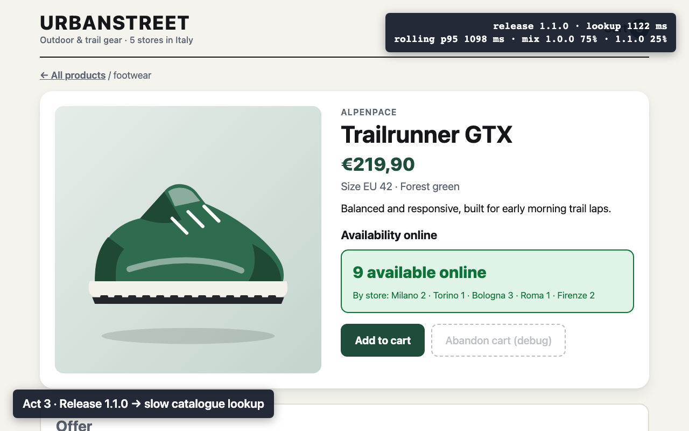

</details>

#### 4. Run the gate: it fails

The gate compares the canary (1.1.0) with the release it would replace (1.0.0).

<div data-path="panel" markdown="1">

**With the control panel**

1. In the [control panel](#2-open-the-control-panel "stack-link:control"), press **Verify** on the **Checks** card and wait for `VERIFY PASSED` with 0 position and 0 sellable mismatches.
2. Press **Check canary** and confirm.

You should see: Verify passes, because the stock numbers are right (1.1.0 is slow, not wrong). Then Check canary fails on latency only: the result box shows `CANARY GATES FAILED: p95 1.1.0 <ms> ms > budget 200 ms; roll back`, with several hundred ms against the 200 ms budget. Only the `p95_b` line is `FAIL`; the sample, error-rate and correctness gates are `PASS`.

</div>

<div data-path="terminal" markdown="1">

**With the terminal**

```sh
make verify
make canary-check CHECK_ARGS="--release-a 1.0.0 --release-b 1.1.0 --min-samples 30 --verify-file /out/verify.json"
```

You should see: `make verify` passes with 0 mismatches, because the stock numbers are right (1.1.0 is slow, not wrong). Then the gate fails on latency only, with a p95 of several hundred ms against the 200 ms budget:

```text
PASS min_samples_a: release 1.0.0: <n> samples, need >= 30
PASS min_samples_b: release 1.1.0: <n> samples, need >= 30
PASS error_rate_a: release 1.0.0: 0/<n> errors (0.0000), max 0.0
PASS error_rate_b: release 1.1.0: 0/<n> errors (0.0000), max 0.0
FAIL p95_b: release 1.1.0: p95 <ms> ms, budget 200 ms
PASS correctness: verify: 0 mismatch(es)
CANARY GATES FAILED: p95 1.1.0 <ms> ms > budget 200 ms; roll back
```

</div>

That is the expected result: the answers are correct and there are no errors, but the canary is too slow, so the rollout stops here.

<details><summary>More about this step</summary>

**What the gate checks.** It requires at least 30 samples of each, no errors, a canary p95 of 200 ms or less, and a passing verify. The default minimum is 100 samples, but a 10% share gives only about 60 in two minutes, so at 10% the gate lowers it to 30.

<div data-path="panel" markdown="1">

**With the control panel**

**Which gate the card picks.** With the routing at 90 / 10 / 0, the card picks this gate by itself and shows it below the buttons as `CHECK_ARGS="--release-a 1.0.0 --release-b 1.1.0 --min-samples 30 --verify-file /out/verify.json"`.

</div>

<div data-path="panel" markdown="1">

**With the control panel**

**The status line.** The status line reads `canary-check failed: CANARY GATES FAILED: p95 1.1.0 <ms> ms > budget 200 ms; roll back ...`.

</div>

<div data-path="terminal" markdown="1">

**With the terminal**

**Exit code, and running it without `CHECK_ARGS`.** The command exits with a non-zero code. Without `CHECK_ARGS`, `make canary-check` reads the live routing and picks the same gate; the explicit form above shows what it checks.

</div>

</details>

#### 5. Roll back

<div data-path="panel" markdown="1">

**With the control panel**

In the [control panel](#2-open-the-control-panel "stack-link:control"), press **Rollback** on the **Release routing** card and confirm. The tiles should read 100 / 0 / 0 again, the split before the last change, and the line under them `Live 100/0/0 · previous (for Rollback): 90/10/0`.

</div>

<div data-path="terminal" markdown="1">

**With the terminal**

```sh
make rollback
make route-show
```

```text
...
current=100 0 0 previous=90 10 0
```

</div>

Only the 10% of lookups that went to 1.1.0 during the canary were slow. The other 90% never reached it.

<details><summary>Where the evidence is</summary>

The canary's traces stay in Datadog, so you can now look for the cause while shoppers use the healthy release.

</details>

#### 6. Compare releases in APM

Open the [`APM inventory-api 1.1.0:` link](#3-open-the-datadog-stock-dashboard "stack-link:apm") and look at the **Deployments** section of the service page. Each row is one version, with its p95 latency and error rate. You should see 1.1.0 far above 1.0.0.

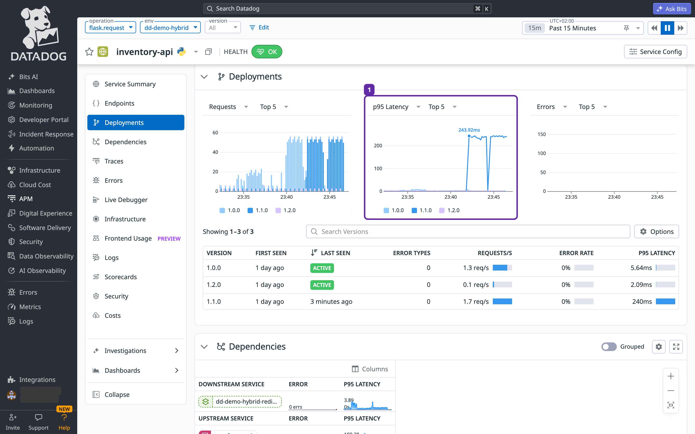

<details>
<summary>Two more views, our numbers, and why the three numbers differ</summary>

Without the link: APM > `inventory-api` with environment `dd-demo-hybrid`, past 15 minutes, operation `flask.request` (the APM link redirects to `/apm/entity/service:inventory-api`). During the canary, 1.1.0 is far above 1.0.0 at p95: around a second or more, against under ten milliseconds.

You can read the comparison in three places. The first is the **Deployments** section above; the other two follow.

In our run (2026-10-06, every release on 0.5 vCPU) the load script measured a client-side p95 of about 1.5 s for 1.1.0 and about 10 ms for 1.0.0 at 90 / 10 / 0. Your numbers will differ.

2. To see the same number as a graph, open Metrics > Explorer and paste this query (the environment in angle brackets is yours: `dd-demo-` followed by your stack name; a connected guide fills it in):

   ```text
   p95:trace.flask.request{env:<env>,service:inventory-api,resource_name:get_/api/availability/_product_id} by {version}
   ```

   Set the time range to the load window. You should see one line per version.
3. To see the load balancer's measurement, open Metrics > Explorer with the AWS integration's metric (the name in angle brackets is `dd-demo-` followed by your stack name; a connected guide fills it in):

   ```text
   avg:aws.applicationelb.target_response_time.p95{name:<stack name>} by {targetgroup}
   ```

   The AWS integration publishes the percentile as a separate metric (`.p95`), so take its average by target group. You should see the target group of 1.1.0 (`inventory-110`) well above the others. The AWS integration sends this metric once per minute.

**Why the three numbers differ.** The load script's p95, the one the gate checks, is measured end to end through the load balancer. It includes the time a request waits while the slow release is busy. The load balancer's target response time starts when the request is sent to the task and ends when the first byte comes back. The APM <abbr title="One timed step inside a request.">span</abbr> measures only the handler inside the service, so it does not see time spent waiting before the handler starts.

The three numbers agree when no requests wait, as on 1.0.0 and 1.2.0. Use the APM number to say how much time the code takes, and the client number to say what a shopper experienced.

</details>

#### 7. Open one slow trace

Open Traces filtered to `version:1.1.0` and open a slow request's <abbr title="The full record of one request, made of spans: one timed step each.">trace</abbr>. You should see a `catalogue.prepare` span that takes most of the request time and a short `stock.read` span (the Redis reads).

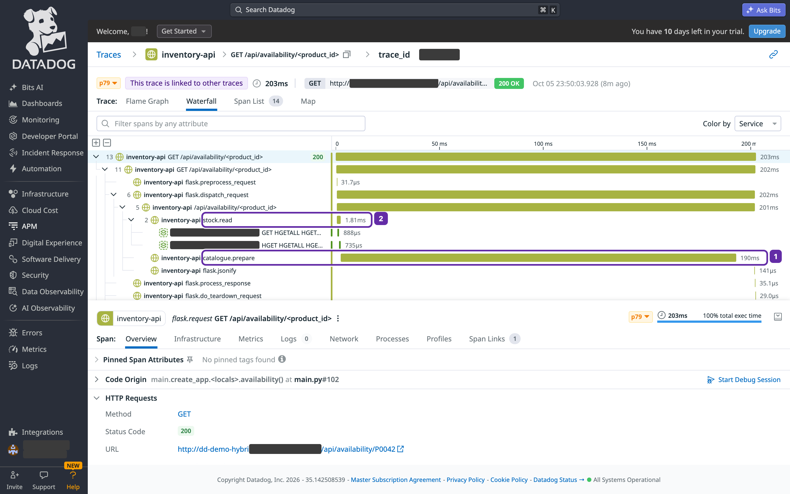

<details><summary>More about this step</summary>

**If you do not see the spans.** If the trace does not show them at first, switch to the **Waterfall** view and look for `catalogue.prepare` and `stock.read` there.

**Optional, with the `dd-rum` layer: start from the shopper's side.** Optional, with the `dd-rum` layer on: the Online shop's <abbr title="Real User Monitoring: Datadog's record of what real browser sessions do.">RUM</abbr> SDK adds trace headers to its own `/api/` calls, so you can also start from the shopper's side. In RUM, open a session of your product page from the canary window, choose a slow `/api/availability/...` resource and open its trace. It opens the same `inventory-api` trace with `catalogue.prepare`.

*What just happened:* every span carries the *unified service tags* `env`, `service` and `version`, so APM can compare releases directly, even when one of them got only a tenth of the traffic. The catalogue work uses CPU and runs again in every request, so latency grows with load, while the Redis read stays fast.

</details>

#### 8. Rule out the stream

On the [stock dashboard](#3-open-the-datadog-stock-dashboard "stack-link:stock-dashboard") the **Freshness** group has not changed, and the **Service objective** group shows `inventory-api p95 latency by version` rising for 1.1.0 only.

<details><summary>The DSM map and the p95 monitor</summary>

The [DSM map](#3-open-the-datadog-stock-dashboard "stack-link:dsm") shows the same healthy edges as in Lab 1.1. The monitor "[dd-demo-hybrid] inventory-api p95 latency above 0.2s on 1.1.0" can go to Alert after its evaluation window, depending on how many 1.1.0 samples fell into that window.

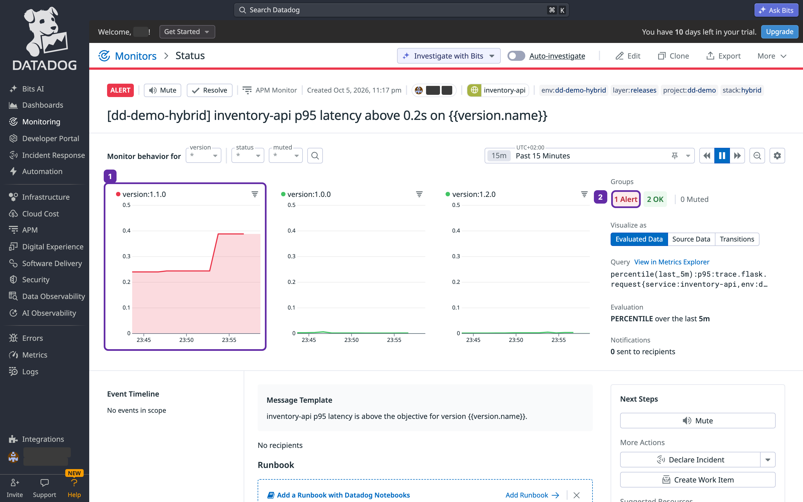

</details>

#### 9. Optional: see what skipping the gate would have done

To see the effect without a canary, send all traffic to 1.1.0 once, send load for about 2 minutes, then switch back to the healthy release.

<details><summary>Try it: all traffic to 1.1.0, and what happened in our run</summary>

<div data-path="panel" markdown="1">

**With the control panel**

1. In the [control panel](#2-open-the-control-panel "stack-link:control"), press **Incident (all to 1.1.0)** on the **Release routing** card and confirm. The tiles read 0 / 100 / 0.
2. Press **Run load (120 s, 5 rps)** on the **Checks** card and wait for the run to end.
3. Press **Baseline (all to 1.0.0)**. The tiles read 100 / 0 / 0.

</div>

<div data-path="terminal" markdown="1">

**With the terminal**

```sh
make incident
```

Then send load. It runs for about 2 minutes:

```sh
make load LOAD_DURATION=120 LOAD_RPS=5
```

When it ends, switch back to the healthy release:

```sh
make route-baseline
```

</div>

While the load runs, every lookup goes to 1.1.0 and requests queue up. On 0.5 vCPU, 1.1.0 cannot keep up with 5 requests per second. In our run (2026-10-06) 532 of the 600 requests timed out on the client, the 15 that were answered had a p95 of about 9.4 s, the task used its whole 0.5 vCPU, and ECS replaced it after it failed its health check. This is what the 10% canary kept away from 90% of the lookups. To see it in Datadog, open the [demo home](#3-open-the-datadog-stock-dashboard "stack-link:overview-dashboard"), group "3. The incident", and use its link "The night of the incident": it opens the same dashboard on 2026-10-06 18:10-18:30 UTC, our run, where ECS CPU of 1.1.0 stays at 100% for about four minutes, the target turns unhealthy and the Amazon ECS events show the task being replaced. That fixed window has data only on the stack `hybrid`; for your own run, set the time picker to the minutes of your load. ECS starts a new 1.1.0 task by itself; Lab 4.1 does not need it. This run also gives you the CPU comparison under the same load that you use at the end of [Lab 4.1](#5-prove-it-latency-cpu-and-cost).

</details>

#### Checkpoint

- [ ] The gate reported `CANARY GATES FAILED` with a `FAIL` line for `p95_b` on release 1.1.0 ([step 4](#4-run-the-gate-it-fails)).
- [ ] After the rollback, the routing is back to 100 / 0 / 0. **Control panel:** the **Release routing** tiles read 100 / 0 / 0 · **Terminal:** `make route-show` reads `100 0 0` ([step 5](#5-roll-back)).
- [ ] APM shows a much higher p95 for 1.1.0 than for 1.0.0, and a 1.1.0 trace shows `catalogue.prepare` ([steps 6 and 7](#6-compare-releases-in-apm)).
- [ ] The Freshness group shows no change ([step 8](#8-rule-out-the-stream)).

The failed gate stopped the slow release at 10%, and the rollback removed it. The version tags changed "the canary is slow" into "release 1.1.0 prepares a catalogue in every request". Do not reset: Lab 4.1 starts from 100 / 0 / 0. **Next:** [Lab 4.1](#lab-41-canary-the-fix).

### Lab 4.1: Canary the fix

*About 25 minutes.* Release 1.2.0 fixes the slowdown from Lab 3.1: it prepares the product catalogue once, when the service starts. A fix is still a change, and if it is wrong, sending everyone to it at once gives everyone the problem. So you ship 1.2.0 the way you shipped 1.1.0: 10% of traffic next to 1.0.0, then wider steps. Before each step you run the <abbr title="canary-check, or Check canary in the panel: a pass or fail check of samples, errors, p95 and correctness. You run it yourself.">gate</abbr> and go on only if it passes. You also practise the way back. This time the gates pass.

**Needs:** `releases`, already on from Chapter 3.

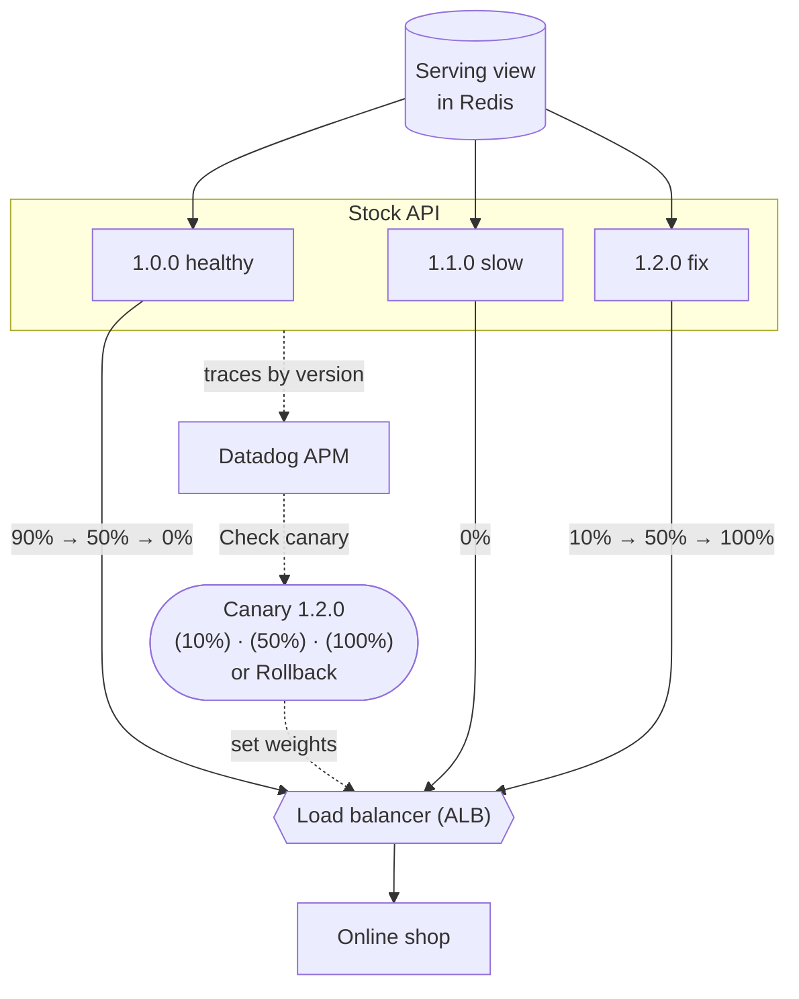
```mermaid
%%{init: {"flowchart": {"nodeSpacing": 24, "rankSpacing": 45}}}%%
flowchart TB
  view[("Serving view<br/>in Redis")]
  subgraph REL["Stock API"]
    direction TB
    r100["1.0.0 healthy"]
    r110["1.1.0 slow"]
    r120["1.2.0 fix"]
  end
  view --> r100 & r110 & r120
  r100 -->|"90% → 50% → 0%"| alb{{"Load balancer (ALB)"}}
  r110 -->|"0%"| alb
  r120 -->|"10% → 50% → 100%"| alb
  alb --> web["Online shop"]
  REL -.->|"traces by version"| apm["Datadog APM"]
  apm -.->|"Check canary"| btn(["Canary 1.2.0<br/>(10%) · (50%) · (100%)<br/>or Rollback"])
  btn -.->|"set weights"| alb
```

Every step uses the same loop as Lab 3.1: set the weight, read it back, generate load, verify the data, then run the gate.

<details><summary>The three steps at a glance</summary>

<div data-path="panel" markdown="1">

**With the control panel**

In the [control panel](#2-open-the-control-panel "stack-link:control"), the **Release routing** card has one button per step, and the **Checks** card runs the load, the verify and the gate:

| Step | Button on **Release routing** | Tiles 1.0.0 / 1.1.0 / 1.2.0 | Gate that **Check canary** picks |
|---|---|---|---|
| 10% | **Canary 1.2.0 (10%)** | 90 / 0 / 10 | 1.2.0 against 1.0.0, at least 30 samples of each (step 1) |
| 50% | **Canary 1.2.0 (50%)** | 50 / 0 / 50 | 1.2.0 against 1.0.0, at least 100 samples of each (step 3) |
| 100% | **Canary 1.2.0 (100%)** | 0 / 0 / 100 | 1.2.0 alone (step 4) |

</div>

<div data-path="terminal" markdown="1">

**With the terminal**

| Step | Command | `route-show` should read | Gate (`canary-check CHECK_ARGS=...`) |
|---|---|---|---|
| 10% | `make canary-10` | `90 0 10` | `--release-a 1.0.0 --release-b 1.2.0 --min-samples 30` (see step 1) |
| 50% | `make canary-50` | `50 0 50` | `--release-a 1.0.0 --release-b 1.2.0` (see step 3) |
| 100% | `make canary-100` | `0 0 100` | `--release-b 1.2.0` only (see step 4) |

Each gate also takes `--verify-file /out/verify.json`.

</div>

A weight is the share you ask for, not the exact split, so the gate counts what really happened: it reads the `X-Release` header of every response to see which release answered.

</details>

Open this Chapter in the [demo home](#3-open-the-datadog-stock-dashboard "stack-link:overview-dashboard"), group "4. Canary the fix": requests and error rate per release as traffic moves to 1.2.0.

#### 1. Send 10% to the fix

<div data-path="panel" markdown="1">

**With the control panel**

1. In the [control panel](#2-open-the-control-panel "stack-link:control"), press **Canary 1.2.0 (10%)** on the **Release routing** card and confirm. The tiles read 90 / 0 / 10, and the line under them `Live 90/0/10 · previous (for Rollback): 100/0/0`.
2. On the **Checks** card, press **Run load (120 s, 5 rps)** and wait about 2 minutes for the run to end.
3. Press **Verify** and wait for `VERIFY PASSED`.
4. Press **Check canary**.

The result box shows `CANARY GATES PASSED`, a `PASS` line for each gate, and the samples, errors and p95 per release.

</div>

<div data-path="terminal" markdown="1">

**With the terminal**

```sh
make canary-10
make route-show
```

The last line should read `current=90 0 10 previous=100 0 0`. Then send load for about 2 minutes:

```sh
make load LOAD_DURATION=120 LOAD_RPS=5
```

When the summary line appears, verify the data and run the gate:

```sh
make verify
make canary-check CHECK_ARGS="--release-a 1.0.0 --release-b 1.2.0 --min-samples 30 --verify-file /out/verify.json"
```

This is the same gate as in Lab 3.1, with 1.2.0 as the canary. You should see:

```text
PASS min_samples_a: release 1.0.0: <n> samples, need >= 30
PASS min_samples_b: release 1.2.0: <n> samples, need >= 30
PASS error_rate_a: release 1.0.0: 0/<n> errors (0.0000), max 0.0
PASS error_rate_b: release 1.2.0: 0/<n> errors (0.0000), max 0.0
PASS p95_b: release 1.2.0: p95 <ms> ms, budget 200 ms
PASS correctness: verify: 0 mismatch(es)
CANARY GATES PASSED
```

If a gate fails, the command exits with a non-zero code.

</div>

If a gate fails, its `FAIL` line names it: stop and roll back.

<details><summary>More about this step</summary>

<div data-path="panel" markdown="1">

**With the control panel**

**Which gate the card picks.** The card picks the gate for this step from the live routing, `CHECK_ARGS="--release-a 1.0.0 --release-b 1.2.0 --min-samples 30 --verify-file /out/verify.json"`, the same gate as in Lab 3.1 with 1.2.0 as the canary.

</div>

<div data-path="panel" markdown="1">

**With the control panel**

**The status line.** The status line reads `canary-check succeeded: CANARY GATES PASSED at 10% (...)`.

</div>

**Our numbers, and the shop during the 10% canary.** In an earlier run, the 10% step had 75 samples of 1.2.0, and the p95 of 1.2.0 was about 23 ms.

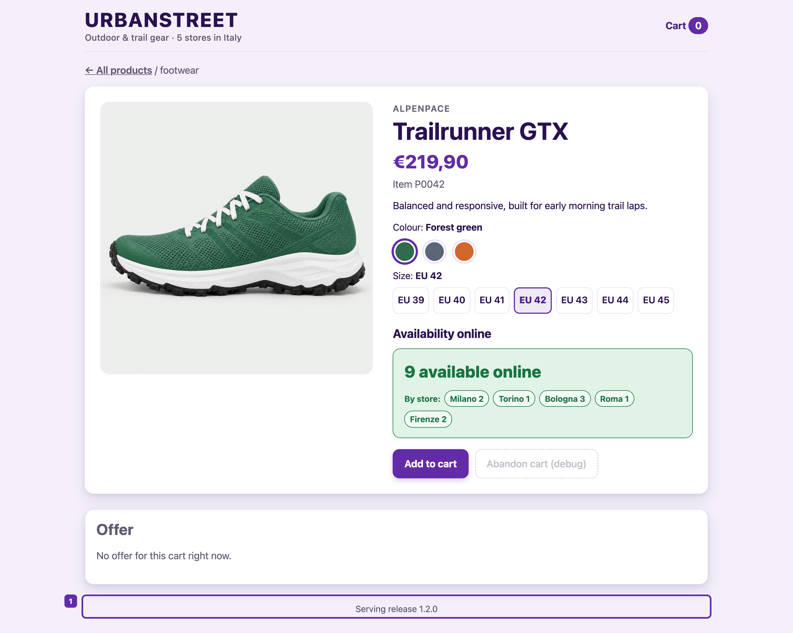

</details>

#### 2. Compare the versions in APM

Open the `inventory-api` service page (environment `dd-demo-hybrid`, past 15 minutes). The **Deployments** section now lists three versions: 1.0.0, 1.1.0 (from the Lab 3.1 canary) and 1.2.0. The p95 of 1.2.0 is close to that of 1.0.0 and much lower than that of 1.1.0.

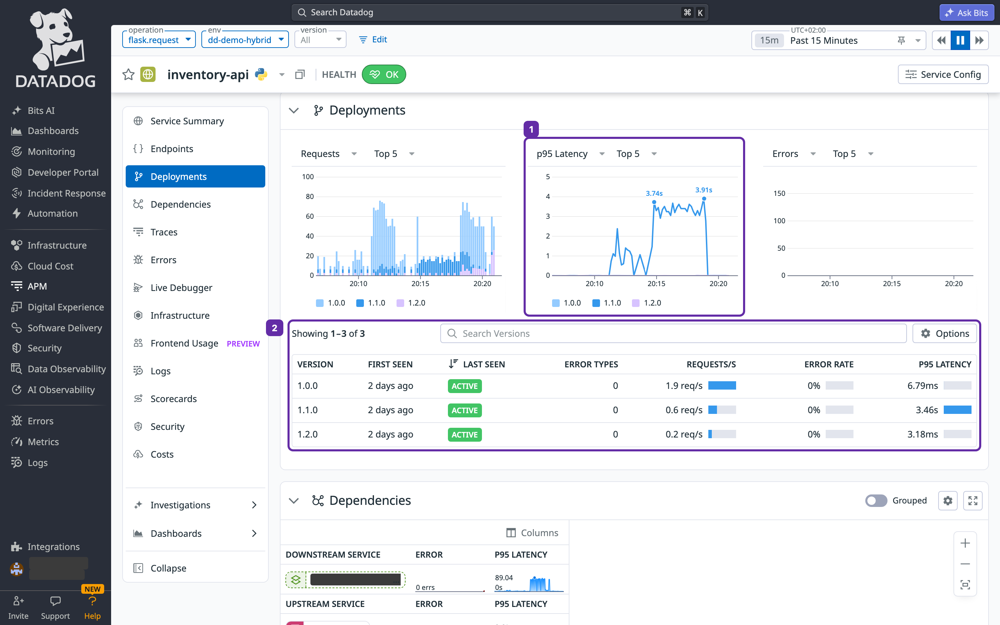

#### 3. Go to 50%, then practise backing out

Do this step only if the 10% gate passed.

<div data-path="panel" markdown="1">

**With the control panel**

1. In the [control panel](#2-open-the-control-panel "stack-link:control"), on the **Release routing** card, press **Canary 1.2.0 (50%)** and confirm. The tiles read 50 / 0 / 50.
2. Press **Run load (120 s, 5 rps)**, wait for the end of the run, press **Verify**, then **Check canary**. At 50 / 0 / 50 the card picks `CHECK_ARGS="--release-a 1.0.0 --release-b 1.2.0 --verify-file /out/verify.json"` and should show `CANARY GATES PASSED`.
3. Roll back once, to practise it: press **Rollback** and confirm. The tiles go back to 90 / 0 / 10, and the line under them reads `Live 90/0/10 · previous (for Rollback): 50/0/50`.

Now press **Canary 1.2.0 (50%)** again to go forward.

</div>

<div data-path="terminal" markdown="1">

**With the terminal**

Run the loop again with `canary-50` and `CHECK_ARGS="--release-a 1.0.0 --release-b 1.2.0 --verify-file /out/verify.json"`, so without `--min-samples`. Then roll back once, to practise it:

```sh
make rollback
make route-show
```

```text
...
current=90 0 10 previous=50 0 50
```

Now go forward again with `canary-50`.

</div>

<details><summary>More about this step</summary>

**Why this gate keeps the default minimum.** With half of the 600 requests, 1.2.0 gets about 300 samples, above the default minimum of 100, so this gate does not lower the minimum.

<div data-path="panel" markdown="1">

**With the control panel**

**Rollback** restores the split that was live before the last change, here 90 / 0 / 10. That is not always the healthy release. In a real emergency, press **Baseline (all to 1.0.0)**, which sends all traffic back to 1.0.0. Both buttons change only the routing.

</div>

<div data-path="terminal" markdown="1">

**With the terminal**

**Rollback is not always the healthy release.**

`rollback` restores the split that was live before the last change for this stack, here 90 / 0 / 10. That is not always the healthy release. In a real emergency, run `make route-baseline`, which sends all traffic back to 1.0.0. Both commands change only the routing.

</div>

</details>

#### 4. Finish the rollout

<div data-path="panel" markdown="1">

**With the control panel**

1. In the [control panel](#2-open-the-control-panel "stack-link:control"), on the **Release routing** card, press **Canary 1.2.0 (100%)** and confirm. The tiles read 0 / 0 / 100.
2. Press **Run load (120 s, 5 rps)**, wait for the end of the run, then press **Verify** and **Check canary**. At 0 / 0 / 100 the card picks `CHECK_ARGS="--release-b 1.2.0 --verify-file /out/verify.json"`. You should see `PASS` for `min_samples_b`, `error_rate_b`, `p95_b` and `correctness`, then `CANARY GATES PASSED`.

</div>

<div data-path="terminal" markdown="1">

**With the terminal**

```sh
make canary-100
make route-show
```

The last line should start with `current=0 0 100`. Then send load for about 2 minutes:

```sh
make load LOAD_DURATION=120 LOAD_RPS=5
```

When the summary line appears, verify the data and run the gate:

```sh
make verify
make canary-check CHECK_ARGS="--release-b 1.2.0 --verify-file /out/verify.json"
```

You should see `PASS` for `min_samples_b`, `error_rate_b`, `p95_b` and `correctness`, then `CANARY GATES PASSED`.

</div>

<details><summary>More about this step</summary>

**Why the last gate checks only 1.2.0.** At 100%, 1.0.0 gets no traffic, so the gate checks only 1.2.0.

<div data-path="panel" markdown="1">

**With the control panel**

**Changed the routing after the load?** If you change the routing after a load, run the load again before you press **Check canary**. The card does not judge a load that ran with a different split.

</div>

*What just happened:* each load, from make or from the panel, replaces the summary file that `canary-check` reads, so the gate always judges the latest step. Do not widen a rollout based on an old summary. Each release is a separate Fargate service, so changing the split did not change any image, any data or any Kafka offset.

</details>

#### 5. Prove it: latency, CPU and cost

You have now run the same load (120 s at 5 requests per second) with 1.2.0 taking all traffic. Compare it with 1.1.0 in Datadog:

1. Latency: use the Metrics Explorer query from [Lab 3.1](#6-compare-releases-in-apm) and compare the versions. 1.2.0 should be much lower than 1.1.0.

<details><summary>CPU and cost, with the query and our numbers</summary>

In our run the load script measured a client-side p95 of about 8 ms for 1.2.0 with all traffic (575 requests, no errors), and APM showed about 3 ms. 1.1.0 with all traffic timed out, as in Lab 3.1 step 9.

2. CPU: open Metrics > Explorer and paste the query below. It is the query of the **Fargate CPU usage by service/version** widget on the stock dashboard (group *ElastiCache and VM host*, tags `service` and `version`). The stack in angle brackets is your stack name; a connected guide fills it in:

   ```text
   sum:ecs.fargate.cpu.usage{project:dd-demo,stack:<stack>} by {service,version}
   ```

   The values are in nanocores (1 vCPU = 10⁹ nanocores), averaged over the whole task, including the Agent sidecar container. To compare fairly, each version must get the same load. The optional all-traffic step at the end of [Lab 3.1](#lab-31-the-incident) gives you that. In our run, with 5 requests per second sent to each release in turn, 1.1.0 used its whole 0.5 vCPU until ECS replaced it, and 1.2.0 used about 0.02 vCPU (AWS Container Insights, `CpuUtilized`, 2026-10-06). That is at least 20 times less CPU for the same traffic; the real gap is larger, because 1.1.0 hit its limit.
3. Cost: all three releases run on the same task size (0.5 vCPU / 1 GB in `service_sizing`, `terraform/aws/variables.tf`), so each task costs the same per hour on Fargate. The saving comes from capacity: the fix uses much less CPU per request, so the same tasks can serve more traffic before you need more tasks. We did not measure at what traffic level either release needs more tasks.

</details>

#### Checkpoint

- [ ] All traffic goes to 1.2.0. **Control panel:** the **Release routing** tiles read 0 / 0 / 100 · **Terminal:** `make route-show` reads `0 0 100` ([step 4](#4-finish-the-rollout)).
- [ ] The final gate passed. **Control panel:** the final **Check canary** shows `CANARY GATES PASSED` · **Terminal:** the final `make canary-check` prints `CANARY GATES PASSED` ([step 4](#4-finish-the-rollout)).

The fix now gets all traffic. You widened it in steps, each step passed the same gate that stopped 1.1.0, and you tested the way back. Lab 5.1 starts with a reset, which sets the routing back to 100 / 0 / 0. **Next:** [Lab 5.1](#lab-51-offers-with-a-safe-default).

### Lab 5.1: Offers with a safe default

*About 20 minutes.* When a product in a shopper's cart sells out, the Online shop offers an alternative. An external AI service can choose it, but its choice counts only when it is confident enough; otherwise a fixed rule decides. The AI part is optional, so the shop still works when the AI is slow, wrong or switched off, and every offer records why it was made.

**Needs:** the `offers` layer. Lab 5.1 starts by turning it on (skip that if you chose everything at once). Lab 5.2 needs the `restock` layer and turns it on the same way.

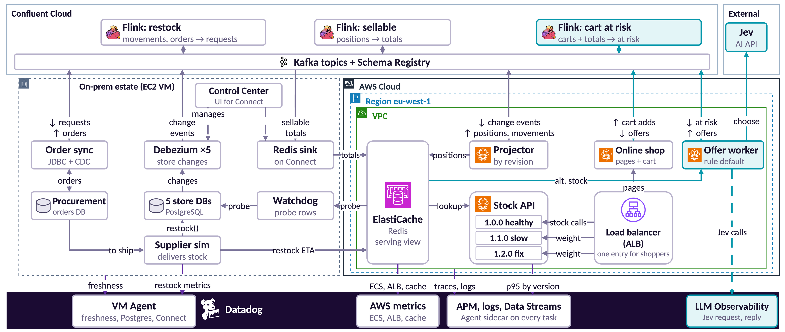

*Figure 5: the offers layer adds a Flink "cart at risk" statement, the offer worker on Fargate, and an optional call to the external Jev API.*

A *cart at risk* is an active cart that holds a product whose sellable stock just reached zero.

<details><summary>How the offer is chosen</summary>

For each one, `offer-worker` builds up to two <abbr title="In stock, same category and size, price within 20% of the sold-out product.">eligible alternatives</abbr> plus a "notify me" option. It sends Jev, an external decision API, the product facts, the restock ETA and a few synthetic cart signals (cart value, item count, new or returning shopper), never cart or shopper IDs. Jev returns a choice and a confidence score. The worker accepts the choice only if it is one of the options and its confidence is at least 0.8, the *confidence threshold*. Otherwise it uses the *rule default*: the in-stock alternative closest in price, or "notify me" if there is none.

</details>

> [!NOTE]
> Without a Jev key every offer takes the rule default with reason `disabled`, and LLM Observability has no AI call to show. The rest of the lab works the same way.

Open this Chapter in the [demo home](#3-open-the-datadog-stock-dashboard "stack-link:overview-dashboard"), group "5. The AI offer": decisions by route and reason, with links to LLM Observability and the offer-worker service.

#### Turn on the offers layer

Skip this if you chose everything at once, or if `offers` is already in your `layers:` line. In `demo.yaml`, add `offers` to the line, then run:

```sh
make layer-on L=offers CONFIRM=yes
```

<details><summary>What this creates</summary>

This creates two Kafka topics and one more Flink statement ("cart at risk") in Confluent Cloud, starts the `offer-worker` Fargate service, and switches the Online shop's offer branch on. If you set `jev_api_key` in `demo.yaml`, the worker can call Jev; without it every offer uses the rule default.

</details>

Check with `make layers-status`: `offers: ON`.

#### 1. Reset and add to cart

<div data-path="panel" markdown="1">

**With the control panel**

In the [control panel](#2-open-the-control-panel "stack-link:control"), press **Full reset** on the **Background sales** card and confirm. Wait for `full-reset succeeded`.

</div>

<div data-path="terminal" markdown="1">

**With the terminal**

```sh
make reset
```

</div>

Open the [product page](#hop-5-the-shop-page "stack-link:shop") of `P0042` and click **Add to cart**. The cart badge should show 1.

<details><summary>What adding to the cart does</summary>

The Online shop has published a cart `ADD` event to Kafka.

</details>

#### 2. Sell it out

Keep the [product page](#hop-5-the-shop-page "stack-link:shop") open where you can see it.

<div data-path="panel" markdown="1">

**With the control panel**

In the [control panel](#2-open-the-control-panel "stack-link:control"), on the **Actions** card, keep `P0042` in the **Product ID** field, press **Sell out product** and confirm.

</div>

<div data-path="terminal" markdown="1">

**With the terminal**

```sh
make sell-out PRODUCT=P0042 GAP=1.5
```

</div>

About 8 to 10 seconds after the last store sells out, an offer card appears below the product.

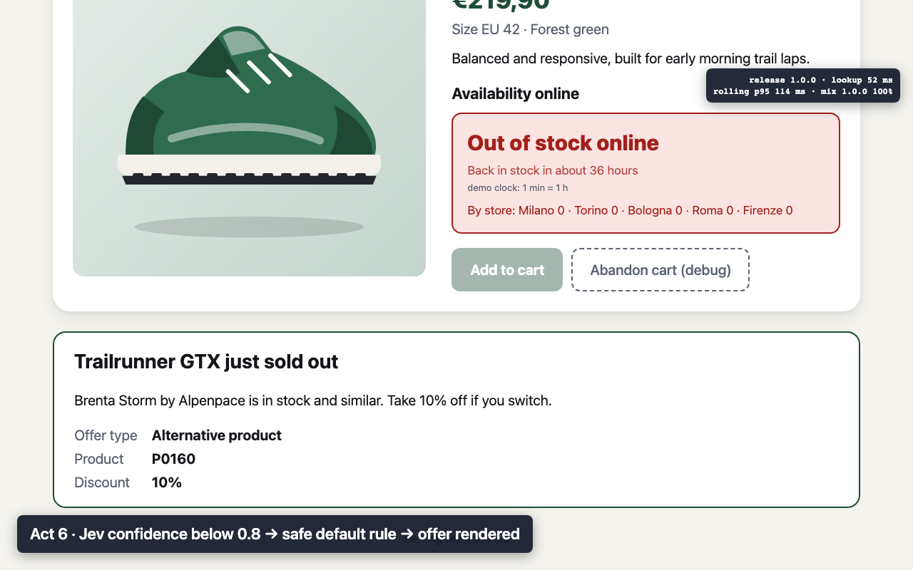

<details><summary>More about this step</summary>

**Which offer you get, and why a different model.** With the default threshold, the offer is usually the rule default: the closest-priced eligible alternative, at 10% off. For P0042 (Trailrunner GTX, EU 42) that is P0160, the Brenta Storm in EU 42.

It is a different model because the Trailrunner GTX exists in EU 42 only in Forest green, so there is no other colour of it to offer in that size.

*What just happened:* Flink joined your cart (topic `carts.events`) with the `stock.sellable` value of 0 and emitted a cart at risk. `offer-worker` built the alternatives, asked Jev, compared Jev's confidence with 0.8, checked the stock again, and published the offer to the `offers` topic, where the Online shop reads it.

</details>

#### 3. See why in LLM Observability

In Datadog, open AI Observability > Agent Observability > Traces and select the application `urbanstreet-offers` (the picker may show another application first). Open the latest trace and its `offer.jev.call` span, the step that called Jev. The input shows the eligible alternatives as `criteria`. The output shows the `choice` and its `confidence`.

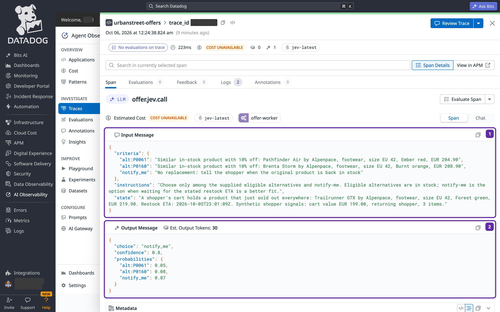

<details><summary>More about this step</summary>

**What LLM Observability keeps.**

<abbr title="Datadog's record of each AI call as a trace, with what was sent and what came back.">LLM Observability</abbr> keeps the Jev calls here.

**The trace list, and the same request in APM.**

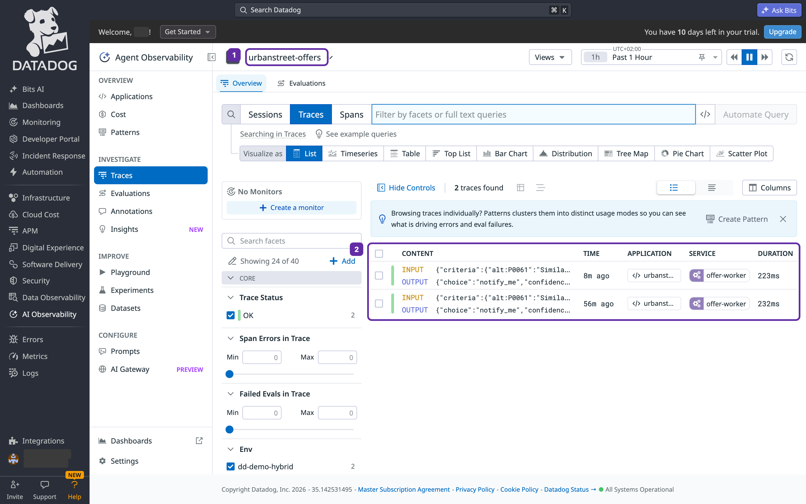

The same request also appears in APM (service `offer-worker`, span `offer.process`). Its linked logs state the decision, for example route `RULE_DEFAULT` with reason `low_confidence`.

</details>

#### 4. Lower the threshold, live

This setting exists only in the control panel, so you use the panel in both paths ([how to open it](#2-open-the-control-panel "stack-link:control")). In the `offers` settings, set **Jev minimum confidence** (`jev_min_confidence`) to `0.7` and press **Save**. Then reset, reload the page, add P0042 to the cart again, and sell it out.

<div data-path="panel" markdown="1">

**With the control panel**

In the [control panel](#2-open-the-control-panel "stack-link:control"), press **Full reset**, reload the [product page](#hop-5-the-shop-page "stack-link:shop"), click **Add to cart**, then press **Sell out product** with `P0042`.

</div>

<div data-path="terminal" markdown="1">

**With the terminal**

Reload the [product page](#hop-5-the-shop-page "stack-link:shop") and click **Add to cart** after the reset:

```sh
make reset
make sell-out PRODUCT=P0042 GAP=1.5
```

</div>

With the lower threshold, some runs use the AI choice and some still use the rule default.

<details><summary>Why reset before each run</summary>

The reset expires the carts from the previous run, so each sell-out produces exactly one offer, and it cancels the purchase orders left from an earlier Lab 5.2 run.

</details>

#### 5. Use the kill switch

In the [control panel](#2-open-the-control-panel "stack-link:control"), set **AI kill switch** (`offers_kill_switch`) to `1` and press **Save**. Then repeat the reset, add to cart and sell-out. You should see the decision line "safe rule — AI did not return a decision" in the Online shop.

<details><summary>More about the kill switch</summary>

This <abbr title="A setting that stops all calls to Jev, so every offer uses the rule default.">kill switch</abbr> takes effect on the next offer. The decision line in the Online shop reads "safe rule — AI did not return a decision", the reason on the dashboard is `kill_switch`, and the worker makes no Jev call. On the stock dashboard, in the **Offers** group, `offer.decision by route and reason` shows each of your runs.

</details>

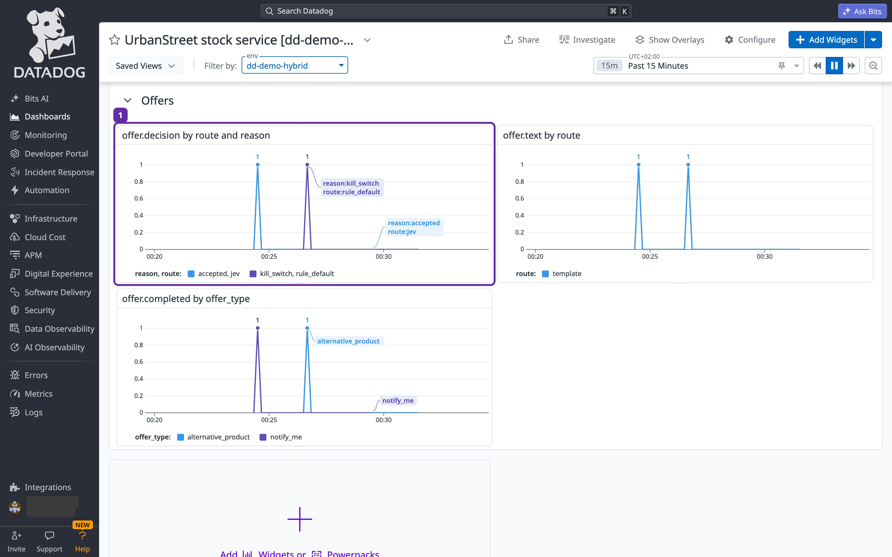

#### 6. Restore the defaults

In the [control panel](#2-open-the-control-panel "stack-link:control"), set `jev_min_confidence` back to `0.8` and `offers_kill_switch` back to `0` (or press **Reset to default** on each), then reset.

<div data-path="panel" markdown="1">

**With the control panel**

Press **Full reset** and confirm.

</div>

<div data-path="terminal" markdown="1">

**With the terminal**

```sh
make reset
```

</div>

#### Checkpoint

- [ ] You have seen at least one offer card ([step 2](#2-sell-it-out)).
- [ ] `offer.decision` shows at least two reasons, for example `accepted` or `low_confidence`, and `kill_switch` (or `disabled` without a Jev key) ([step 5](#5-use-the-kill-switch)).

The shop does not depend on the AI. Fixed rules decide what may be offered, the rule default always gives an answer, and the trace shows why each offer was made. An offer is only an offer: nothing in this lab proves that it saved a sale. **Next:** [Lab 5.2](#lab-52-restock-that-learns) (optional) or [Lab 6.1](#lab-61-datadog-on-top-of-the-solution).

<!-- box: also-lab-5-2
Also in this chapter: Lab 5.2, restock that learns (optional)
-->

### Lab 5.2: Restock that learns

*About 15 minutes.* When a product sells out, nobody can buy it until new stock arrives. Someone has to notice and order more, early enough and in the right amount. Here the system does it by itself: you sell out a product and watch the sale turn into restock requests, then into <abbr title="Orders sent to the supplier, kept in the procurement database until the goods arrive.">purchase orders</abbr>, and finally into a delivery that puts the product back in stock.

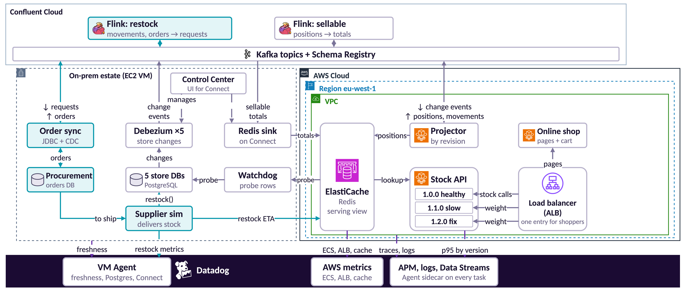

*Figure 4: the restock layer adds Flink restock logic in Confluent Cloud, and a procurement database, order sync and supplier simulator on the VM.*

A *demo clock* saves you from waiting days for a delivery: by default, one real minute counts as one business hour.

<details><summary>How Flink decides when to reorder</summary>

Flink learns two values: each store's *demand rate* (units sold per hour, from recent sales) and the *supplier lead time* (order to delivery, from past purchase orders).

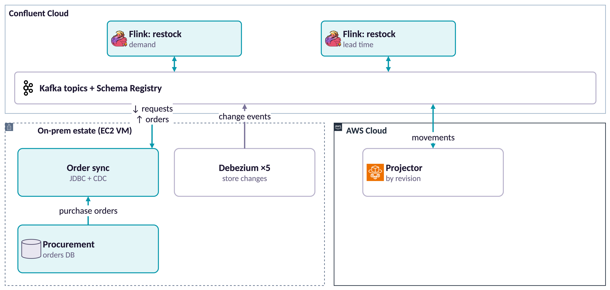

Flink adds the stock on hand and the stock already on order. When that total falls to the *reorder point* (demand rate × lead time × <abbr title="A margin on top of the demand expected during the lead time.">safety factor</abbr>), Flink emits a *restock request*.

</details>

Open this Chapter in the [demo home](#3-open-the-datadog-stock-dashboard "stack-link:overview-dashboard"), group "5. The AI offer". The restock charts themselves are in the **Restock** group of the stock dashboard (step 6).

#### Turn on the restock layer

Skip this if you chose everything at once, or if `restock` is already in your `layers:` line. In `demo.yaml`, add `restock` to the line (for example `layers: core,releases,restock`), then run:

```sh
make layer-on L=restock CONFIRM=yes
```

<details><summary>What this starts</summary>

This starts the procurement database and the supplier simulator on the VM, registers the two procurement connectors, and creates three more Flink statements in Confluent Cloud (demand, procurement, restock) with a Datadog restock group and monitors.

</details>

Flink bills for the statements while they run; the pool stays capped at 5 CFU. The command waits for the first records before it starts the statements, so give it several minutes. Check with `make layers-status`: `restock: ON`.

#### 1. Reset and sell out

<div data-path="panel" markdown="1">

**With the control panel**

1. In the [control panel](#2-open-the-control-panel "stack-link:control"), press **Full reset** on the **Background sales** card and confirm.

<details><summary>Why Full reset, not Reset demo data</summary>

When the restock layer is on, it also cancels open purchase orders and clears the restock ETA keys in Redis. **Reset demo data** does neither of these, so use **Full reset**.

</details>
2. In the [control panel](#2-open-the-control-panel "stack-link:control"), on the **Actions** card, keep `P0042` in the **Product ID** field and press **Sell out product**. Wait for `succeeded: Source and Redis verification completed`.

</div>

<div data-path="terminal" markdown="1">

**With the terminal**

```sh
make reset
make sell-out PRODUCT=P0042 GAP=1.5
```

You should see the five `{"store": ..., "remaining_store": 0, ...}` lines from Lab 1.1.

</div>

#### 2. Watch the ETA appear

After a few seconds the page shows "Out of stock online" with "Back in stock in about N hours" and the note "demo clock: 1 min = 1 h".

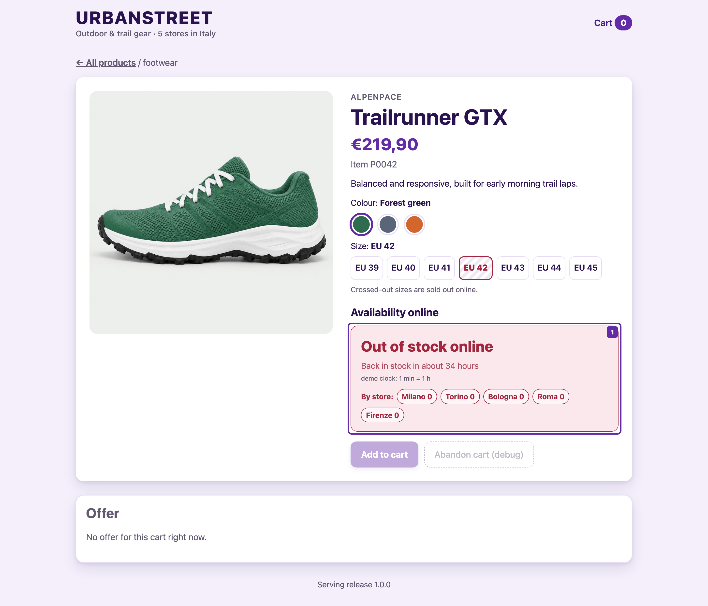

<details><summary>More about this step</summary>

**What the ETA is.** This is the <abbr title="Estimated time until the product is back in stock.">ETA</abbr>. The default lead time is 48 business hours and each order gets a random variation (jitter), so N is a few tens of hours. We saw 28, 29 and 37.

**What just happened: the order loop.** This is the loop that just ran:

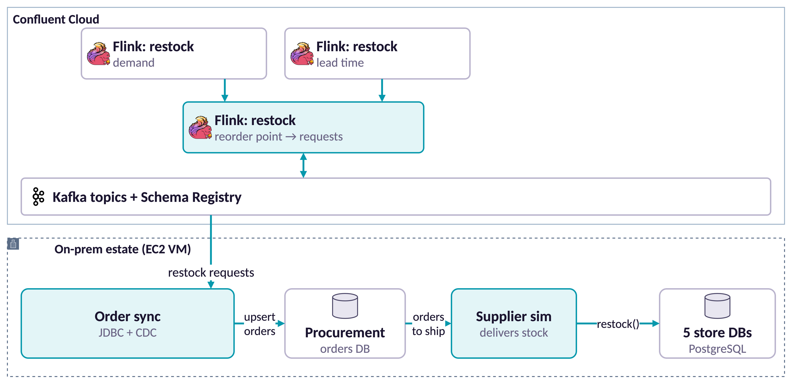

*What just happened:* Flink emitted one restock request per store. A <abbr title="A Kafka Connect connector that copies Kafka records into a database table.">JDBC sink connector</abbr> wrote each request into the procurement database as a purchase order, and Debezium streamed the orders back into Kafka. That is how Flink knows the stock is on order and does not order it twice. The supplier simulator (`supplier-sim`) wrote the earliest due time to Redis, and the page shows it as the ETA.

</details>

#### 3. Open the control panel

Open the [control panel](#2-open-the-control-panel "stack-link:control") in both paths ([how to open it](#2-open-the-control-panel "stack-link:control")) and scroll below the cards to the `restock` settings. You should see the restock parameters: supplier lead time, lead time jitter, safety factor, coverage after delivery, minimum order quantity, demand window and the demo clock (`time_compression`, 60 by default).

<details><summary>Your changes become Datadog events</summary>

Each change you save is also sent to Datadog as an event.

</details>

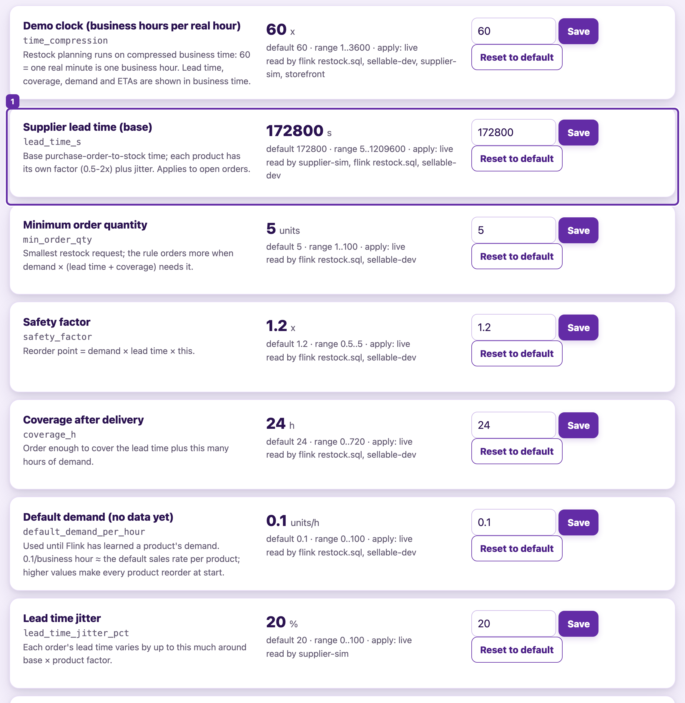

#### 4. Shorten the lead time

Set the supplier lead time to 2 business hours, which is 2 real minutes with the default clock.

<div data-path="panel" markdown="1">

**With the control panel**

Set **Supplier lead time (base)** (`lead_time_s`, in business seconds) to `7200` and press **Save**.

</div>

<div data-path="terminal" markdown="1">

**With the terminal**

```sh
make lead-time SECONDS=7200
```

```text
lead time set to 7200 s (applies to every open purchase order on supplier-sim's next cycle, every second)
```

</div>

<details><summary>More about this step</summary>

<div data-path="panel" markdown="1">

**With the control panel**

**The change becomes a Datadog event.** The panel also sends this change to Datadog as an event, which you see in step 6.

</div>

<div data-path="terminal" markdown="1">

**With the terminal**

**No event marker from the terminal.** This command sends no event to Datadog, so step 6 shows no marker for it. If you want the marker, set **Supplier lead time (base)** to `7200` in the panel and press **Save** instead: a setting is not routing, so it does not mix the paths.

</div>

**What happens to open orders.** Every open order is rescaled and keeps its own jitter.

</details>

#### 5. Watch the delivery

After about a minute (the exact time depends on the product), you should see the page go back to "N available online".

<details><summary>How the delivery travels</summary>

After about a minute (the exact time depends on the product), the supplier calls `restock()` in each store's database. That is an ordinary stock update, like a sale but marked `restock`, so it travels the same path and the page goes back to "N available online". N depends on the demand Flink has learned and on the coverage setting.

</details>

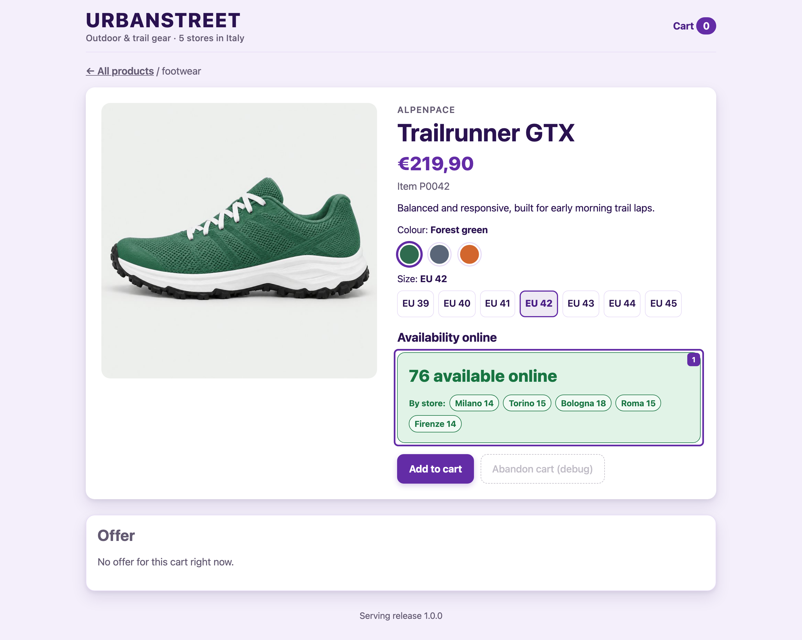

#### 6. See it in Datadog

On the [stock dashboard](#3-open-the-datadog-stock-dashboard "stack-link:stock-dashboard"), open the **Restock** group. `restock.orders.open` rises after the sell-out and falls at delivery. Next to it are `restock.orders.delivered by store` and `restock.lead_time`.

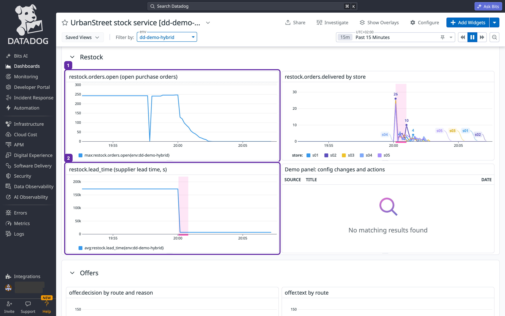

<details><summary>The config-change events, and the Flink statements in Confluent Cloud</summary>

If you saved the lead-time change in the panel, it shows as an event marker on `restock.orders.open` and as a `demo config: lead_time_s = 7200` entry in the **Demo panel: config changes and actions** list. That list also shows each panel action, such as a sell-out or a reset, as `demo action: <name> started`, then `succeeded` or `failed`. These events have the tags `project:dd-demo`, `stack:hybrid` and `demo_event:config` or `demo_event:action`, so you can also find them in the Events Explorer.

Optional: in the Confluent Cloud console, open the environment's Flink section. It lists the <abbr title="SQL queries that run continuously on the stream.">Flink statements</abbr> `dd-demo-hybrid-*`. The `-0` statements create the output tables. The `-1` statements are the long-running inserts (`sellable-1`, `demand-1`, `procurement-1`, `restock-1`, `offers-1`).

</details>

#### Checkpoint

- [ ] The page shows P0042 available again ([step 5](#5-watch-the-delivery)).
- [ ] Verify passes. **Control panel:** **Verify** on the **Checks** card shows `VERIFY PASSED` · **Terminal:** `make verify` prints zero mismatches ([how in Lab 1.1](#hop-1-the-store-table)).

The stream triggered the reorder directly, with no batch job, and you could change its parameters from the panel while it ran. The restock numbers come from a simulation. They are not a forecast. **Next:** [Lab 6.1](#lab-61-datadog-on-top-of-the-solution).

### Lab 6.1: Datadog on top of the solution

*About 20 minutes.* In the earlier labs you looked at one incident at a time. Here you use Datadog to watch the whole platform: the VM, Confluent Cloud and AWS. You look at the integrations, at tests that call the shop from outside, at monitors and at cost.

**Needs:** up to three small layers that only change what Datadog collects: `dd-streams`, `dd-synthetics` and `dd-rum`. The step "Turn on the Datadog layers" turns on the ones you want (skip it if you chose everything at once).


*Figure 6: everything Datadog collects, as in Figure 1.*

#### Start from the demo home

Open the [demo home](#3-open-the-datadog-stock-dashboard "stack-link:overview-dashboard").

<details><summary>What the demo home shows</summary>

It starts with a "Start here" note, then one group per Chapter: what you are seeing, links to the deeper views already filtered to your stack, and the key charts. Group "6. Datadog on top" holds Synthetics, Confluent consumer lag and the cost per hour. Charts of a layer you have not turned on stay empty. Come back to it after each step below.

</details>

#### Turn on the Datadog layers

Skip this if you chose everything at once.

Add the ones you want to `demo.yaml`, for example `layers: core,releases,dd-streams,dd-synthetics,dd-rum`, then run one command per layer:

```sh
make layer-on L=dd-streams CONFIRM=yes
make layer-on L=dd-synthetics CONFIRM=yes
make layer-on L=dd-rum CONFIRM=yes
```

Steps 1, 2, 5 and 6 need none of them. Datadog usage runs on your trial; check your trial terms. Skip the steps of a layer you did not turn on.

<details><summary>More about this step</summary>

**What these layers change.** This lab uses three small layers that only change what Datadog collects.

**What each Datadog layer creates.**

| Layer | What it creates | Used in step |
|---|---|---|
| `dd-streams` | A read-only Confluent identity and the Datadog Confluent Cloud integration (consumer lag) | 3 |
| `dd-synthetics` | A Synthetics private location on the VM and two tests (an API test every 60 s, a browser test every 300 s) | 4 |
| `dd-rum` | A RUM application, and the Online shop is redeployed with its settings | 7 |

</details>

#### 1. Read back the stack

<div data-path="panel" markdown="1">

**With the control panel**

Open the [stock dashboard](#3-open-the-datadog-stock-dashboard "stack-link:stock-dashboard"). The **Pipeline** group shows the six core connectors in `stock.connect.task_running by connector`, plus `restock-procurement` and `procurement-orders` if you turned on the restock layer, all running.

</div>

<div data-path="terminal" markdown="1">

**With the terminal**

```sh
make status
```

You should see the six core connectors, plus `restock-procurement` and `procurement-orders` if you turned on the restock layer, all `RUNNING`.

</div>

<details><summary>More about this step</summary>

<div data-path="panel" markdown="1">

**With the control panel**

**The control panel header.** The header of the control panel shows the running layers and the canary routing.

</div>

<div data-path="terminal" markdown="1">

**With the terminal**

**What else the output lists.** The output lists the VM containers, the current routing, the layers that are on and the status of every connector.

</div>

**Why not DSM for connectors.** This is where you check connectors. DSM shows the data flow, but it does not show connector status.

</details>

#### 2. AWS-native online dashboard

Open the [AWS-native online dashboard](#3-open-the-datadog-stock-dashboard "stack-link:online-dashboard"). It shows Fargate CPU and memory by service and version, ElastiCache memory and CPU, and ALB unhealthy targets, next to `inventory-api` p95 by version. If you ran Lab 3.1, you can see the CPU peak of release 1.1.0.

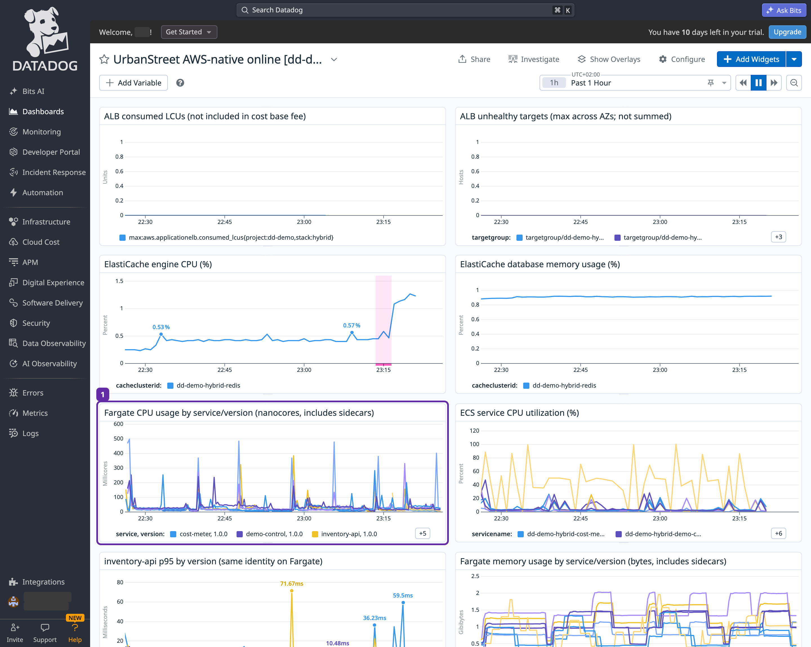

#### 3. Confluent Cloud integration

On the [stock dashboard](#3-open-the-datadog-stock-dashboard "stack-link:stock-dashboard"), in the **Pipeline** group, the chart "Confluent Cloud consumer lag (offsets) by group" comes from the Confluent <abbr title="Datadog reading metrics from another provider's account, here Confluent Cloud.">integration</abbr> (the `dd-streams` layer). <abbr title="The number of messages a consumer group has not read yet.">Consumer lag</abbr> for `stock-projector` and `connect-sellable-redis` should stay near zero, which agrees with the probe.

<details><summary>Spikes are normal</summary>

A short spike after a burst of records, like the one in the screenshot, is normal; the lag should fall back to near zero.

</details>

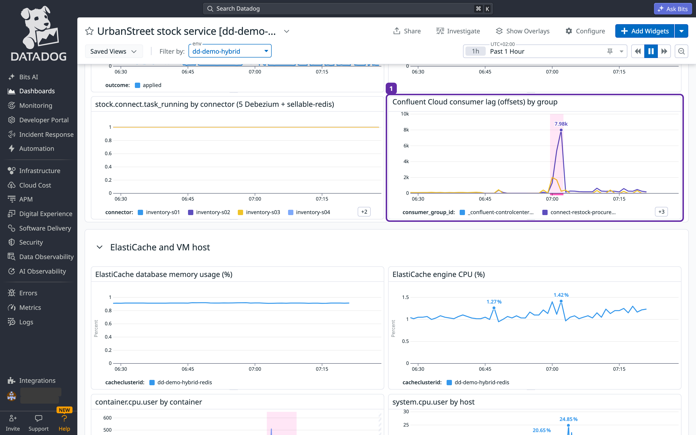

#### 4. Synthetics

Open Synthetic Monitoring > Tests and search `dd-demo-hybrid`. You should see two <abbr title="Requests that Datadog sends to your Online shop on a schedule from its own locations, like a shopper on the internet.">synthetic tests</abbr> that run from `aws:eu-central-1` against your ALB: an API test of `GET /api/availability/P0042` every 60 s, and a browser test of the product page every 300 s.

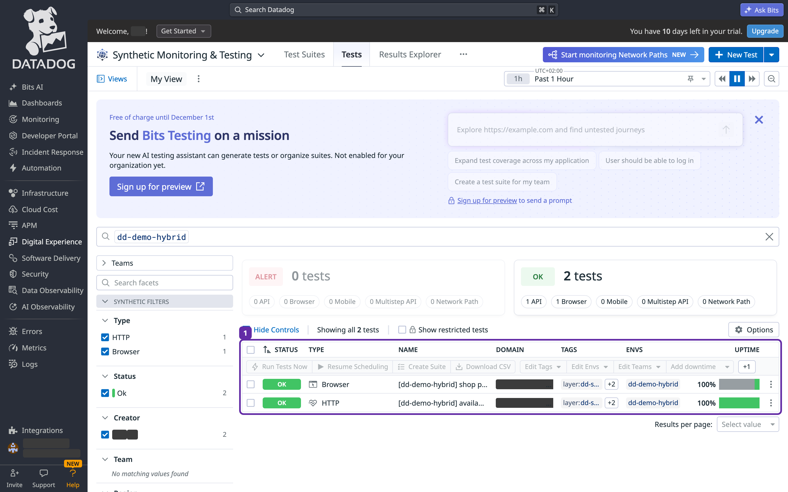

#### 5. Monitors

Open Monitors > Manage Monitors and search `tag:project:dd-demo tag:stack:hybrid`. You should see the freshness, connector, VM Agent, p95-by-version, restock and AWS-side <abbr title="Rules that watch a metric and alert when it crosses a threshold or stops arriving.">monitors</abbr> (16 in our test run). A monitor in "No Data" does not mean everything is fine: the signal is missing.

<details><summary>More about this step</summary>

<div data-path="panel" markdown="1">

**With the control panel**

Then open Events > Explorer and search `demo action`. Every control-panel action posts `demo action: <name> started` and then `succeeded` or `failed`, for example `demo action: canary-10 succeeded`. The resulting weights are in a `weights:` tag. Overlay these events on the p95-by-version graph to see exactly when a release change took effect.

</div>

<div data-path="terminal" markdown="1">

**With the terminal**

Then open Events > Explorer and search `demo config`. You should see the settings you saved in the panel in Labs 5.1 and 5.2. The make commands post no events, so your routing changes from the terminal do not appear here.

</div>

</details>

#### 6. Cost

Open the [`account-cost dashboard:` link](#3-open-the-datadog-stock-dashboard "stack-link:cost-dashboard") and set `stack` to `hybrid`.

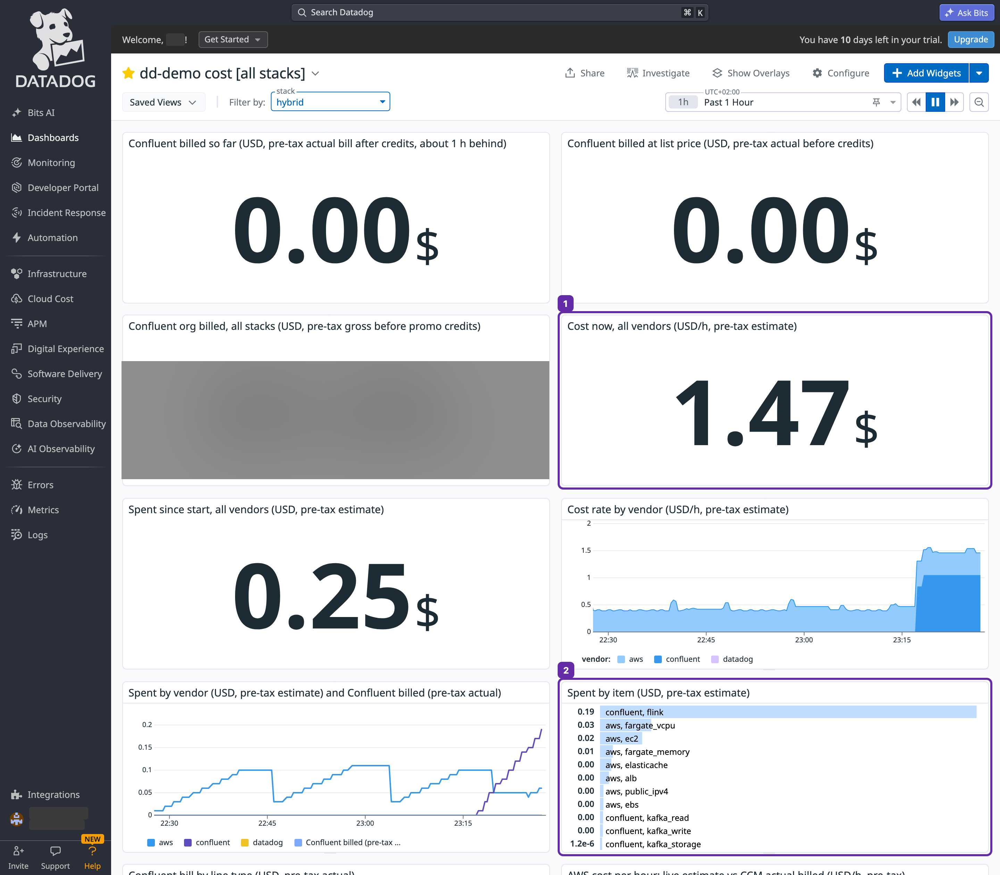

<details><summary>More about this step</summary>

**Where the numbers come from, and when the billed cost arrives.** The `cost-meter` service estimates the hourly cost of the AWS pieces from list prices and reads Confluent usage. The billed AWS cost arrives later: AWS writes it to the <abbr title="AWS's detailed billing export, delivered to an S3 bucket.">Cost and Usage Report</abbr>, and Datadog Cloud Cost Management reads it from there, typically 48 to 72 hours after the first complete report.

**Why the fix does not change the price of a task.** Fargate bills each task by its vCPU and memory size, so the cost estimate follows the task size set in `service_sizing` (`terraform/aws/variables.tf`). All three releases use the same size (0.5 vCPU / 1 GB). The fix therefore does not change the hourly price of a task. It changes how much traffic one task can handle (see the CPU comparison in [Lab 4.1](#5-prove-it-latency-cpu-and-cost)).

</details>

#### 7. Check RUM on your run

<abbr title="Real User Monitoring: Datadog's record of what real browsers do in the Online shop, such as page loads and API calls.">RUM</abbr> should record your browser sessions. Check that it works on your run: open `http://<alb-dns-name>/config` in your browser.

<details><summary>Or ask it from the terminal</summary>

```sh
curl -s http://<alb-dns-name>/config
```

</details>

You should see a `rum` block with an application ID and a client token. The client token is meant to be public. Browse the shop for a minute, then open Digital Experience > RUM > Sessions for the application `dd-demo-hybrid-shop`. If a session appears, RUM works on your run.

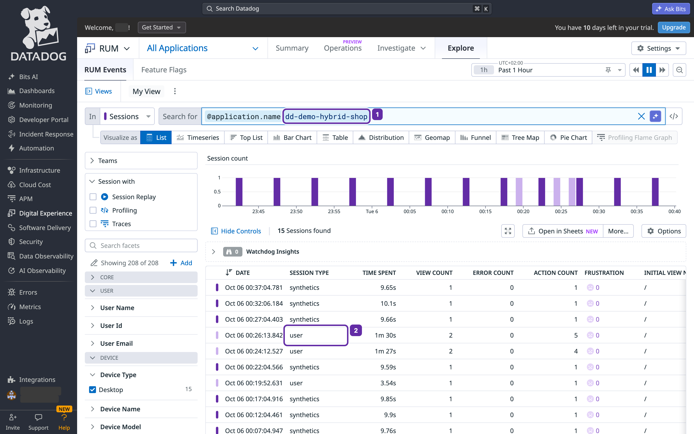

#### Checkpoint

- [ ] Every connector is running, six or eight with the restock layer. **Control panel:** the **Pipeline** group of the stock dashboard shows them all running · **Terminal:** `make status` shows every connector `RUNNING` ([step 1](#1-read-back-the-stack)).
- [ ] If `dd-synthetics` is on: both Synthetics tests have recent passing results ([step 4](#4-synthetics)).
- [ ] The cost dashboard shows a current USD-per-hour value for `hybrid` ([step 6](#6-cost)).

Across the labs, APM found the slow request, freshness and DSM showed that the data path was fine, version tags checked the canary, and the integrations and monitors gave you the view of the whole platform. **Next:** [Teardown](#teardown).

---

## Troubleshooting

When a step fails, read the last lines before the failure. Every script prints the step, the command and, where it can, the fix. If a step fails twice, stop and read before you try a third time. Running the build again without knowing why it failed is the most expensive way to debug.

**Setup and preflight**

| Symptom | Cause and check | Fix |
|---|---|---|
| `demo: demo.yaml must be mode 0600` or `... still contains a placeholder` | Other users can read `demo.yaml`, or a `REPLACE_WITH_...` value is still there | `chmod 600 demo.yaml`; fill in every required key |
| `AWS login session unavailable; run: aws login --profile dd-demo` | Your sign-in expired. Check: `aws sts get-caller-identity --profile dd-demo` | `aws login --profile dd-demo`, then run the command again. The routing commands need it too |
| `MISSING docker compose plugin` or `buildx` | The Docker CLI cannot find its plugins. Check: `docker compose version` | Install the plugins. With Homebrew, add their directory to `cliPluginsExtraDirs` in `~/.docker/config.json` |
| `MISSING ~/.ssh/id_ed25519.pub` | You have no Ed25519 key | `ssh-keygen -t ed25519`, or set `TF_VAR_ssh_public_key_path` |
| `calibration selection failed` | You changed the VM or Fargate size | Use the default sizes (`t4g.xlarge`, `FARGATE_SIZE=512-1024`) |

**Build**

| Symptom | Cause and check | Fix |
|---|---|---|
| The step `build images on the host` fails with a path under `vendor/jr` that does not exist, or `vendor/jr` is empty | The `vendor/jr` submodule was not downloaded (you cloned without `--recurse-submodules`, or downloaded a ZIP) | Run `git submodule update --init` from the repository root ([0.1.4 Get the code](#014-get-the-code)), then `./demo create` again |
| `terraform account` fails creating the Datadog AWS integration | Your Datadog organisation already has an integration with this AWS account (Integrations > AWS) | Use an AWS account that has no integration yet, or remove the existing integration if it is yours |
| `This server does not host this topic-partition` | A temporary Confluent Cloud error after topic creation | No action needed: the script retries up to three times |
| `readiness timeout after 300s for table/topic: <topic>` | An input topic never received its first record, usually because of a connector. Check: `make status` | Fix the producer, then run `./demo create` again. Existing Flink statements are kept |
| `after 5 minutes only N sellable:P* keys in Redis (expected 200)` | The Flink `sellable` statement or the `sellable-redis` connector is not running | Fix that piece, then run `./demo create` again |
| `ECS service ... did not reach steady state` | A task does not start. Check: AWS console > ECS > `dd-demo-hybrid` > service > Events | Fix the cause shown there, then run `./demo create` again |
| `AWS login expired during apply of terraform/...`, or `ExpiredToken: The security token included in the request is expired` during `./demo create` | Your AWS login session ended during the build, often while Terraform waited for ElastiCache or the load balancer. A login lasts at most 12 hours, and the script cannot read how much is left | `aws login --profile dd-demo`, then `./demo create` again. Resources that were being created when it failed are rebuilt, which costs extra minutes (we have not measured how many). To prevent it, sign in again right before a long build |
| You changed a table in `flink/*.sql` and nothing changed | Output tables use `CREATE TABLE IF NOT EXISTS`, so an existing table is not replaced | Change the schema in a compatible way, or tear down and rebuild |

**Labs**

| Symptom | Cause and check | Fix |
|---|---|---|
| The shop or control panel does not load | Your public IP no longer matches `allowed_cidr`. Check: `curl -s https://checkip.amazonaws.com` | Put the new address with `/32` in `allowed_cidr` in `demo.yaml` (or comment the line out to detect it automatically), then run `./demo create` again to update the security groups (duration not measured) |
| `allowed_cidr is not set and your public IPv4 could not be detected via https://checkip.amazonaws.com (...); set allowed_cidr in demo.yaml to your public IPv4 as a.b.c.d/32 (nothing was created)` | `allowed_cidr` is not set and the lookup failed (you are offline, the request was blocked, or it timed out after 5 seconds) | Set `allowed_cidr: a.b.c.d/32` in `demo.yaml` with your public IPv4, then run `./demo create` again |
| `demo.yaml: allowed_cidr must be a single IPv4 address in /32 form, for example 203.0.113.7/32 (or empty to auto-detect)` | The value is a range, has another prefix length, or is not an IPv4 address | Use one IPv4 address with `/32`, or comment the line out to detect it automatically |
| The Actions card shows `unavailable: Actions are not configured` or a request returns `actions are not configured` | The control panel started without the Actions operations | Check the control panel service in AWS console > ECS > `dd-demo-hybrid`. This should not happen on a healthy build |
| The browser keeps asking for a password, or shows `authentication required` | Wrong user or password for the control panel | The user is `demo`. Copy `CONTROL_PASSWORD` from `.env.secrets` again |
| The Store feed card shows `Store feed control is not configured in this deployment (CONNECT_URL absent)` | The control panel has no Connect address, as in a local run | Use `store-pause` and `store-resume` |
| Both Actions buttons are disabled and the card shows `queued` or `running` | Only one action runs at a time. A second request while one is running does not start; the card shows the running one | Wait for `succeeded` or `failed`, then press the button again |
| `product_id must match Pdddd, for example P0042` | The product field is not `P` followed by four digits | Enter a product such as `P0042` |
| `failed: Action failed: S01/P9999 not found in its source ...` | The product does not exist in a store's Source | Use a product between `P0001` and `P0200` |
| `failed: Action failed: source verification failed for S0n/P0042: ...` | A store's Source did not end with a live position of zero | Check `status` and `verify`, then retry. If in doubt, use `make ... reset` |
| **Reset demo data** does not start: `Background sales are on (<rate>/min per store): press Sales off first, or use Full reset` | Background sales are on. **Reset demo data** does not stop them, and while sales keep changing the stock the reset can never match the baseline, so the panel refuses to run it | Press **Full reset** on the **Background sales** card (sales off, routing 100 / 0 / 0, data reset), or press **Sales off** and then **Reset demo data**, or run `make reset` |
| `failed: Action failed: sell-out P0042 did not converge in 30s ...`, or `reset did not converge` with sales already off | The Sources changed, but Redis did not match them in time because a connector or the projector is stopped, for example a store you paused in Lab 2.1 | Run `make status`, resume any paused store, then retry |
| `AWS rejected the weighted forward action ...` from a make routing command, with an expired-session message above it | Your AWS login expired (the make commands run on your laptop) | `aws login --profile dd-demo`, then retry |
| A Release routing button fails with `AWS rejected the weighted forward action ...: ... AccessDenied ...` on `ModifyRule` | The control panel's task role cannot change the inventory rule. Either the stack was built before the role existed, or the rule changed | Run `./demo create` again to apply the role, then retry (duration not measured) |
| `ALB rule reports <weights> after requesting <weights>` | The weights read back after the change did not match the request. Someone else changed the rule at the same moment, or AWS did not apply it | Press **Refresh weights**, then run `route-show`, and set the split again |
| Store feed fails with `Connect REST ... unreachable` or `answered HTTP 404` | Unreachable: the Connect container on the VM is down or was not recreated to publish port 8083, or the VM security group is missing the rule. 404: the connector name does not exist | Run `make status`. Run `./demo create` again to restore the rule and the container. Check that the store is between `S01` and `S05` |
| Store feed fails with `... still reports connector ..., tasks ... 20s after pause` (or `resume`), or `reports connector FAILED` | The connector did not reach `PAUSED` or `RUNNING` within 20 seconds, or it failed | Press **Refresh state**. If it failed, read the Connect container logs on the VM and run `status` |
| `no previous routing recorded; make a routing change first` | **Rollback** has nothing to restore because no routing change was made through the panel yet. The panel keeps its own record, separate from the make commands | Press a preset first, then **Rollback**, or use `make ... rollback` |
| `Release routing is not configured in this deployment (ALB_INVENTORY_* variables absent)` | The control panel runs without the routing settings, as in a local run | Use the make commands, or use the hybrid stack, where the panel runs on ECS next to the load balancer |
| The Checks card shows `Checks are not configured in this deployment (SCENARIO_API_URL / SCENARIO_API_TOKEN absent)` | The control panel runs without the scenario API settings, as in a local run, or the stack was built before the card existed | Use `load`, `verify` and `canary-check`. On an existing stack, run `make secrets` once, then `./demo create` again |
| A Checks action fails with `scenario API ... answered HTTP 401 ... (token mismatch: SCENARIO_API_TOKEN differs between demo-control and the VM)` | The token in the control panel and the token on the VM are different, for example after someone ran `make secrets` on another machine | Keep one `.env.secrets`. Run `./demo create` again so the VM and the control panel get the same token |
| A Checks action fails with `answered HTTP 409: run <id> (load) is still running; one run at a time` | Another run is active, for example a load started from the panel or from the terminal API | Wait for it to end (a load takes about 2 minutes) and retry |
| `scenario API ... unreachable` | The `scenario-api` container on the VM is down, or port 8090 is not open to the control panel | Run `make status`. Run `./demo create` again to restore the container and the security group rule |
| **Check canary** fails with `canary-check error on the VM: ... does not exist: run load first` (or `verify first`) | The gate needs the summary of a load and the result of a verify, and one of them does not exist yet | Press **Run load** and **Verify**, then **Check canary** |
| **Check canary** fails with `routing changed since the panel's last load (load ran at <weights>, live is <weights>): run load again before gating` | You changed the routing after the last load you ran from the panel | Press **Run load** again, then **Verify** and **Check canary** |
| **Check canary** fails with `live routing is 100/0/0 ...` | Only the baseline 1.0.0 receives traffic, so there is no canary to check | First set a canary step on the **Release routing** card (**Canary 1.1.0 (10%)** in Lab 3.1, **Canary 1.2.0 (10%)** in Lab 4.1) |
| `CANARY GATES FAILED: p95 1.1.0 <ms> ms > budget 200 ms; roll back` in Lab 3.1 | This is expected: the gate exists to catch this regression | Roll back ([Lab 3.1, step 5](#5-roll-back)) and continue. Never send more traffic to a canary after a failed gate |
| The Lab 3.1 gate passes for 1.1.0 | The p95 of 1.1.0 stayed within the 200 ms budget for this load, for example because few lookups reached it | Press **Run load** and **Check canary** again. If it still passes, roll back anyway and use the APM comparison and the optional all-traffic step of Lab 3.1 |
| **Sales on** fails with `no background sale was recorded in any store for ... s: the jr-sales containers are probably stopped` | The sales containers are stopped, for example after `make sales-off` or `reset` | Run `make sales-on` to start them, then press **Sales on** |
| **Full reset** is disabled, or fails with `Full reset needs ALB release routing (hybrid stack)` | The control panel runs without the routing settings | Use `make ... reset`, or use the hybrid stack |
| No data in Datadog charts | Telemetry needs a few minutes to fill a 15-minute window | Wait 10 to 15 minutes. The freshness probe sends data even while background sales are off |
| `route-show` shows an unexpected split | Someone changed the ALB rule | Set the split you want with `route-baseline`, `canary-110-10`, `canary-*` or `incident` |
| `canary-check` fails on samples at 10% | The canary (1.1.0 in Lab 3.1, 1.2.0 in Lab 4.1) received too few responses. A weight does not give an exact split | Run a longer `load`, or pass `--min-samples` explicitly ([Lab 4.1](#lab-41-canary-the-fix)) |
| `smoke` fails with a feed not ok | A store is paused (Lab 2.1) or a connector is down. Check: `status` | Run `make store-resume STORE=S0n`, then `reset` |
| Offers are always `disabled` although you have a Jev key | You added the key after the build | Uncomment `jev_api_key` in `demo.yaml`, set your key and run `./demo create` again (billed while it runs) |
| No offer after the sell-out | No product was added to a cart after the last reset | Run `reset`, reload, press **Add to cart**, and sell out again |
| AI Observability shows another application | The application picker selected another application by default | Select `urbanstreet-offers` |
| No RUM session | The `dd-rum` layer is off, or the Online shop was not redeployed with the RUM settings. Check: `curl -s http://<alb-dns-name>/config` has a `rum` block | If the block is missing, check that `dd-rum` is in the layers (`./demo status`) and run `./demo create` again |
| Some ElastiCache or host widgets on the stock dashboard are empty | Unverified on the current build | Use the AWS-native online dashboard for ElastiCache |

**Teardown**

| Symptom | Cause and check | Fix |
|---|---|---|
| `AWS session expired or missing ...` or `Confluent CLI session expired or missing ...`, then `Nothing was destroyed.` | The login check at the start of the teardown failed | Run the login that the message names (`aws login --profile dd-demo` or `confluent login`), then `./demo destroy` again |
| `stack.sh: FAILED: <layers>; Terraform state, local env files and docker context kept` | One or more pieces could not be destroyed. The script still tried the others | Read the error above `destroy of layer '<layer>' FAILED`, fix it, then run `./demo destroy` again. It continues with the pieces that still exist |
| `[destroy vm] SKIPPED: terraform/aws failed ...` | The AWS online side still uses the VM's security group, so AWS cannot delete the VM's network rules yet. The VM keeps billing | Fix the AWS error above, then run `./demo destroy` again |
| The leftover check skips Confluent | The `confluent` CLI is missing | Look for `dd-demo-hybrid` in the Confluent Cloud console |
| The leftover check stops with `'aws ...' failed` or `'confluent environment list' failed` | The AWS or Confluent login expired during the teardown | Log in again (`aws login --profile dd-demo`, `confluent login`) and run `make stack-leftovers` |
| `WARNING: ... still exist and may bill` | A resource was not deleted by the destroy | Delete it in the console or run `./demo destroy` again, then `make stack-leftovers` |

---

## Teardown

> [!WARNING]
> `./demo destroy` deletes everything in the `hybrid` stack: the Datadog objects, the AWS online side, the container images (unless `keep_images: true`), the VM with its volumes, and the Confluent environment with all topics. The data is synthetic, but a rebuild takes about 30 minutes with the core layers and about 36 with every layer. Until you run it, the stack keeps costing about $1.50 to $2.50 per hour.

#### 1. Destroy the stack

```sh
./demo destroy
```

Type `yes` when the script asks.

A successful run ends like this:

```text
== leftover check: AWS resources tagged project=dd-demo, each confirmed with its service API
   <n> tagged ARNs: <n> ECS task-definition revisions skipped (free), <n> already deleted (Tagging API lags)
   account-owned, kept on purpose (make account-down removes it): <the cost report bucket>
   no billable AWS leftovers for stack hybrid
   no dd-demo-* Confluent environment
== stack hybrid destroyed in <seconds> s
```

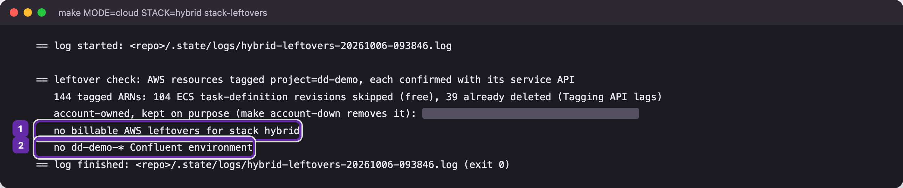

The check lists every resource tagged `project=dd-demo`, asks the service that owns each one whether it still exists, and reports only what really exists:

- `no billable AWS leftovers for stack hybrid` means that nothing of this stack remains.
- `WARNING: <n> resource(s) of stack hybrid still exist and may bill`, followed by their ARNs, means that stack-down fails with an error. Delete the resources in the console or run `./demo destroy` again.

<details><summary>More about this step</summary>

**What the teardown does, in order.** The script stops the VM services and destroys the Datadog pieces. Then it destroys the AWS online side, the VM and the image repositories in that order, while the Confluent environment is destroyed at the same time in the background. With `keep_images: true` in `demo.yaml` the image repositories stay. It deletes the stack's SSM parameters and generated files, and ends with a read-only check for leftover resources.

**If a login has expired, or a piece fails to destroy.** Before the question, the script checks your AWS and Confluent logins. If one has expired, it stops, names the login to run again, and destroys nothing. If one piece fails to destroy, the script still tries the others, then ends with `FAILED: <pieces>` and keeps its local files. Fix the error and run `./demo destroy` again: it continues with what is left. The teardown never deletes the Terraform state, so a rerun always knows what remains.

**The other lines of the leftover check, and how to run it again.**

- `other stack, not part of this teardown` and `account-owned, kept on purpose` are for information only.
- `kept on purpose (keep_images: true): <n> ECR repositories of stack hybrid, <size> GB stored, about $<x> per month` appears only with `keep_images: true`. It is the storage price at $0.10 per GB-month. To delete them, set `keep_images: false` and run `./demo destroy` again. With `keep_images: false`, a remaining repository of the stack is a leftover like any other.
- An AWS or Confluent API error (an expired login or a missing permission) stops the check and shows the command that failed. The check never reports "clean" unless it got an answer from every service.

You can run the same read-only check by itself at any time:

```sh
make stack-leftovers
```

</details>

#### 2. Prove that nothing billable remains in AWS

To check it yourself, run these commands. They are all read-only, and each one should print nothing for this stack:

```sh
aws ssm get-parameters-by-path --path /dd-demo/hybrid --recursive --profile dd-demo --region eu-west-1 --query 'Parameters[].Name' --output text
aws ec2 describe-instances --profile dd-demo --region eu-west-1 --filters Name=tag:project,Values=dd-demo Name=instance-state-name,Values=pending,running,stopping,stopped --query 'Reservations[].Instances[].InstanceId' --output text
aws elbv2 describe-load-balancers --profile dd-demo --region eu-west-1 --query 'LoadBalancers[?starts_with(LoadBalancerName, `dd-demo`)].LoadBalancerName' --output text
aws elasticache describe-cache-clusters --profile dd-demo --region eu-west-1 --query 'CacheClusters[?starts_with(CacheClusterId, `dd-demo`)].CacheClusterId' --output text
aws ec2 describe-volumes --profile dd-demo --region eu-west-1 --filters Name=tag:project,Values=dd-demo --query 'Volumes[].VolumeId' --output text
aws ec2 describe-addresses --profile dd-demo --region eu-west-1 --filters Name=tag:project,Values=dd-demo --query 'Addresses[].AllocationId' --output text
aws ecr describe-repositories --profile dd-demo --region eu-west-1 --query 'repositories[?starts_with(repositoryName, `dd-demo-hybrid`)].repositoryName' --output text
aws ecs list-clusters --profile dd-demo --region eu-west-1 --output text
```

The last command lists every ECS cluster in the region. Check that none of them is named `dd-demo-hybrid`. Don't use `aws resourcegroupstaggingapi get-resources` as proof (see below).

<details>
<summary>Why the leftover check does not trust the tag list</summary>

The check starts from the AWS Resource Groups Tagging API, which lists resources by their tags. That list lags behind: deleted ECS services, EBS volumes, security-group rules and even the terminated instance stay in it for a while, and deregistered ECS task-definition revisions stay in it permanently (they are `INACTIVE` and free). So the check skips task definitions and asks the owning service (EC2, ECS, ELB, ElastiCache, ECR, CloudWatch Logs, SSM, IAM, S3) about each remaining resource.

</details>

#### 3. Prove that nothing billable remains in Confluent Cloud

```sh
confluent environment list
```

The list should not contain a `dd-demo-hybrid` environment. In the console, also check that no cluster or Flink compute pool remains under a `dd-demo-*` environment. Confluent billing is delayed: charges can appear for up to 72 hours after deletion, and the last partial hour is billed as a full hour. A cost page with no new charges right after teardown therefore does not prove that nothing is billing.

#### 4. Check Datadog

Search Monitors and Synthetic tests for `stack:hybrid`, and Dashboards for `dd-demo-hybrid`. You should find none. They have no hourly cost, but a Synthetics test that you forget to delete keeps testing a URL that no longer exists.

#### 5. Clean up credentials

If you no longer need them, delete the Confluent Cloud API key and the Datadog application key that you created for this workshop. Also delete the local files `demo.yaml`, `.env`, `.env.secrets` and `.env.cloud-hybrid` if they still exist.

The teardown keeps the account-wide pieces on purpose: the Cost and Usage Report export, the Datadog AWS integration, the read-only Confluent identity and the account cost dashboard. They have no hourly cost. To remove them too, see [Remove the account-wide pieces](#f-remove-the-account-wide-pieces).

#### Checkpoint

- [ ] `./demo destroy` ended with `== stack hybrid destroyed in <seconds> s` ([step 1](#1-destroy-the-stack)).
- [ ] Every command in steps 2 and 3 printed nothing for `hybrid` ([step 2](#2-prove-that-nothing-billable-remains-in-aws), [step 3](#3-prove-that-nothing-billable-remains-in-confluent-cloud)).

---

## Recap and further reading

You streamed changes out of five store databases without changing them. You built a serving view that never queries the stores and never shows unknown stock as zero, and you used a probe to show that it stays fresh. Then you shipped a slow release as a 10% canary; the gate failed it, and you rolled it back before most lookups reached it. You found the cause with version-tagged traces, and you rolled out the fix through the same gate, with a tested way back. Two optional layers used the same stream for restocking and for AI offers that follow rules.

| Question | Datadog view that answered it | Lab |
|---|---|---|
| Is the stock in the Online shop current? | Freshness group: probe age, feed state, apply delay, sellable age | 1, 2 |
| Which store stopped reporting? | `stock.feed.state` by store, per-store monitor | 2 |
| Should this release reach more shoppers? | The `canary-check` gates on the canary's samples, errors, p95 and correctness | 3, 4 |
| Is the slowness in the release or in the stream? | APM latency by version, `catalogue.prepare` span, unchanged freshness and DSM | 3 |
| Is the fix safe to roll out further? | APM Deployments by version, plus the `canary-check` gates | 4 |
| Are restock orders flowing? | Restock group, config-change events, restock monitors | 5 |
| Why did the shopper get this offer? | LLM Observability span input and output, `offer.decision` by reason | 6 |
| Is the platform healthy, and what does it cost? | AWS-native dashboard, Confluent consumer lag, Synthetics, monitors, cost dashboard | 7 |

<details>
<summary>Further reading (official documentation)</summary>

- Debezium: [PostgreSQL connector](https://debezium.io/documentation/reference/stable/connectors/postgresql.html)
- Confluent Cloud: [getting started](https://docs.confluent.io/cloud/current/get-started/index.html), [Apache Flink](https://docs.confluent.io/cloud/current/flink/overview.html), [Schema Registry](https://docs.confluent.io/cloud/current/sr/index.html), [billing](https://docs.confluent.io/cloud/current/billing/overview.html), [Cluster Linking](https://docs.confluent.io/cloud/current/multi-cloud/cluster-linking/index.html)
- Datadog APM: [tracing](https://docs.datadoghq.com/tracing/), [unified service tagging](https://docs.datadoghq.com/getting_started/tagging/unified_service_tagging/), [deployment tracking](https://docs.datadoghq.com/tracing/services/deployment_tracking/), [connecting Python logs and traces](https://docs.datadoghq.com/tracing/other_telemetry/connect_logs_and_traces/python/)
- Datadog [Data Streams Monitoring](https://docs.datadoghq.com/data_streams/), [LLM Observability](https://docs.datadoghq.com/llm_observability/)
- Datadog [Amazon ECS on AWS Fargate, including FireLens log collection](https://docs.datadoghq.com/integrations/ecs_fargate/)
- Datadog integrations: [AWS](https://docs.datadoghq.com/integrations/amazon_web_services/), [Confluent Cloud](https://docs.datadoghq.com/integrations/confluent_cloud/)
- Datadog [Synthetic Monitoring](https://docs.datadoghq.com/synthetics/), [RUM](https://docs.datadoghq.com/real_user_monitoring/), [Cloud Cost Management for AWS](https://docs.datadoghq.com/cloud_cost_management/setup/aws/), [API and application keys](https://docs.datadoghq.com/account_management/api-app-keys/), [sites](https://docs.datadoghq.com/getting_started/site/)
- AWS: [Amazon ECS on AWS Fargate](https://docs.aws.amazon.com/AmazonECS/latest/developerguide/AWS_Fargate.html), [ALB listeners and weighted forward actions](https://docs.aws.amazon.com/elasticloadbalancing/latest/application/load-balancer-listeners.html), [Fargate pricing](https://aws.amazon.com/fargate/pricing/), [ElastiCache pricing](https://aws.amazon.com/elasticache/pricing/)

</details>

---

## Reference

Use this part to look things up. You do not need to read it in order.

### A. Glossary

| Term | Meaning in this workshop |
|---|---|
| ALB | Application Load Balancer, the single public entry point on AWS |
| APM | Application Performance Monitoring: Datadog's traces of requests through services |
| Canary | Sending a small share of traffic to a new release next to the old one, and comparing the two by version. You run the gate (`canary-check`) before each wider step |
| CDC | Change data capture: turning committed database changes into events |
| Change event | The record that one stock position changed at a Source, with its new quantity and revision |
| Change stream | The ordered sequence of change events. Every consumer reads it independently |
| Cart at risk | An active cart that holds a product whose sellable stock has just reached zero |
| DSM | Data Streams Monitoring: Datadog's map of services and the Kafka topics between them |
| Demand rate | The number of units of one product that one store sells per hour, learned from recent sales |
| Eligible alternative | An in-stock product of the same category and size, with a price inside the agreed range |
| Flink statement | A Flink SQL query in Confluent Cloud that runs continuously |
| Freshness | How long a stock change takes to travel from the Source to the serving view |
| Inventory position | Stock on hand plus stock on order |
| Layer | A part of the demo that you can switch on or off by itself |
| p95 | The latency that 95% of requests stay under |
| Probe | A synthetic stock position that changes on a schedule, so that a stopped feed shows up even when nothing sells |
| Purchase order | A restock request that the procurement system accepted. It stays open until the goods arrive |
| Release | One deployed build of the stock lookup service: 1.0.0, 1.1.0 or 1.2.0 |
| Reorder point | Demand rate × expected supplier lead time × safety factor |
| Restock request | The automatic request a store creates when its inventory position falls to the reorder point |
| Revision | A number that a Source increases on every change to a stock position. The higher number wins |
| Rule default | The offer that the policy picks by itself when the AI choice is missing, unsure, invalid, late or switched off |
| Sellable stock | The sum of a product's stock positions across all stores |
| Serving view | The copy of stock positions that the Online shop reads (ElastiCache Redis). It can be rebuilt from the change stream |
| SKU | One model in one colour and one size, such as P0042. It is the unit in which stock is tracked, from the stores to the API. The shop groups SKUs into models for display |
| Sources | The five store PostgreSQL databases |
| SSM | AWS Systems Manager Parameter Store, where the Fargate tasks read their secrets |
| Stack | One complete, isolated deployment with its own Confluent environment, VM, AWS services and Datadog `env` |
| Stock position | The quantity of one product at one store |
| Unknown stock | The answer when the serving view cannot confirm a position. It is never shown as zero |

### B. Components and data flow

**Kafka Connect, self-managed next to the Sources.** Debezium runs as a Kafka Connect source connector. It runs on a Connect worker in a container on the VM (built from `connect/Dockerfile`). The worker opens outbound TLS connections to Confluent Cloud, and its internal topics are stored there too. The store databases are never exposed to the internet.

The cost of this design is that you run the worker yourself, and its connectors do not appear on the managed Connectors page of Confluent Cloud. You see their state in `make status` and in the Datadog metric `stock.connect.task_running`, which feeds one monitor per connector. Teams that already run Kafka on-premises would copy topics with Cluster Linking instead. This workshop does not need it.

| Connector | Type | From → to | Layer |
|---|---|---|---|
| `inventory-s01` … `inventory-s05` | Debezium PostgreSQL source (`pgoutput`) | each store's `stock_position` table → `inventory.cdc` | core |
| `sellable-redis` | Redis sink | `stock.sellable` → `sellable:<product>` in ElastiCache | core |
| `procurement-orders` | Debezium PostgreSQL source | procurement `purchase_order` → `procurement.orders` | restock |
| `restock-procurement` | Confluent JDBC sink | `restock.requests` → procurement `purchase_order` | restock |

**Who writes and who reads the serving view.**

| Component | Writes | Reads |
|---|---|---|
| `stock-projector` (Fargate) | Per-store positions `stock:<namespace>:<store>:<product>`, readiness metadata | Its own keys, for compare-and-set |
| Redis sink connector (VM) | Sellable stock `sellable:<product>` | none |
| `freshness-probe` (VM) | Feed status `feed:status:<store>` | Probe positions, `sellable:__probe__` |
| `inventory-api` (Fargate) | none | `sellable:*`, `stock:*`, `feed:status:*` |
| `demo-control` (Fargate) | Demo settings `demo:config`, the routing and last-load notes it keeps for the Checks card | Demo settings, live routing |
| `scenario` tool (VM) | The current scenario id during reset | Everything, to verify against the Sources |
| `scenario-api` (VM) | The load summary and the verify result, as the make targets do | Same as the `scenario` tool |
| Restock and offers layers | `supplier-sim` writes `restock:eta:<product>` | `offer-worker` reads stock of alternatives |

Nothing on the shopper's path reads the Sources. Only Debezium (which reads the database log), the sales and `scenario` tools, the probe and the supplier simulator access them.

**The load balancer.** The ALB listener on port 80 sends `/control` to the control panel and everything else to the Online shop (`storefront`), except `/api/availability/*`. It sends those requests to the lookup service as a weighted forward to three target groups, one per release. Its security group accepts traffic only from `allowed_cidr`, from the VM and, with `dd-synthetics`, from Datadog's Synthetics IP ranges.

**What the control panel can reach.** `demo-control` runs with its own task role and its own security group, separate from the other tasks. The role can change only this stack's inventory listener rule (`elasticloadbalancing:ModifyRule`, limited to that rule) and read rules (`elasticloadbalancing:DescribeRules`, which AWS cannot limit to one resource). The VM's security group accepts traffic to Kafka Connect's REST port 8083 only from the `demo-control` security group, and the Connect container publishes port 8083 on the VM for this purpose. The Connect REST API has no authentication, so this port must stay private: never add it to `allowed_cidr`.

| Piece | Purpose | Who may use it |
|---|---|---|
| `demo-control` task role | `ModifyRule` on the inventory rule only; `DescribeRules` read-only | `demo-control` task only |
| `demo-control` security group | Identifies the task to the VM | `demo-control` task only |
| VM rule for port 8083 | Connect REST for **Pause feed** and **Resume feed** | Source: the `demo-control` security group only |
| VM rule for port 8090 | The `scenario-api` for **Run load**, **Verify** and **Check canary** | Source: the `demo-control` security group only |

**The scenario API.** `scenario-api` is another service on the VM. It runs the same scenario package as the `scenario` tool (load, verify and canary gate) inside its own process, with no shell and no Docker socket. It can therefore run only those three things, with limited parameters and one run at a time. Every path except `/healthz` needs the bearer token `SCENARIO_API_TOKEN`. `make secrets` generates the token into `.env.secrets`, and `stack-up` passes it to both the VM and the control panel. Port 8090 is published on the VM and must stay private, like 8083: never add it to `allowed_cidr`. On a stack built before this card existed, run `make secrets` once (it adds the token and does not change your passwords) and then `./demo create`.

**Release sizing.** All three releases run with 0.5 vCPU and 1 GB (each including the Agent sidecar). The slow release does not get a larger task to absorb its CPU-bound regression. It is shipped like any other release and stopped when its canary gate fails (Lab 3.1). Because the sizes are equal, p95 and CPU by version compare the code, not the task size.

**Datadog wiring.** Each Fargate task runs the app, a Datadog Agent sidecar and a FireLens log router that sends JSON logs to Datadog and CloudWatch Logs. The Python services run `ddtrace` with unified service tags, log injection and DSM. On the VM, the Agent collects host and container metrics, logs, PostgreSQL checks and the `freshness-probe` freshness metrics.

### C. Datadog signals

| Question | Signal | Source | Lab |
|---|---|---|---|
| Is the feed moving, per store? | `stock.probe.age`, `stock.feed.state`, `stock.sellable.age` | `freshness-probe` via the VM Agent | 1, 2 |
| How long do changes take to reach Redis? | `stock.freshness.apply_delay` (p95) | `stock-projector` | 1, 5 |
| Which Kafka edges are healthy? | DSM map | `ddtrace` in projector, storefront, inventory-api, offer-worker | 1, 7 |
| Which release is slow, and where? | APM latency by `version`, the `catalogue.prepare` span | `ddtrace` in inventory-api | 3, 4 |
| Are the connectors running? | `stock.connect.task_running` | `freshness-probe` polling the Connect REST API | 1, 7 |
| Is consumer lag growing? | `confluent_cloud.kafka.consumer_lag_offsets` | Confluent Cloud integration | 7 |
| Are ECS, ElastiCache and the ALB healthy? | AWS-native online dashboard | AWS integration | 7 |
| Why did the AI pick that offer? | LLM span input and output, `offer.decision` | offer-worker | 6 |
| Can a shopper load the page from outside? | Synthetics API and browser tests | Datadog location `aws:eu-central-1` | 7 |
| When did a release change or a feed pause happen? | Events `demo action: <name> started/succeeded/failed` | `demo-control` | 2, 3, 4, 7 |
| What is this costing? | `dd_demo.cost.*`, account cost dashboard, Cloud Cost Management | `cost-meter`, AWS Cost and Usage Report | 7 |

### D. Cost details

| Item | Size | Price used for the estimate | Source |
|---|---|---|---|
| EC2 VM | 1 × `t4g.xlarge`, 40 GB gp3, CPU credits `unlimited` | $0.1472/h | AWS Pricing API, `eu-west-1`, read 2026-10-04 |
| ECS Fargate (ARM64) | 8 services, 3.5 vCPU and 7 GB in total | $0.0324 per vCPU-hour, $0.0036 per GB-hour, about $0.14/h | AWS Pricing API, `eu-west-1`, read 2026-10-04 |
| ElastiCache | 1 × `cache.t4g.small` | $0.034/h | AWS Pricing API, `eu-west-1`, read 2026-10-04 |
| ALB, public IPv4, EBS, CloudWatch Logs, data transfer | 1 ALB, 9 public IPs | Not itemised | [ELB pricing](https://aws.amazon.com/elasticloadbalancing/pricing/), [VPC pricing](https://aws.amazon.com/vpc/pricing/) |
| Confluent Cloud | Basic cluster, Schema Registry Essentials, Flink pool capped at 5 CFU | About $1.00/h | [Confluent pricing](https://www.confluent.io/confluent-cloud/pricing/); check yours with `confluent billing price list` |
| Datadog | Trial | Check your trial terms | [Datadog pricing](https://www.datadoghq.com/pricing/) |

Which layer adds which billed pieces (we have no measured cost per layer, so there are no per-layer prices here):

| Layer | Adds to the bill |
|---|---|
| `core` | Everything in the table above except what the layers below add |
| `releases` | Two more Fargate services of 0.5 vCPU and 1 GB each. At the Fargate prices above, about $0.02 per hour each (calculated from those prices, not measured) |
| `restock` | Three more running Flink statements (demand, procurement and restock) and a procurement database container on the VM, which has no billed instance of its own |
| `offers` | One more Flink statement and a Fargate service for `offer-worker` |
| `dd-streams`, `dd-synthetics`, `dd-rum` | Datadog usage on your trial (integration metrics, Synthetics runs, RUM sessions) |

Trial credits: when we wrote this, a new Confluent Cloud account came with $400 of promotional credit valid for 30 days (shown by `confluent billing promo list`), and Datadog ran on a time-limited trial. AWS bills from the first hour unless your account has credits. Offers change, so check your own accounts. What we observed: during one session of about 11 hours, the Confluent credit went down by about $24 (about $2 per hour, Flink statements included; Confluent billing is delayed by up to 72 hours), and AWS billed about $6.30 for the busiest day of our testing.

We have two numbers from our runs: an estimate from list prices of about $1.40 to $1.50 per hour (2026-10-04), and about $1.72 per hour from the stack's own cost meter (2026-10-05). Neither one is a bill. Together with the Confluent usage we saw (about $2 per hour), this guide plans with $1.50 to $2.50 per hour. Both numbers were taken when release 1.1.0 still ran on 2 vCPU / 4 GB. With the equal 0.5 vCPU / 1 GB sizing, the cost is about $0.06 per hour lower at the same list prices, but we have not yet measured it on a run. *CFU* is a Confluent Flink compute unit. Billed cost can take up to 72 hours to appear in the Confluent and AWS consoles.

### E. Command reference

| `./demo` | What it does |
|---|---|
| `./demo create [--dry-run] [--yes]` | Validates `demo.yaml`, writes `.env`, runs the preflight, asks for confirmation, builds the stack (billed) |
| `./demo status` | Shop and control URLs, dashboards, ECS cluster, Confluent IDs |
| `./demo links` | Datadog dashboards, APM and DSM links |
| `./demo reset` | Same as `make ... reset` |
| `./demo destroy [--yes]` | Asks for confirmation, then destroys the stack and runs a leftover check |

Every make target below reads the stack name and settings from `demo.yaml` ([the stack name in 0.2.1](#the-stack-name)); a value on the command line, such as `STACK=<name>`, wins. `make help` lists all of them.

| Make target | What it does |
|---|---|
| `reset`, `verify`, `smoke` | Baseline data and 100/0/0 routing; compare the Sources with Redis; end-to-end smoke test |
| `sales-on`, `sales-off` | Start or stop background sales in all five stores (never P0042). The panel's **Sales on** and **Sales off** change the rate instead |
| `sell-out PRODUCT=P0042 GAP=1.5` | Sells all the stock of a product, one store after another |
| `store-pause STORE=S03`, `store-resume STORE=S03` | Pause or resume one store's Debezium connector |
| `canary-110-10`, `canary-10`, `canary-50`, `canary-100`, `incident`, `rollback`, `route-baseline` | Set the ALB weights for 1.0.0/1.1.0/1.2.0 |
| `route-check`, `route-show` | Read the live ALB weights (and the recorded current and previous split) |
| `load LOAD_DURATION=120 LOAD_RPS=5` | Fixed-rate load on the availability API, counted per release |
| `canary-check [CHECK_ARGS=...]` | Run the gate on the results of the last load and verify |
| `lead-time SECONDS=<n>` | Set the supplier lead time in business seconds |
| `status`, `layers-status` | VM containers, routing, layers, connector status |
| `control` | Control panel URL and where to find its password |
| `links-publish` | Write this stack's links to Redis for the panel's **Links** card (`./demo create` runs it) |
| `layer-on L=<layer> CONFIRM=yes`, `layer-off L=<layer> CONFIRM=yes` | Switch one layer on or off on an existing stack (billed Terraform changes) |
| `stack-preflight`, `stack-up`, `stack-status`, `stack-down` | The lifecycle targets that `./demo` runs ([Reference I](#i-what-demo-does-step-by-step)) |
| `stack-leftovers` | Read-only leftover check, the last step of `stack-down` ([Teardown](#teardown)) |

### F. Remove the account-wide pieces

The build also creates account-wide resources that are kept across stacks: the Cost and Usage Report export and its S3 bucket, the Datadog AWS integration and its IAM role, a read-only Confluent service account with its key and the Datadog Confluent integration, and the account cost dashboard. They have no hourly cost. Remove them only when you no longer want cost history:

```sh
make MODE=cloud STACK=account account-down CONFIRM=yes ACCOUNT_DOWN_DESTROY=yes
```

`ACCOUNT_DOWN_DESTROY=yes` is a second switch that you must set on purpose. Only with it does the script remove Terraform's `prevent_destroy` protection and empty the report bucket, after you review the plan. Unverified: this path has not been tested end to end.

### G. Other Datadog sites

This guide supports only the Datadog EU site. `./demo` accepts other site names, but the Terraform providers, the FireLens log host, the Synthetics IP-range lookup and the link helper still point to `datadoghq.eu`. Changing them is untested.

### H. The control panel, button by button

The labs tell you which button to press. This section describes every card and button in one place. Sign in as in [Open the control panel](#2-open-the-control-panel). Five action cards sit at the top; below them are the demo's settings by layer, which Labs 5.1 and 5.2 use. Each button does the same job as a make command:

| Card | Buttons | Replaces |
|---|---|---|
| **Actions** (Source data actions) | **Sell out product**, **Reset demo data** | `sell-out`, the data part of `reset` |
| Release routing | **Canary 1.1.0 (10%)**, **Canary 1.2.0 (10%)** / **(50%)** / **(100%)**, **Incident**, **Baseline**, **Rollback**, **Refresh weights** | `canary-110-10`, `canary-*`, `incident`, `route-baseline`, `rollback`, `route-show` |
| Store feed | **Pause feed**, **Resume feed**, **Refresh state** | `store-pause`, `store-resume` |
| Checks | **Run load (120 s, 5 rps)**, **Verify**, **Check canary**, **Refresh** | `load`, `verify`, `canary-check` |
| Background sales | **Sales off**, **Sales on**, **Full reset** | `sales-off`, `sales-on`, `reset` |

The **Actions** card (Source data actions) runs two steps of the labs:

| Control | What it does |
|---|---|
| Product field (default `P0042`) | The product to sell out, written as `P` and four digits |
| **Sell out product** | Like `sell-out`: sells all of the product's stock in each of the five stores, one store at a time, and waits `sell_out_gap_s` seconds (1.5 by default) between stores |
| **Reset demo data** | Like the data part of `reset`: writes the seeded stock back into the five Sources. Background sales must be off first, or it refuses to start (see below) |

Both buttons ask you to confirm, and only one action runs at a time. The card shows a progress line such as `running: Sold out S01 (1/5); source verified` and ends with `succeeded: Source and Redis verification completed`: before it reports success, the panel reads the Sources back and checks that Redis has the same values.

The actions change only PostgreSQL; the change travels through Debezium and Confluent Cloud as in Lab 1.1. **Reset demo data** refuses to run while background sales are on: press **Sales off** first, or use **Full reset** on the **Background sales** card.

<details>
<summary>Why Reset demo data refuses while sales are on</summary>

Background sales keep changing the stock, so a reset could never match the baseline. **Reset demo data** does not stop background sales, does not change the load balancer routing and does not cancel restock purchase orders. **Full reset** does all of that: it turns sales off, sets routing to 100 / 0 / 0, cancels open purchase orders and then resets the data. `make reset` does the same from the terminal.

</details>

The **Release routing** card moves the inventory API traffic between the three releases, like the `canary-110-10`, `canary-*`, `incident`, `route-baseline` and `rollback` make commands:

| Button | Weights 1.0.0 / 1.1.0 / 1.2.0 (%) |
|---|---|
| **Canary 1.1.0 (10%)** | 90 / 10 / 0 (Lab 3.1) |
| **Canary 1.2.0 (10%)** | 90 / 0 / 10 (Lab 4.1) |
| **Canary 1.2.0 (50%)** | 50 / 0 / 50 |
| **Canary 1.2.0 (100%)** | 0 / 0 / 100 |
| **Baseline (all to 1.0.0)** | 100 / 0 / 0 |
| **Incident (all to 1.1.0)** | 0 / 100 / 0 (optional step at the end of Lab 3.1) |
| **Rollback** | The split that was in place before the last routing change |
| **Refresh weights** | Changes nothing. Reads the load balancer again |

Each change asks you to confirm. The weight tiles show the live weights of the load balancer rule, and the line under them shows the live split and the previous one, for example `Live 90/10/0 · previous (for Rollback): 100/0/0`. The card reports success only after it has read the rule back and found the weights you asked for. The panel changes the rule from AWS itself, so routing from the panel needs no AWS login on your computer.

The **Store feed** card pauses or resumes the Debezium connector of one store, like `store-pause` and `store-resume`. Pick a store, `S01` to `S05`, and press **Pause feed** or **Resume feed**. After a pause or resume, the card waits up to 20 seconds for the connector to report `PAUSED` or `RUNNING`, and shows an error if it does not. **Refresh state** reads the connector and task states again. The panel reaches Kafka Connect over the VPC's private network; port 8083 is never open to the internet (see [Reference B](#b-components-and-data-flow)).

The **Checks** card runs three tools on the VM through the `scenario-api` service: the load generator, the comparison of the Sources with Redis, and the <abbr title="A pass or fail check of the canary's samples, errors, p95 latency and data correctness. You run it; it never runs by itself.">canary gate</abbr>. They work exactly like `load`, `verify` and `canary-check`, with the same files, output lines and results.

| Button | What it does |
|---|---|
| **Run load (120 s, 5 rps)** | Sends steady load to the Online shop for 2 minutes. The card shows live progress lines, for example `Load 40/120 s, last window: ...` with the requests, p95 and errors per release |
| **Verify** | Compares the Source of every store with Redis and ends with `VERIFY PASSED` or `VERIFY FAILED` |
| **Check canary** | Checks the last load and verify results against the gates and ends with `CANARY GATES PASSED` or `CANARY GATES FAILED` (with the failed gates and `roll back`). It prints one `PASS` or `FAIL` line per gate, the samples per release and the p95 |
| **Refresh** | Changes nothing. Reads the live routing and the last run again |

**Check canary** picks the gate from the live routing and shows it below the buttons. At 90 / 10 / 0 (Lab 3.1) it checks 1.1.0 against 1.0.0. At 90 / 0 / 10 and 50 / 0 / 50 (Lab 4.1) it checks 1.2.0 against 1.0.0. At 0 / 0 / 100 it checks 1.2.0 alone. At 100 / 0 / 0 there is nothing to check, so it refuses. It also refuses if the routing changed since the last load you ran in the panel, because that load measured a different split. **Run load** blocks the cards for about 2 minutes.

<details>
<summary>How the panel's gate matches the make commands</summary>

The canary is the newer release that receives traffic, and the baseline is the older one. When the canary has less than 50% of the traffic, the gate lowers the minimum number of samples from 100 to 30. These are the same gates as the `canary-check CHECK_ARGS=...` commands in Labs 3 and 4.

</details>

The **Background sales** card controls the sales generator, so you do not need a terminal. The rate tile shows the sales per minute per store (24 by default), or `OFF` with `rate 0 · Sales on restores 24/min` when sales are off.

| Button | What it does |
|---|---|
| **Sales off** | Sets the sales rate to 0 in every store, remembers the old rate and checks that sales stop |
| **Sales on** | Sets the remembered rate again, then waits for a real sale before it reports success |
| **Full reset** | Like `make ... reset`: **Sales off**, then **Baseline** (100 / 0 / 0), then **Reset demo data**. When the restock layer runs, it also cancels open purchase orders before the data reset and clears the restock ETA keys after it. Otherwise its progress line says it did not change them. It needs the hybrid stack, which has the load balancer routing |

The panel turns sales on and off by changing the rate, while the sales containers keep running.

Every action also sends a Datadog event named `demo action: <name> started`, then `succeeded` or `failed` (see [Lab 6.1](#5-monitors)).


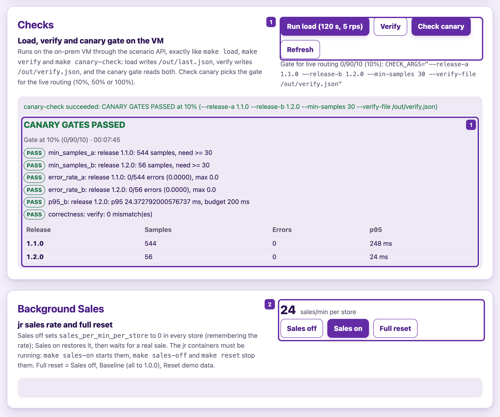

<details>
<summary>Why one path?</summary>

The panel stores the demo settings (key `demo:config`) and its **Rollback** memory (key `demo:routing-state`) in Redis, in the same ElastiCache instance that holds the serving view, under separate keys. `make rollback` keeps its memory in a local file on your computer, `.state/routing-<stack>`. So a **Rollback** in one does not know about a change made in the other: it restores what was live before the last change made by *that same* path.

Background sales differ too. The panel turns sales on and off by changing the rate; `make sales-on` and `make sales-off` start and stop the containers. After the panel's **Sales off**, `make sales-on` starts containers that sell nothing until you press **Sales on**.

</details>

### I. What `./demo` does, step by step

You do not need to run anything in this section. Read it to understand the build or to debug a failed step.

#### I.1 The commands underneath

`./demo` is a small script that checks your input and then runs make targets. Each action maps to one of them:

| `./demo` action | Runs |
|---|---|
| `create` | `make secrets`, `make stack-preflight`, the cost question, then `make stack-up CONFIRM=yes` |
| `status` | `make stack-status` |
| `links` | `make links` |
| `reset` | `make reset` |
| `destroy` | A confirmation question, then `make stack-down CONFIRM=yes` |

Every call adds `MODE=cloud TOPOLOGY=hybrid STACK=<stack>` and the profile, region and layers from `demo.yaml`. `./demo create --dry-run` prints the exact commands, with secrets masked. When you run `make <target>` yourself, the Makefile reads the same values from `demo.yaml`, so you do not need to add them.

#### I.2 Where each secret goes

You enter credentials for three accounts (AWS, Confluent Cloud, Datadog) and, optionally, the Jev key. The build generates everything else. Your AWS credentials stay in your AWS CLI profile. The others go in `demo.yaml`.

| File or store | Contents | Created by |
|---|---|---|
| `demo.yaml` (repository root, mode 600, ignored by git) | Your Datadog, Confluent Cloud and optional Jev keys | You |
| `.env` (repository root, mode 600, ignored by git) | The same keys as environment variables | `./demo create`, from `demo.yaml` |
| `.env.secrets` (mode 600) | Random database and control panel passwords, and `SCENARIO_API_TOKEN`, the token the control panel uses for the Checks card | `make secrets` |
| `.env.cloud-hybrid` (mode 600) | Kafka and Schema Registry keys for each service, endpoints, ALB and Redis addresses | `stack-up`, from Terraform outputs |
| AWS <abbr title="The AWS service that stores configuration values and secrets for the Fargate tasks.">SSM Parameter Store</abbr>, `/dd-demo/hybrid/` | The secrets that the Fargate tasks need, as encrypted SecureStrings, taken from an allowlist | `stack-up` |

`.gitignore` excludes all `.env*` files and `demo.yaml`, so `git add .` cannot add them.

#### I.3 The build steps

`stack-up` runs these steps in order. The table groups them; the log prints one `== [stage]` line per step, for example `== [terraform vm (EC2 host)]`. Each `terraform` step applies one of the six Terraform configurations.

| # | Steps | What they do |
|---|---|---|
| 1 | preflight | The checks from [0.2.2 Run the preflight](#022-run-the-preflight-no-cloud-costs-yet) |
| 2 | terraform account, terraform images | Resources for the whole account, kept across stacks: Cost and Usage Report export, Datadog AWS integration, read-only Confluent identity for cost data, account cost dashboard. Then the stack's <abbr title="The AWS registry that stores the container images.">ECR</abbr> repositories, one per image, which keep the 5 newest images each |
| 3 | terraform cloud | Confluent environment `dd-demo-hybrid`, Basic cluster, Schema Registry, topics, keys and Flink pool. The Flink statements wait until step 9 |
| 4 | terraform vm, RUM application | The EC2 VM, its security group (`allowed_cidr` only) and key pair. With `dd-rum`, the Datadog RUM application, so that the Online shop starts with its RUM settings |
| 5 | env file, docker context, secrets | Writes `.env.cloud-hybrid`, waits for SSH, creates the <abbr title="Tells your local docker CLI to run commands on the VM over SSH.">Docker context</abbr> `dd-demo-hybrid`, generates `.env.secrets` |
| 6 | image tags, SSM, images and terraform aws | Tags each image with a hash of its source files. Copies the allowlisted secrets to SSM. Then, at the same time: the image job checks ECR for each tag, prints `skipped: image unchanged` for the ones it finds and builds only the others on the ARM64 VM; Terraform creates ElastiCache, the ECS services, the ALB and target groups |
| 7 | roll-out | Restarts only the ECS services whose image was just pushed, then waits until every ECS service is stable |
| 8 | VM services | Starts the on-premises services, seeds the five stores with data, registers the connectors and waits until they run |
| 9 | schema priming and Flink | Writes a first record to each input topic, waits for its schema, then starts the Flink statements |
| 10 | first data | Waits until Redis holds sellable stock for all 200 products, resets, verifies, turns sales on |
| 11 | terraform datadog | Dashboards, monitors, Synthetics, Confluent integration (the RUM application already exists from step 4) |
| 12 | smoke | The end-to-end smoke test, then the status summary |

The step times quoted in this guide come from builds before images were reused and built in parallel with step 6; the new times are not measured yet. A rebuild only skips building an image when ECR still has it: after `./demo destroy` that is the case only with `keep_images: true`. `make stack-up REBUILD_IMAGES=1` builds every image again.

<details>
<summary>Why the Flink statements wait until step 9</summary>

Confluent Cloud Flink reads a table's columns from the topic's Schema Registry subject (`<topic>-value`), and that subject exists only after the first record arrives. A statement created earlier fails. So the script first writes a record to each input topic ("priming"), waits up to 300 s for the subjects, and only then creates the statements.

</details>

Every lifecycle command writes a log under `.state/logs/` (mode 600). Logs can contain operational details such as hostnames, so do not share them publicly.
